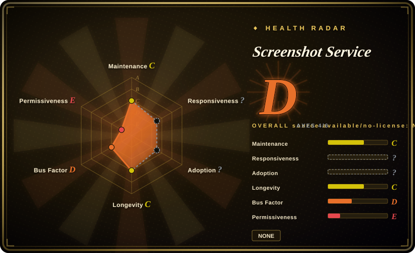

# Screenshot Service

A small Express and Puppeteer service that renders supplied HTML to PNG, JPEG, or WebP, with insecure defaults that make the unmodified service unsuitable for exposure to untrusted clients or networks.

## When to use

You're building an isolated internal rendering worker whose only caller is another trusted service. You need browser-accurate CSS and web-font rendering from controlled HTML, want PNG, JPEG, or WebP output over a small HTTP interface, and can place the worker in a disposable container with blocked outbound access, upstream authentication, strict resource limits, and no direct Internet exposure.

You choose Screenshot Service over [sharp](sharp.md) because the input is HTML that must be laid out by a browser, not an existing raster image. You choose it over embedding Puppeteer directly only when the convenience of a tiny standalone HTTP wrapper outweighs the work required to replace its permissive security defaults.

## When NOT to use

- **Any Internet user or tenant can submit HTML.** Use Browserless or a hardened Playwright worker with authentication, per-job isolation, and network policy instead; this service accepts arbitrary HTML while its API-key check is disabled.
- **Rendered HTML may reference attacker-controlled URLs or internal network addresses.** Use [Playwright](../../web-automation/playwright.md) with request interception and an explicit destination allowlist instead; [推断] unrestricted remote-resource loading creates an SSRF path in networks the browser can reach.
- **You need a managed, authenticated browser pool with concurrency and session controls.** Use Browserless instead; this repository is a minimal endpoint with CORS `*`, not a multi-tenant browser platform.
- **You only resize, crop, composite, or convert existing images.** Use [sharp](sharp.md) instead; launching Chromium for raster-only transforms wastes memory and expands the attack surface.
- **You need HTML or Office documents converted primarily to PDF.** Use Gotenberg instead; it provides a document-conversion API and container-oriented deployment, while this service is focused on PNG, JPEG, and WebP screenshots.
- **You require reproducible dependency resolution and a maintained application lifecycle.** Embed [Puppeteer](../../web-automation/puppeteer.md) or Playwright in your own lockfile-controlled service instead; this repository has no lockfile and little adoption evidence.

## Comparison

| Alternative | In index | Our verdict | Tradeoff |
|---|---|---|---|
| [Playwright](../../web-automation/playwright.md) | ✅ | For untrusted or policy-sensitive rendering, build a Playwright worker with request interception and isolated browser contexts; choose Screenshot Service only for trusted HTML behind compensating controls. | Playwright requires application code and lifecycle design but provides broader browser automation and network controls; this service offers a smaller ready-made endpoint with unsafe defaults. |
| [Puppeteer](../../web-automation/puppeteer.md) | ✅ | For a Node.js application that owns rendering and dependency pinning, use Puppeteer directly; choose Screenshot Service only when a separate minimal HTTP process is the desired boundary. | Direct Puppeteer removes one wrapper and lets you implement authentication and limits in-process; the service saves glue code but inherits its exposed API design. |
| [sharp](sharp.md) | ✅ | For transformations of existing raster images, choose sharp; choose Screenshot Service only when browser layout of HTML and CSS is essential. | sharp is much lighter and avoids a browser but cannot render arbitrary web layouts; Screenshot Service gains browser fidelity at substantial runtime and security cost. |
| Browserless | not indexed | For a shared authenticated browser API with pooling and operational controls, choose Browserless; choose Screenshot Service only for a small isolated internal worker you are prepared to harden yourself. | Browserless has a larger platform and deployment surface but addresses concurrency and browser operations; this service is simpler and leaves those controls to the operator. |
| Gotenberg | not indexed | For document and HTML-to-PDF conversion, choose Gotenberg; choose Screenshot Service when direct PNG, JPEG, or WebP output is the deciding requirement. | Gotenberg is a broader containerized document-conversion service; Screenshot Service is narrower but exposes browser-rendering risks without comparable hardening. |

## Tech stack

- **Runtime:** JavaScript on Node.js.
- **HTTP layer:** Express exposes the HTML-to-image endpoint and enables CORS for all origins with `*`.
- **Renderer:** Puppeteer launches Chromium to load supplied HTML and emit PNG, JPEG, or WebP.
- **Browser flags:** Chromium is started with `--no-sandbox` and `--disable-web-security`, removing two important browser isolation boundaries.
- **Authentication posture:** API-key enforcement is disabled in the current service path.

## Dependencies

- Node.js and npm to install and run the Express application.
- Puppeteer and its compatible Chromium download or browser runtime.
- CPU, memory, temporary storage, and process capacity for browser instances; the repository includes coarse request-size, concurrency, navigation-timeout, page-close, and browser-restart controls, which still need deployment-specific tuning.
- Network access for any remote images, fonts, scripts, or styles referenced by submitted HTML. That access must be constrained if inputs are not fully trusted.
- There is no lockfile, so the exact transitive dependency graph can vary by installation time unless the operator creates and reviews one.

## Ops difficulty

**Low for a local demo, high as a network service.** The application includes a 10 MiB request limit, screenshot rate limiting, a five-page concurrency cap, navigation and page timeouts, per-request page cleanup, and a browser-restart threshold. Those coarse controls do not make it a safe untrusted multi-tenant renderer: operators still need reverse-proxy authentication, outbound network deny rules or allowlists, filesystem isolation, and container or host sandboxing. CORS `*`, disabled API-key enforcement, `--no-sandbox`, and `--disable-web-security` make direct exposure a security boundary failure rather than a routine deployment choice.

## Health & viability

- **Maturity, as of 2026-07:** the repository is early and has one GitHub star, providing little adoption evidence for production behavior or operational edge cases.
- **Supply-chain posture:** no lockfile is present, so dependency resolution is not reproducible from the repository alone.
- **License posture:** no `LICENSE` file is present and GitHub reports `NOASSERTION`; usage and redistribution rights are not established by a standard repository license.
- **Security posture:** permissive CORS, disabled API-key enforcement, arbitrary HTML and remote-resource loading, and weakened Chromium flags are selection blockers for an untrusted service boundary.
- **Lindy and governance:** [推断] the early state and minimal adoption do not support a positive longevity prior; maintainer redundancy and production stewardship are not established here.

## Caveats (unverified)

- [推断] Arbitrary HTML plus remote-resource loading creates SSRF exposure when Chromium can reach internal or privileged network destinations; exploitability depends on the deployment network and any controls added by the operator.
- [推断] Processing attacker-controlled HTML inside Chromium adds a browser-exploit and resource-exhaustion surface; this page did not perform a vulnerability assessment of the bundled browser version.
- [未验证] No repository `LICENSE` file was found, so copyright permissions beyond viewing the public code are not established here; obtain upstream clarification before redistribution or commercial use.
- [未验证] Without a lockfile, the exact Puppeteer, Chromium, Express, and transitive versions depend on install-time resolution; this page did not generate or audit a resolved dependency tree.
- [未验证] No independent security audit, production-user report, or published hardening guide was identified in the supplied research.
