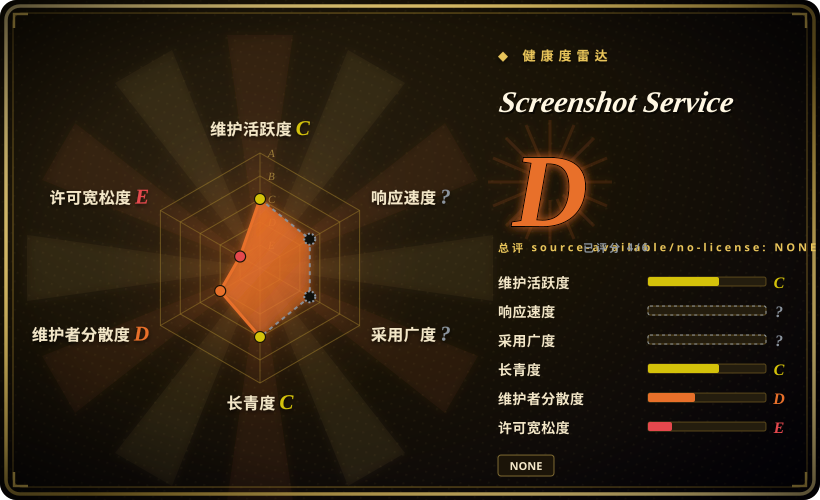

# Screenshot Service

一个小型 Express + Puppeteer 服务，把传入 HTML 渲染成 PNG、JPEG 或 WebP；其默认安全配置不适合把未修改的服务暴露给不可信客户端或网络。

## 何时使用

你在构建一个隔离的内部渲染 worker，唯一调用方是另一个可信服务。输入是受控 HTML，需要浏览器级 CSS 和 Web font 排版，并希望通过小型 HTTP 接口得到 PNG、JPEG 或 WebP。你能把 worker 放进一次性容器，阻断出站网络，在上游补认证和严格资源限制，而且不会把它直接暴露到互联网。

输入是必须由浏览器排版的 HTML，而不是已有位图时，你选择 Screenshot Service 而不是 [sharp](sharp.zh.md)。只有独立小型 HTTP wrapper 的便利性，高于替换其宽松安全默认值所需的工作时，才在应用内直接嵌入 Puppeteer 之上选择它。

## 何时不用

- **任何互联网用户或租户都能提交 HTML。** 改用 Browserless，或使用带认证、逐任务隔离和网络策略的加固 Playwright worker；本服务接受任意 HTML，而且 API key 检查已禁用。
- **待渲染 HTML 可能引用攻击者控制的 URL 或内网地址。** 改用带请求拦截和显式目标 allowlist 的 [Playwright](../../web-automation/playwright.zh.md)；[推断] 任意远程资源加载会在浏览器可达网络中形成 SSRF 路径。
- **你需要带并发和 session 控制的托管认证浏览器池。** 改用 Browserless；本仓库只是启用 CORS `*` 的最小 endpoint，不是多租户浏览器平台。
- **你只做已有图片的缩放、裁剪、合成或格式转换。** 改用 [sharp](sharp.zh.md)；为纯位图处理启动 Chromium 会浪费内存并扩大攻击面。
- **你主要把 HTML 或 Office 文档转成 PDF。** 改用 Gotenberg；它提供文档转换 API 和面向容器的部署方式，本服务聚焦 PNG、JPEG 和 WebP 截图。
- **你要求可复现的依赖解析和受维护的应用生命周期。** 在自己的 lockfile 管理服务中嵌入 [Puppeteer](../../web-automation/puppeteer.zh.md) 或 Playwright；本仓库没有 lockfile，采用证据也很少。

## 横向对比

| 替代品 | 是否收录 | 我们的评价 | 取舍 |
|---|---|---|---|
| [Playwright](../../web-automation/playwright.zh.md) | 已收录 | 处理不可信或需要网络策略的渲染时，应构建带请求拦截和隔离 browser context 的 Playwright worker；只有输入可信且外部控制已补齐时，才选 Screenshot Service。 | Playwright 需要自行编写应用和生命周期控制，但提供更完整的浏览器自动化与网络控制；本服务 endpoint 更小，默认值却不安全。 |
| [Puppeteer](../../web-automation/puppeteer.zh.md) | 已收录 | Node.js 应用需要自己掌控渲染和依赖锁定时，直接用 Puppeteer；只有明确需要独立最小 HTTP 进程作为边界时，才选 Screenshot Service。 | 直接使用 Puppeteer 少一层 wrapper，也能在进程内实现认证和限制；本服务节省胶水代码，却继承公开 API 的设计风险。 |
| [sharp](sharp.zh.md) | 已收录 | 处理已有位图时，选 sharp；只有浏览器排版 HTML 和 CSS 是硬需求时，才选 Screenshot Service。 | sharp 轻得多，也不需要浏览器，但无法渲染任意 Web 布局；Screenshot Service 换来浏览器保真度，同时承担明显的运行时与安全成本。 |
| Browserless | 未收录 | 需要共享认证浏览器 API、池化和运维控制时，选 Browserless；只有小型隔离内部 worker 且准备自行加固时，才选 Screenshot Service。 | Browserless 平台和部署面更大，但处理并发与浏览器运维；本服务更简单，也把这些控制全部留给运营者。 |
| Gotenberg | 未收录 | 需要文档和 HTML 转 PDF 时，选 Gotenberg；直接输出 PNG、JPEG 或 WebP 是决定条件时，才选 Screenshot Service。 | Gotenberg 是更宽的容器化文档转换服务；Screenshot Service 更窄，却在没有同等加固的情况下暴露浏览器渲染风险。 |

## 技术栈

- **运行时：** Node.js 上的 JavaScript。
- **HTTP 层：** Express 暴露 HTML 转图片 endpoint，并以 `*` 为所有来源开启 CORS。
- **渲染器：** Puppeteer 启动 Chromium，加载传入 HTML 并输出 PNG、JPEG 或 WebP。
- **浏览器参数：** Chromium 使用 `--no-sandbox` 和 `--disable-web-security` 启动，移除了两层重要浏览器隔离边界。
- **认证姿态：** 当前服务路径中的 API key 校验已禁用。

## 依赖

- 安装并运行 Express 应用所需的 Node.js 与 npm。
- Puppeteer，以及与之兼容的 Chromium 下载或浏览器运行时。
- 浏览器实例需要的 CPU、内存、临时存储和进程容量；仓库已提供粗粒度的请求大小、并发、导航超时、页面关闭和浏览器重启控制，但仍需按部署环境调优。
- 传入 HTML 引用远程图片、font、script 或 style 时所需的网络访问。输入并非完全可信时，必须限制这类访问。
- 仓库没有 lockfile；除非运营者自行生成并审查，否则精确的传递依赖图会随安装时间变化。

## 运维难度

**本地演示低，作为网络服务则高。** 应用已包含 10 MiB 请求上限、截图速率限制、五页面并发上限、导航与页面超时、逐请求页面清理，以及浏览器重启阈值。这些粗粒度控制仍不足以形成安全的不可信多租户渲染边界：运营者还要补反向代理认证、出站网络 deny rule 或 allowlist、文件系统隔离，以及容器或主机 sandbox。CORS `*`、禁用 API key、`--no-sandbox` 和 `--disable-web-security` 使直接暴露成为安全边界失败，而不是普通部署选择。

## 健康度与可持续性

- **成熟度，截至 2026-07：** 仓库处于早期，GitHub 只有 1 个 star，几乎没有生产行为或运维边界情况的采用证据。
- **供应链姿态：** 没有 lockfile，因此仅凭仓库无法复现依赖解析结果。
- **许可证姿态：** 仓库没有 `LICENSE` 文件，GitHub 返回 `NOASSERTION`；标准仓库许可证没有确立使用和再分发权利。
- **安全姿态：** 宽松 CORS、禁用 API key、任意 HTML 与远程资源加载，以及削弱 Chromium 隔离的参数，都会阻断把它直接选为不可信服务边界。
- **Lindy 与治理：** [推断] 早期状态和极少采用不足以形成正向寿命先验；本页也无法确认维护者冗余和生产维护责任。

## 存疑（未验证）

- [推断] 任意 HTML 加远程资源加载，会在 Chromium 可访问内部或高权限网络目标时形成 SSRF 暴露；实际可利用性取决于部署网络和运营者补充的控制。
- [推断] 在 Chromium 中处理攻击者控制的 HTML 会增加浏览器漏洞利用和资源耗尽攻击面；本页没有对所捆绑浏览器版本执行漏洞评估。
- [未验证] 仓库中未发现 `LICENSE` 文件，因此除查看公开代码外的版权许可并未在此确立；再分发或商业使用前，应取得上游说明。
- [未验证] 没有 lockfile 时，精确的 Puppeteer、Chromium、Express 和传递依赖版本取决于安装时解析；本页没有生成或审计 resolved dependency tree。
- [未验证] 已核验材料中没有独立安全审计、生产用户报告或公开加固指南。
