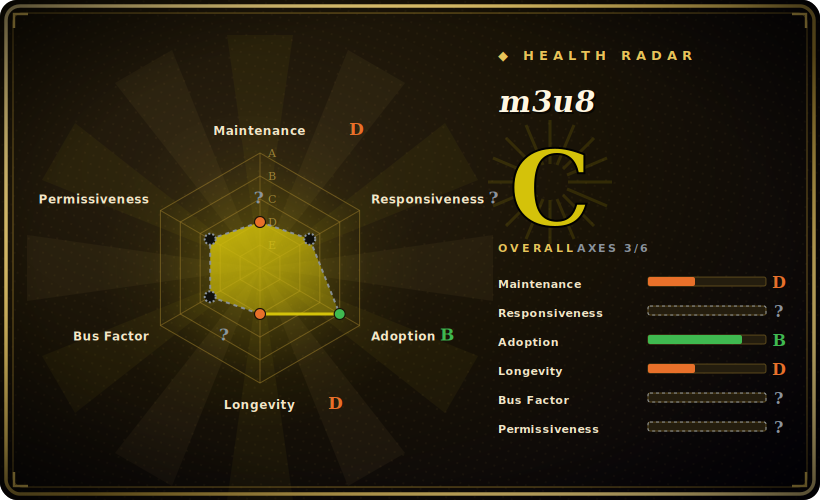

# m3u8

A Python parser and serializer for HLS (HTTP Live Streaming) `.m3u8` playlists — load a playlist from a URL, file, or string into a typed object model, inspect/modify segments and variants, and dump it back out (RFC 8216).

## When to use

You're building something that handles HLS streams — a downloader, a packager, an ad-insertion service, a stream validator — and you need to *understand* a `.m3u8` playlist programmatically, not regex it. You `pip install m3u8`, call `m3u8.load('http://server/playlist.m3u8')`, and get an object where `playlist.segments`, `playlist.target_duration`, `playlist.playlists` (variant streams), keys, byteranges, and discontinuities are typed attributes you read and mutate. Then `playlist.dumps()` serializes valid HLS back out. It covers the real tag surface — `EXT-X-STREAM-INF`, `EXT-X-MEDIA`, `EXT-X-KEY`, `EXT-X-MAP`, SCTE-35 cue tags (`EXT-X-CUE-OUT`/`CUE-IN`), I-frame playlists, byteranges — so master and media playlists both parse cleanly.

It's the go-to when your job is *manipulating HLS manifests* specifically: rewriting URIs, splicing ad markers, filtering renditions, or validating that a packager's output is well-formed — turning the text format into a data structure you can reason about. [推断]

## When NOT to use

- **You need the media, not the manifest.** m3u8 parses the *playlist text*; it does not download segments, decrypt, demux, or play video. Pair it with an HTTP client / FFmpeg for the actual media.
- **You're not in Python.** It's a Python library; other runtimes have their own HLS parsers (hls.js, etc.).
- **You need MPEG-DASH or other ABR formats.** It's HLS/`.m3u8`-specific; DASH `.mpd` is a different parser entirely.
- **You need guaranteed coverage of every newest/draft HLS tag.** It tracks RFC 8216 (+ some drafts/SCTE-35), but newer `rfc8216bis` additions or exotic vendor tags may lag; verify the specific tag you depend on against the current code. [未验证]
- **You're on a hot path needing zero-allocation parsing.** It's a convenience object model in pure Python; for extreme-throughput manifest parsing you'd profile or drop lower-level.

## Comparison

| Alternative | In index | Tradeoff |
|---|---|---|
| Hand-rolled regex / manual parsing | 未收录 | No dependency, but you reimplement the tag grammar, variant/media structure, and serialization — and HLS has many edge cases this library already handles. |
| hls.js / other-language parsers | 未收录 | Mature HLS parsers in other runtimes (JS, Go); same job, wrong language if you're in Python. |
| [FFmpeg](ffmpeg.md) | ✅ | Reads/writes HLS as part of (de)muxing media, but it's an opaque media engine — not a manipulable manifest *object model* you can introspect and rewrite tag-by-tag. |
| streamlink / yt-dlp (as consumers) | 未收录 | Full stream-download tools that parse HLS internally; use them to *grab* a stream, not as a library to *manipulate* manifests in your own code. [未验证] |

## Tech stack

- **Language:** pure Python; object model wrapping the `.m3u8` grammar.
- **API shape:** `load`/`loads` (from URI/file/string) and `dump`/`dumps` (to file/string), with typed objects — `M3U8`, `Segment`, `Key`, `Playlist`/`Media` (variants), plus attributes for target duration, sequences, byteranges, discontinuities, and SCTE-35 cue tags.
- **Spec coverage:** RFC 8216 tag set plus some draft/`rfc8216bis` and SCTE-35 tags (see README's supported-tags list).

## Dependencies

- **Runtime:** Python plus a small dependency set (an HTTP client for `load(url)`, historically `iso8601` for date parsing); installed via `pip install m3u8`.
- **External:** for remote loads, network access to the playlist URL — but nothing to stand up; no services, DB, or media tooling required to parse.
- **Optional:** an HTTP client of your choice / a media tool (FFmpeg) if you go on to fetch or process the segments the playlist references.

## Ops difficulty

**Low.** It's a pure-Python parsing library — `pip install` and import, nothing to deploy or operate. The only operational nuances are keeping the version current as HLS tags evolve and handling malformed/real-world playlists defensively (vendor manifests violate the spec in creative ways). No runtime infrastructure, no datastore; it does one job and stays out of the way.

## Health & viability

- **Maintenance (2026-06).** **Stable but quiet.** v6.0.0 released 2024-08 with a steady 5.x→6.0 release run that year; last push 2025-01 — current enough but no recent 2026 activity, so it reads as mature/maintenance-mode rather than actively evolving. Not archived. [推断]
- **Governance / backing.** Owned by **globo.com** (`globocom`, an `Organization`) with a multi-contributor history (`leandromoreira`, `mauricioabreu`, et al.) — corporate backing and several maintainers, a healthier bus factor than a solo project. [推断]
- **Age & Lindy verdict.** Created 2012-04, ~14 years old and reached v6 ⇒ **strong Lindy** for a parser: a long-lived, widely-depended-on library in a stable problem domain (HLS manifest grammar changes slowly), so quietness is less alarming here than for a scraper.
- **Adoption & ecosystem.** A de-facto Python HLS-parsing dependency (2.3k stars, used across streaming tooling); for a narrow, well-scoped parser that's healthy adoption. [推断]
- **Risk flags.** Low cadence in 2026 is the main watch-item — for a stable parser it's tolerable, but newer HLS/`rfc8216bis` tags may lag until someone files them. No relicense history found; MIT-licensed (read from the LICENSE file). [推断]

## Caveats (unverified)

- [未验证] ~2.3k stars / 491 forks as of 2026-06; star counts are date-sensitive and not a maintenance signal.
- [推断] License is MIT: the repo's LICENSE file text reads "The MIT License" (Copyright globo.com), even though the GitHub API reports `NOASSERTION` — the id is taken from reading the file.
- [未验证] The exact runtime dependency set and Python-version floor are from README/inference, not a manifest re-read this pass — verify before pinning.
- [未验证] Coverage of the newest `rfc8216bis`/vendor tags may lag the spec; confirm the specific tag you rely on against the current code.
- [推断] "Maintenance-mode / strong Lindy for a parser" is judgment from the 2024-08 last release + 2025-01 last push + age in a slow-changing domain, not a maintainer statement.
