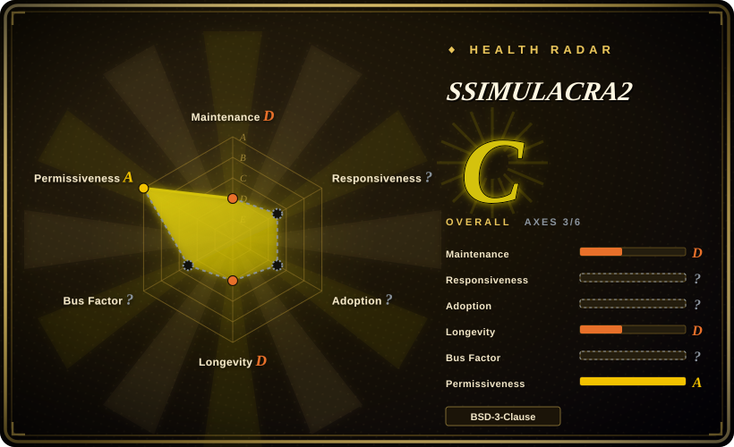

# SSIMULACRA2

A perceptual image-quality metric from the JPEG XL ecosystem, developed by Cloudinary. It scores how visible compression artifacts are to human viewers using multiscale SSIM computed in XYB color space — designed for codec benchmarking and image-format evaluation.

## When to use

You're a codec researcher evaluating next-generation image formats (JPEG XL, AVIF, WebP) and you need a perceptual quality metric that correlates with human subjective scores, not just mathematical error. You reach for SSIMULACRA2: you take a pristine source image and a compressed version, run `ssimulacra2 original.png distorted.png`, and get a 0-100 score that tells you how visible the quality loss is. It's particularly useful when you're benchmarking codecs side-by-side or tuning encoder parameters, because the metric is designed to align with the CID22 subjective dataset — a score of 90 means "visually lossless" to human viewers, while 50 means medium quality with noticeable artifacts.

You also use it when you want a lightweight, self-contained tool with no model files to manage. Unlike VMAF, which ships multiple model versions and requires careful model selection, SSIMULACRA2 is a single deterministic implementation — what you compile is what you get, making cross-paper comparisons more reproducible.

## When NOT to use

- **Video quality assessment.** SSIMULACRA2 is image-only. For video, use [VMAF](vmaf.md) or per-frame SSIMULACRA2 — but per-frame aggregation loses temporal pooling nuance. [推断]
- **You need a symmetric metric.** SSIMULACRA2(a, b) ≠ SSIMULACRA2(b, a) — the order matters because smoothing and ringing artifacts are weighted differently. [推断]
- **You need an industry-standard metric with broad adoption.** VMAF is the de-facto standard for video; SSIMULACRA2 is newer, smaller (~200 stars), and less battle-tested in production pipelines. [推断]
- **You're working in a CI pipeline that needs compiled binaries.** The C++ implementation requires compilation; there's no pre-built package ecosystem on par with libvmaf.
- **You need a no-reference metric.** Like VMAF, SSIMULACRA2 is full-reference — it needs the original image alongside the distorted one.
- **You're optimizing for a metric without understanding its asymmetry.** The asymmetric design means you must be careful about which image is "original" and which is "distorted" — swapping them changes the score.

## Comparison

| Alternative | In index | Our verdict | Tradeoff |
| --- | --- | --- | --- |
| [VMAF](vmaf.md) | ✅ | Choose VMAF when you need the industry-standard perceptual video metric. | Industry-standard video metric with broad adoption, temporal pooling, and multiple models; SSIMULACRA2 is image-only and younger. |
| PSNR / SSIM (standalone) | 未收录 | Choose PSNR or SSIM when you need simple, fast signal-fidelity metrics. | Classic metrics; cheap and ubiquitous but correlate poorly with perceived quality. SSIMULACRA2 is specifically designed for better human correlation. |
| Butteraugli | 未收录 | Choose Butteraugli when you need Google's perceptual metric from the JPEG XL ecosystem. | Google's perceptual metric from the JPEG XL ecosystem; similar lineage but different scoring model and implementation. |
| DSSIM | 未收录 | Choose DSSIM when you need a standalone structural dissimilarity metric. | Structural dissimilarity metric based on SSIM; simpler and older than SSIMULACRA2's multiscale XYB approach. |
| AVQT | 未收录 | Choose AVQT when you need Apple's proprietary perceptual metric. | Apple's proprietary video quality metric; closed implementation, comparable goal but different ecosystem. |
| Netflix VMAF cloud/SaaS scorers | 未收录 | Choose hosted VMAF scorers when you need managed quality scoring. | Hosted quality-scoring services; convenience over running metrics yourself, with vendor dependence. |

## Tech stack

- **Language:** C++ implementation, single-file CLI design.
- **Color space:** Computes multiscale SSIM in **XYB** color space (designed for perceptual uniformity).
- **Algorithm:** Based on the CID22 subjective dataset correlation; multiscale SSIM with asymmetric weighting for smoothing vs ringing artifacts.
- **CLI:** Simple command-line interface: `ssimulacra2 original.png distorted.png`.

## Dependencies

- **Build:** C++ toolchain (compiler with C++17 support); no external build system dependencies (simple Makefile or direct compilation).
- **Runtime:** Two image files (original and distorted); supports PNG input.
- **No runtime services:** No databases, network services, or external APIs required.

## Ops difficulty

**Low.** The tool is a simple CLI binary — compile once, run anywhere. No configuration files, no model files to manage, no service to keep running. The operational simplicity is a key virtue: you feed two images and get a score. The only subtlety is understanding that the score is asymmetric (order matters) and interpreting the 0-100 scale in context of your content.

## Health & viability

- **Maintenance (2026-07).** Active. v2.0 released, Cloudinary maintains the repo with ongoing JPEG XL ecosystem work. Small but focused.
- **Governance / backing.** Owned by **Cloudinary**, a commercial image/video platform company. The project benefits from Cloudinary's investment in image optimization research, but the repo is small (~200 stars) and has a higher bus factor risk than a foundation-backed project.
- **Age & Lindy verdict.** Younger than VMAF (created after 2020, exact date not re-verified); part of the JPEG XL ecosystem which is itself still gaining traction. The Lindy prior is weaker than VMAF's ~10-year track record, but active maintenance within a well-known company partially offsets this.
- **Adoption & ecosystem.** Widely used in image compression research and JPEG XL benchmarking circles despite the small star count; cited in codec comparison papers. Not a general-purpose metric yet — it's a research/codec-evaluation tool.
- **Risk flags.** MIT license is clean; no relicense history. Single-vendor (Cloudinary) stewardship is the main concern — if Cloudinary's priorities shift, the project could stall. No known CVEs.

## Caveats (unverified)

- [未验证] Exact ~200 star count and fork count as of 2026-07; star counts are date-sensitive.
- [未验证] C++17 requirement and exact build process (Makefile vs CMake) are from README inference, not a manifest re-read this pass.
- [推断] "Asymmetric scoring" and "CID22 correlation" are from the project description and ecosystem knowledge, not independently validated.
- [推断] Cloudinary's long-term commitment and bus factor are inferred from repo size and org ownership, not from contributor statistics.
- [推断] Comparison characterizations for PSNR / SSIM, Butteraugli, DSSIM, AVQT, and SaaS scorers are from general ecosystem knowledge, not re-verified this pass.
- [推断] "Temporal pooling nuance," "no pre-built package ecosystem," and "higher bus factor risk" are inferences from the repo's small size and niche focus, not from measured data.
