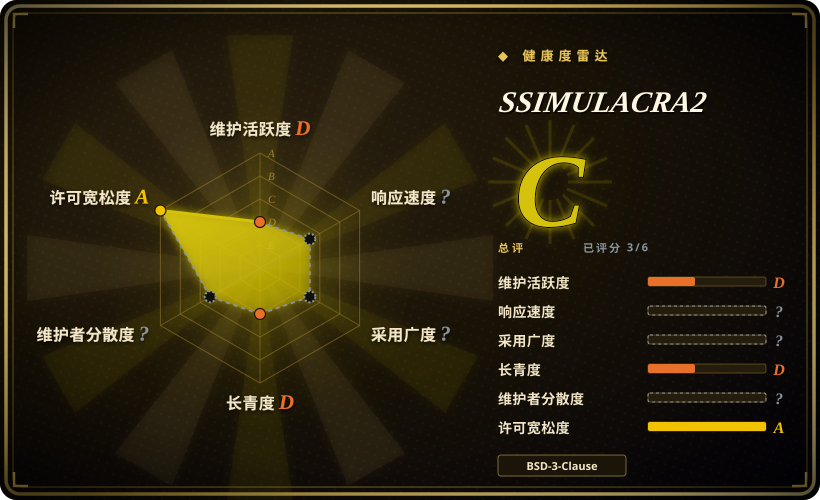

# SSIMULACRA2

来自 JPEG XL 生态系统的感知图像质量指标，由 Cloudinary 开发。它使用 XYB 色彩空间中的多尺度 SSIM 计算，对人类可见的压缩伪影进行打分——专为编解码器基准测试和图像格式评估设计。

## 何时使用

你是一名编解码器研究员，正在评估下一代图像格式（JPEG XL、AVIF、WebP），你需要一个与人类主观评分相关、而非仅与数学误差相关的感知质量指标。你选用 SSIMULACRA2：取一张 pristine 源图像和一张压缩后的版本，运行 `ssimulacra2 original.png distorted.png`，即可获得一个 0—100 的分数，告诉你质量损失在人眼看来有多明显。当你需要并排对比编解码器或调整编码器参数时，它尤其有用，因为该指标的设计与 CID22 主观数据集对齐——90 分意味着对人眼“视觉无损”，而 50 分意味着中等质量、存在明显伪影。

当你想要一个轻量、自包含且无需管理模型文件的工具时，也可以用它。与 VMAF 需要谨慎选择模型版本不同，SSIMULACRA2 是单一确定性实现——编译出来是什么就是什么，这让跨论文对比更可复现。

## 何时不用

- **视频质量评估。** SSIMULACRA2 仅限图像。视频请用 [VMAF](vmaf.zh.md) 或逐帧 SSIMULACRA2——但逐帧聚合会丢失时间池化（temporal pooling）的细微差别。[推断]
- **你需要对称指标。** SSIMULACRA2(a, b) ≠ SSIMULACRA2(b, a)——顺序很重要，因为平滑伪影与振铃伪影的权重不同。[推断]
- **你需要行业广泛采用的标准指标。** VMAF 是视频领域的事实标准；SSIMULACRA2 更新、规模更小（约 200 stars），在生产管线中尚未经充分检验。[推断]
- **你在 CI 管线中需要预编译二进制。** C++ 实现需要编译；其预构建包生态尚不如 libvmaf 成熟。
- **你需要无参考指标。** 与 VMAF 一样，SSIMULACRA2 是全参考——需要原始图像与失真图像同时提供。
- **你在不理解其非对称性的情况下优化指标。** 非对称设计意味着必须小心区分哪张是“原始”、哪张是“失真”——交换它们会改变分数。

## 横向对比

| 替代品 | 是否收录 | 我们的评价 | 取舍 |
| --- | --- | --- | --- |
| [VMAF](vmaf.zh.md) | ✅ | 需要业界标准感知视频指标时，选 VMAF。 | 业界标准的视频指标，采用广泛，带时间池化与多模型；SSIMULACRA2 仅限图像且更年轻。 |
| PSNR / SSIM（独立版） | 未收录 | 需要简单、快速的信号保真度指标时，选 PSNR 或 SSIM。 | 经典指标，计算廉价且随处可见，但与感知质量相关性差。SSIMULACRA2 专为更好的人类相关性设计。 |
| Butteraugli | 未收录 | 需要 Google 的 JPEG XL 生态系统感知指标时，选 Butteraugli。 | Google 来自 JPEG XL 生态系统的感知指标；血统相似，但评分模型与实现不同。 |
| DSSIM | 未收录 | 需要独立结构差异指标时，选 DSSIM。 | 基于 SSIM 的结构差异指标；比 SSIMULACRA2 的多尺度 XYB 方法更简单、更古老。 |
| AVQT | 未收录 | 需要 Apple 的专有感知指标时，选 AVQT。 | Apple 的专有视频质量指标；闭源实现，目标相近但生态不同。 |
| Netflix VMAF 云/SaaS 评分服务 | 未收录 | 需要托管质量评分服务时，选 Netflix VMAF 云/SaaS。 | 托管质量评分服务；比自己跑指标更方便，但有供应商依赖。 |

## 技术栈

- **语言：** C++ 实现，单文件 CLI 设计。
- **色彩空间：** 在 **XYB** 色彩空间（专为感知均匀性设计）中计算多尺度 SSIM。
- **算法：** 基于 CID22 主观数据集相关性；多尺度 SSIM，对平滑伪影与振铃伪影采用非对称加权。
- **CLI：** 简单命令行接口：`ssimulacra2 original.png distorted.png`。

## 依赖

- **构建：** C++ 工具链（支持 C++17 的编译器）；无外部构建系统依赖（简单 Makefile 或直接编译）。
- **运行时：** 两张图像文件（原始与失真）；支持 PNG 输入。
- **无运行时服务：** 无需数据库、网络服务或外部 API。

## 运维难度

**低。** 该工具是简单的 CLI 二进制——编译一次，随处运行。无需配置文件、无需管理模型文件、无需常驻服务。运维简洁是其核心优势：喂两张图，得到一个分数。唯一需要注意的是理解分数的非对称性（顺序有影响），并在内容上下文中解读 0—100 的尺度。

## 健康度与可持续性

- **维护（2026-07）。** 活跃。已发布 v2.0，Cloudinary 持续维护，配合 JPEG XL 生态系统的相关工作。规模小但专注。
- **治理 / 支持方。** 由 **Cloudinary**（一家商业图像/视频平台公司）所有。该项目受益于 Cloudinary 在图像优化研究上的投入，但仓库规模较小（约 200 stars），相比基金会背书的项目存在更高的 bus factor 风险。
- **年龄与 Lindy 判断。** 比 VMAF 年轻（2020 年后创建，确切日期未在本次验证中确认）；属于 JPEG XL 生态系统，而该生态系统本身仍在争取更广泛采用。Lindy 先验弱于 VMAF 约 10 年的记录，但在知名公司内的活跃维护部分弥补了这一不足。
- **采用与生态。** 尽管 star 数不高，仍在图像压缩研究和 JPEG XL 基准测试圈中被广泛使用；在编解码器对比论文中被引用。尚未成为通用指标——目前仍是研究/编解码器评估工具。
- **风险标记。** MIT 许可证干净，无重新授权历史。主要顾虑是单一供应商（Cloudinary）治理——若 Cloudinary 优先级转移，项目可能停滞。无已知 CVE。

## 存疑（未验证）

- [未验证] 截至 2026-07 的约 200 stars 与 fork 数；star 数对日期敏感且并非维护信号。
- [未验证] C++17 要求与具体构建流程（Makefile 或 CMake）来自 README 推断，非本次重新阅读清单的确认。
- [推断] “非对称评分”与“CID22 相关性”来自项目描述与生态知识，未独立验证。
- [推断] Cloudinary 的长期承诺与 bus factor 来自仓库规模与组织所有权推断，非来自贡献者统计。
- [推断] 对 PSNR / SSIM、Butteraugli、DSSIM、AVQT 及 SaaS 评分服务的对比描述来自一般生态知识，未在本次验证中重新确认。
- [推断] “时间池化细微差别”“无预构建包生态”“更高 bus factor 风险”等说法来自仓库规模小与领域聚焦的推断，非来自实测数据。
