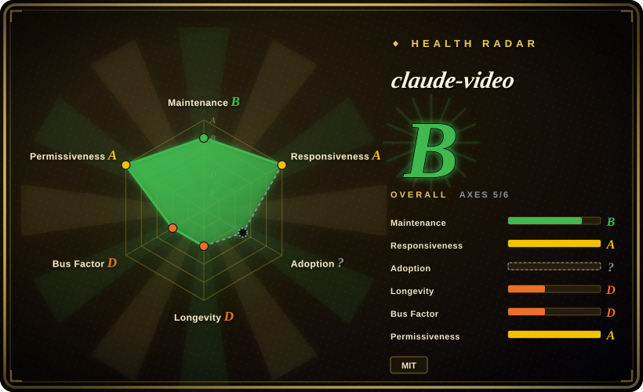

# claude-video

Give Claude the ability to watch any video. /watch downloads, extracts frames, transcribes, hands it all to Claude.

## When to use

You need an agent to answer questions about a video, not produce or edit a video. Use claude-video when Claude/Codex/Cursor needs to fetch a video URL or local file, extract frames, get captions or a transcript, and ground its answer in visual/audio evidence.

It fits tasks like analyzing a launch video, summarizing a lecture, diagnosing a bug from a screen recording, extracting notes from a playlist, or asking “what happens at 2:30?” The upstream `/watch` command wraps `yt-dlp`, `ffmpeg`, caption extraction, optional Whisper fallback, frame budgeting, deduplication, and skill/plugin installation paths.

## When NOT to use

- **You need video generation, editing, transcoding, or production.** Use [MoviePy](moviepy.md), [FFmpeg](ffmpeg.md), [MLT](mlt.md), or a video-production tool; claude-video is a video-understanding helper.
- **You only need raw transcription.** [OpenAI Whisper](whisper.md), native captions, or a dedicated ASR pipeline is simpler when frames are irrelevant.
- **You cannot run shell tools or install `yt-dlp`/`ffmpeg`.** The workflow depends on local command execution; claude.ai web also needs code execution/file creation enabled.
- **The video source blocks download or violates terms/permissions.** `yt-dlp` support does not grant rights to access or redistribute content.
- **You have a long video and need dense visual recall across all moments.** Capped modes thin coverage; upstream recommends focused `--start` / `--end` runs or uncapped `token-burner` with higher token cost.

## Comparison

| Alternative | In index | Our verdict | Tradeoff |
|---|---|---|---|
| [FFmpeg](ffmpeg.md) | ✅ | Choose FFmpeg when you need raw decode/transcode/filter control. | FFmpeg is the engine; claude-video wraps media extraction for agent understanding. |
| [OpenAI Whisper](whisper.md) | ✅ | Choose Whisper when speech-to-text is the whole job. | Whisper handles audio text; claude-video combines transcript with frames and agent prompting. |
| [MoviePy](moviepy.md) | ✅ | Choose MoviePy for programmatic editing/compositing. | MoviePy produces edited videos; claude-video reads videos for analysis. |
| Custom yt-dlp + ffmpeg script | 未收录 | Write custom when you need a fixed ingestion pipeline without agent skill packaging. | Custom scripts can be smaller and deterministic; claude-video already handles agent-facing UX and frame budgets. |

## Tech stack

- **Python skill runtime** — `skills/watch/scripts/` contains the media orchestration code.
- **Agent packaging** — upstream includes Claude Code plugin metadata, Codex/Agent Skills plugin manifests, `skills/watch/SKILL.md`, and a build script for `.skill` bundles.
- **Media pipeline** — `yt-dlp` downloads / extracts captions, `ffmpeg` extracts frames/audio, and optional Whisper backends transcribe captionless audio.

## Dependencies

- **Local shell execution** for `yt-dlp`, `ffmpeg`, Python scripts, and temporary working directories.
- **Optional Whisper API key** — Groq `whisper-large-v3` is preferred upstream; OpenAI `whisper-1` is an alternative. Native captions can avoid paid transcription for many public videos.
- **Agent image-reading context** — extracted frames are handed to Claude/agent context, so cost and context budget scale with frame count/resolution.
- **Platform package managers** — first-run setup may use Homebrew on macOS or print Linux/Windows install commands.

## Ops difficulty

**Low for personal use, medium for shared workflows.** Plugin/skills install is straightforward, but reliable team use needs PATH/tool setup, API-key handling, temp-file hygiene, cost controls for frame/image tokens, and source-permission policy.

## Health & viability

- **Maintenance snapshot (2026-07-16):** GitHub reports `archived=false` and `pushed_at=2026-07-01T01:26:49Z`; health scores maintenance as B and responsiveness as A.
- **Adoption snapshot:** ~8,688 GitHub stars as of 2026-07; strong attention for a young repo, but no package-download axis was available to the scorer.
- **License snapshot:** MIT verified manually from the root `LICENSE`; the current health block marks `risk_license` as `?` because the scorer reported `repo_unreachable` during recomputation.
- **Lindy / governance:** very young project with health longevity D and governance D due to one dominant maintainer.
- **Risk flags:** depends on third-party video-source behavior, local media tools, optional transcription providers, and multimodal token cost.

## Caveats (unverified)

- [未验证] Benchmarked extraction timings in the README were not reproduced locally.
- [未验证] URL support depends on `yt-dlp` and source-site behavior, which can change.
- [推断] It fits agent-assisted video understanding better than automated media pipelines where deterministic ingestion and storage are the main requirement.
