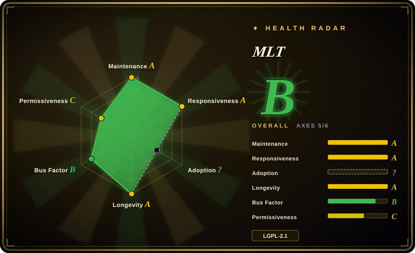

# MLT

A multimedia framework for building non-linear video editors (NLEs) — timeline tracks, clips, transitions, filters, and compositing, with the actual codec work delegated to FFmpeg/libav underneath. Not a standalone editor; it's the engine that powers Shotcut and Kdenlive.

## When to use

You're building a video application that needs a timeline: a custom NLE for a niche workflow, an automated editing pipeline that assembles clips by rules, or a headless server that stitches and renders sequences. You don't want to write a timeline model, a transition engine, or a filter graph from scratch — you want a C++ framework that already understands tracks, clips, in/out points, mixers, and compositions. You model your project as an XML timeline, load it into MLT, and it handles the frame-accurate plumbing: decoding via FFmpeg, applying filters, blending transitions, and encoding the output. You can also drive it programmatically from C++ or via bindings, building an editor UI on top while MLT handles the media backend. If you need a ready-made editor, you might use Shotcut or Kdenlive (both built on MLT) instead; but if you need to embed or extend the engine itself, MLT is the layer to reach for.

## When NOT to use

- **You need a ready-to-use video editor.** MLT is a framework, not an application. If you want an editor you can open and cut with today, use Shotcut, Kdenlive, or another NLE instead of MLT directly.
- **You only need batch transcoding or format conversion.** MLT adds timeline complexity you don't need. For straight decode/encode/transcode, use [FFmpeg](ffmpeg.md) directly — it's faster, simpler, and has far broader community support.
- **You need real-time streaming or a persistent media pipeline.** MLT is designed around offline/sequential timeline rendering, not live stream processing. For real-time pipelines, look at GStreamer.
- **You want a Python-native, friendly video editing API.** MLT's primary interface is C++ with XML project descriptors. For Python-first programmatic editing, consider MoviePy or PyAV instead.
- **You're building a proprietary closed-source product and need to be absolutely sure about LGPL linkage.** MLT is LGPL-2.1+; while linking as a library is generally permitted under LGPL, the dynamic vs static linking boundaries and any plugin-filter combinations must be reviewed for your specific distribution model. If license purity is a hard constraint, verify with counsel. [未验证]
- **You need a large community, extensive tutorials, or rapid issue resolution.** MLT's community is smaller and more specialized than FFmpeg's; troubleshooting may require reading source or mailing-list archaeology.

## Comparison

| Alternative | In index | Our verdict | Tradeoff |
|---|---|---|---|
| [FFmpeg](ffmpeg.md) | ✅ | Use FFmpeg for raw decode/encode/transcode/filter pipelines; use MLT when you need a timeline model on top of that engine. | The universal media Swiss-army-knife; steep API and LGPL/GPL build-licensing trap. MLT sits above it for editorial timeline semantics. |
| [GStreamer](gstreamer.md) | ✅ | Pick GStreamer for real-time, persistent, app-embedded pipelines; pick MLT for offline timeline editing. | Pipeline/element graph framework for live/streaming and app-embedded media; heavier programming model but more composable for real-time apps. |
| [HandBrake](handbrake.md) | ✅ | Pick HandBrake for end-user preset-driven transcoding; pick MLT for programmatic timeline editing. | Preset-driven GUI and CLI for ripping/transcoding to modern MP4/MKV; end-user app, not a library, far narrower than raw FFmpeg. |
| [MoviePy](moviepy.md) | ✅ | Pick MoviePy for friendly Python batch video editing; pick MLT for C++ timeline precision. | Friendly Python API for programmatic video editing — cutting, compositing, text, effects — but batch-only and slower than raw FFmpeg for large files. |
| [PyAV](pyav.md) | ✅ | Pick PyAV for Pythonic libav bindings; pick MLT for timeline model and editorial semantics. | Pythonic bindings to FFmpeg's libav*; gives you codec-level control in Python, but no timeline or NLE abstractions. |
| Shotcut | 未收录 | Shotcut is built on MLT. Use Shotcut when you want a ready-made open-source NLE; use MLT directly when you need to embed or extend the engine. | The open-source NLE built on MLT; reach for it when you need an editor, not a framework. |
| Kdenlive | 未收录 | Kdenlive is built on MLT. Use Kdenlive when you want a KDE-integrated NLE; use MLT directly when you need the engine. | Another open-source NLE built on MLT; KDE/Qt integration, more features than Shotcut in some areas, but still an app, not a library. |
| DaVinci Resolve | 未收录 | Use DaVinci Resolve for professional-grade color, VFX, and editorial — it's a commercial NLE, not an OSS framework. | Professional commercial NLE with world-class color grading; free tier exists but not open-source and not embeddable as a library. |
| Premiere Pro | 未收录 | Use Premiere Pro for Adobe-ecosystem professional editing; not comparable as an open-source embeddable framework. | Commercial Adobe NLE; subscription-only, closed-source, and part of a Creative Cloud workflow. |
| OpenTimelineIO | 未收录 | Use OpenTimelineIO for timeline interchange between apps (Adobe's format); use MLT for actual rendering and playback engine. | Adobe's timeline interchange format — solves "export timeline from app A to app B", not rendering or playback itself. [未验证] |

## Tech stack

- **Language:** C++ (core framework) with C bindings and some language wrappers.
- **Codec engine:** FFmpeg/libav — MLT delegates all actual decode/encode/mux/filter work to FFmpeg's libraries (`libavformat`, `libavcodec`, `libavfilter`, etc.).
- **Timeline model:** XML-based project format describing tracks, clips (producers), transitions, and filters (chainable properties on clips/tracks).
- **Modules/plugins:** A plugin system for producers, filters, transitions, and consumers — ships with FFmpeg, SDL, OpenGL, and other backends.
- **Build:** CMake-based build system; cross-platform (Linux, macOS, Windows).

## Dependencies

- **Runtime:** FFmpeg libraries (libavformat, libavcodec, libavfilter, libavutil, libswscale, libswresample) — the core codec work is entirely delegated to FFmpeg.
- **Optional backends:** SDL2 (for preview/playback display), OpenGL (for GPU-accelerated compositing), Jack/PulseAudio/ALSA (for audio output on Linux).
- **Build tools:** C++ compiler, CMake, and FFmpeg development headers/libraries.
- **Language bindings:** C++ is native; other language access depends on community bindings (e.g., Python via `mlt` Python bindings if available in your distro). [未验证]

## Ops difficulty

**Medium.** MLT itself is a library/framework, not a deployable service — you link it or embed it in your application. The operational burden is in the surrounding build and integration: (1) **FFmpeg dependency management** — you need a compatible FFmpeg build (version matching matters), and MLT's feature set depends on what FFmpeg was compiled with; (2) **plugin availability** — not all transition/filter types may be available depending on build flags and optional dependencies; (3) **timeline correctness** — frame-accurate editing, transition timing, and filter ordering require careful XML/programmatic construction; (4) **resource management** — rendering timelines is CPU/GPU- and memory-intensive like any video pipeline, so you need concurrency controls and output staging. Self-hosting a MLT-based app is as hard as the app you build on top of it; the framework itself is stable but not "batteries included" for end users.

## Health & viability

- **Maintenance — actively maintained, long-lived.** Version 7.30.x as of mid-2026, with consistent releases over many years. The project has been around since the early 2000s and continues to ship updates. [未验证]
- **Governance & bus factor — small core team.** The project is maintained by a small group of dedicated contributors rather than a large foundation; the bus factor is modest but the project has proven resilient over decades. [推断]
- **Backing & longevity — no major corporate or foundation backing.** MLT is community-driven; it survives because it is the shared engine of multiple visible downstream projects (Shotcut, Kdenlive). This ecosystem dependency is its insurance policy — as long as editors need it, it gets maintained. [推断]
- **Age & Lindy verdict — old and still active ⇒ strong Lindy signal.** A project that has been actively maintained for ~20+ years in the video space is a safer bet than a young alternative. MLT's longevity is reinforced by its position as the backend for multiple well-known editors. [推断]
- **Adoption — niche but entrenched.** You're not choosing MLT for its star count (~1.5k); you're choosing it because Shotcut and Kdenlive both depend on it. That production-user validation is more meaningful than raw popularity for a specialized framework. [推断]
- **Risk flags — stable LGPL-2.1+ with no relicense history.** No known relicense drama, no open-core gating, no CLA requirements. The main risk is the small community relative to FFmpeg — patches and niche features may move slowly. [未验证]

## Caveats (unverified)

- [未验证] v7.30.x and ~1.5k stars as of 2026-07; exact star count and latest version tag are time-sensitive.
- [未验证] LGPL-2.1-or-later licensing specifics for dynamic vs static linking in proprietary products — verify with legal counsel for your distribution model.
- [未验证] Python and other language bindings availability and maintenance status vary by platform/distro; check your target environment before committing to a binding strategy.
- [未验证] OpenTimelineIO's exact relationship to MLT — both are timeline-oriented but OTIO is interchange-focused while MLT is render-focused; direct comparison is approximate.
- [推断] Bus factor and exact maintainer count are inferred from GitHub activity patterns and project history, not from a published governance document.
- [推断] The "20+ years" age estimate is approximate; MLT's early history predates widespread GitHub adoption.
