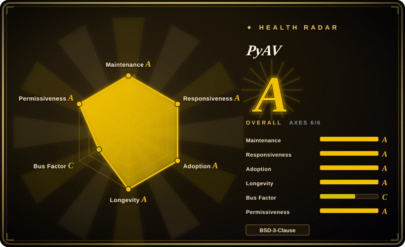

# PyAV

Pythonic bindings to FFmpeg's `libav*` libraries — in-process decode/encode with frame-by-frame access to NumPy arrays and Python bytes, no subprocess spawning.

## When to use

You're a Python ML engineer preprocessing video for a training pipeline: you need to read frames from a high-resolution MP4, optionally resize or convert color spaces, and feed them as NumPy arrays into PyTorch. Shelling out to `ffmpeg` per video is too slow and loses you frame-level control; you need programmatic access to each decoded frame inside the same Python process. You `pip install av`, open the video with `av.open('input.mp4')`, iterate over `container.decode(video=0)`, and each frame gives you `.to_ndarray(format='rgb24')` — a real NumPy array you can batch and normalize immediately. You also use it to encode: create an output container, add a video stream with `codec='libx264'`, and write frames directly from arrays back into a file. Its sweet spot is exactly that boundary: when you need FFmpeg's format/codec coverage but want to stay in Python land with frame-level control.

## When NOT to use

- **You just need simple transcoding or filter graphs.** Use [ffmpeg-python](ffmpeg-python.md) or shell out to FFmpeg directly — PyAV is lower-level and heavier to install.
- **You don't want to compile Cython extensions.** PyAV requires compiling against FFmpeg headers; prebuilt wheels exist for common platforms but exotic environments may need a full build toolchain. [推断]
- **You need a high-level video editor.** PyAV is a thin libav wrapper, not a timeline editor — no cuts, compositing, text overlays, or effects out of the box.
- **You're not in Python.** These are Python-specific bindings.
- **You need hardware-accelerated encoding/decoding at the library level.** PyAV exposes some hardware contexts but the API surface is narrower than raw FFmpeg; verify your specific codec/GPU path is supported. [未验证]
- **You need Python < 3.8.** PyAV requires Python 3.8+.

## Comparison

| Alternative | In index | Our verdict | Tradeoff |
|---|---|---|---|
| [FFmpeg](ffmpeg.md) | ✅ | Choose FFmpeg when you need the universal CLI or C libraries. | The universal CLI and C libraries; maximal power but steep API and no native Python frame access without wrapping it yourself. |
| [ffmpeg-python](ffmpeg-python.md) | ✅ | Choose ffmpeg-python when you need readable Python filter-graph construction that shells out to the CLI. | Readable Python DAG construction that shells out to the ffmpeg CLI; no compilation but no in-process frame access either. |
| [MoviePy](moviepy.md) | ✅ | Choose MoviePy when you need higher-level Python video editing with effects/compositing. | Higher-level Python video editing (effects, compositing, text) with a friendlier API; great for editing, less direct frame control. |
| [GStreamer](gstreamer.md) | ✅ | Choose GStreamer when you need a real-time pipeline framework for application-embedded media. | Pipeline-based multimedia framework for real-time apps; steeper learning curve, stronger in streaming/embedded than batch frame processing. |
| [HandBrake](handbrake.md) | ✅ | Choose HandBrake when you need a preset-driven end-user transcoding app. | End-user transcoding app (GUI + CLI); far narrower than raw libav, not a library, and not for frame-level scripting. |
| OpenCV | 未收录 | Choose OpenCV when you need computer-vision pipelines with its own video I/O. | Computer-vision library with its own video I/O; good for capture and simple read/write, but far narrower codec/format coverage than FFmpeg/libav. |
| imageio-ffmpeg | 未收录 | Choose imageio-ffmpeg when you need a lightweight shim for reading video frames via FFmpeg in imageio. | Lightweight shim for reading video frames via FFmpeg in imageio; simpler but less control than PyAV's direct libav bindings. |

## Health & viability

- **Maintenance (2026-07).** PyAV is actively maintained with the last commit only 1 day ago and 10 active weeks out of the last 13. Community responsiveness is strong with a median first-response time of ~6.3 hours on issues. The project is in continuous iteration.
- **Governance / bus factor.** Governance health is rated C. While there are 26 active contributors in the last 12 months, the top 1 contributor holds 77% share and top 3 hold 86%, indicating a concentration risk. Core maintainer Mike Boers dominates the commit history; his departure could significantly slow the project. This is a notable bus-factor concern.
- **Backing & longevity.** PyAV has been around since approximately 2013 (~13.6 years), MIT-licensed, with no relicense history. As a Python binding to FFmpeg/libav, its value is tightly coupled to the FFmpeg ecosystem; as long as FFmpeg remains widely used, PyAV has enduring necessity. The Lindy effect is positive: a long-lived, still-active project is a safer bet than a newcomer.
- **Adoption & ecosystem.** PyPI package `av` sees 26,983,112 downloads per month with 2,332 dependent repos. It is the de facto standard for Python video frame processing, relied upon by many ML training pipelines and CV toolchains. Its niche is well-defined and alternatives (e.g., imageio-ffmpeg) offer weaker control.
- **Risk flags.** MIT license (permissive), no relicense history. Key risks: (1) governance concentration (grade C); (2) API drift with FFmpeg version changes, requiring version compatibility tracking. Overall risk is low, but evaluate the core maintainer's continued commitment.

## Tech stack

- **Language:** Python (≈55%) with Cython (≈40%) for the compiled extension that wraps `libavcodec`, `libavformat`, `libavfilter`, `libavutil`, `libswscale`.
- **Binding model:** Cython `.pyx` files directly wrap FFmpeg's C API — in-process, no subprocess.
- **Core wrapped libraries:** `libavcodec` (encode/decode), `libavformat` (mux/demux), `libavfilter` (filtergraphs), `libavutil`, `libswscale` (pixel-format conversion).
- **Optional integration:** NumPy for `ndarray` frame access; Pillow for image interoperability.

## Dependencies

- **Runtime:** Python 3.8+ plus the FFmpeg libraries (`libavcodec`, `libavformat`, etc.) linked at compile time. Prebuilt wheels bundle common libraries; building from source requires the FFmpeg headers and a C compiler.
- **Python deps:** `numpy` is strongly recommended for array access; `Pillow` optional for image conversion.
- **No services/DB:** it's an in-process library; you bring the media files and the Python environment.

## Ops difficulty

**Low-to-medium for the library itself, but build-dependent.** Installing from a prebuilt wheel is `pip install av` — trivial. The real burden is when your platform lacks a wheel: you need a C compiler, the FFmpeg development headers/libraries, and matching versions between PyAV and FFmpeg. Containerized environments (Docker) and CI must ensure the build deps are present or pin to a wheel-supported base image. Once installed, operation is straightforward — it's a library call, no daemon, no datastore.

## Caveats (unverified)

- [未验证] ~5k stars and active status as of 2026-07; star counts are time-sensitive.
- [未验证] v14.0.x maturity and Python 3.8+ requirement summarized from README and PyPI metadata, not re-verified from a live install.
- [推断] Hardware acceleration support (NVENC, VAAPI, etc.) is inferred from FFmpeg's general capability; the exact PyAV API surface for each hardware path is not confirmed this pass.
- [推断] Prebuilt wheel coverage is inferred from common platforms (manylinux, macOS, Windows); exotic Linux distros or ARM variants may require source builds.
