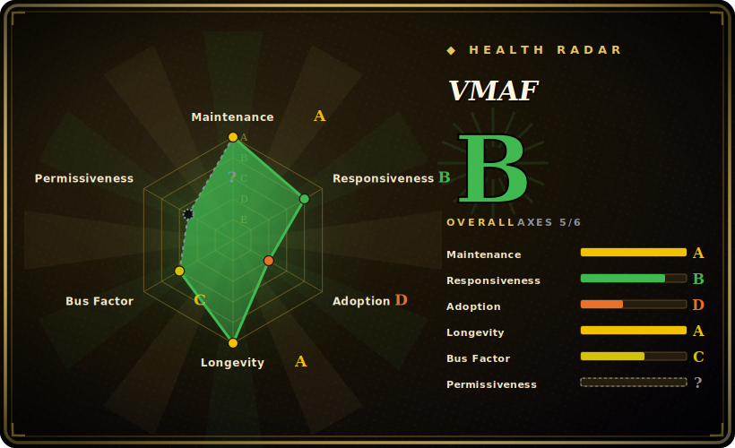

# VMAF

Netflix's Emmy-winning perceptual video-quality metric — a C library `libvmaf` (plus a `vmaf` CLI and a Python wrapper) that scores how good a distorted/encoded video looks to a human vs a reference, and also implements PSNR, SSIM, MS-SSIM, PSNR-HVS, CIEDE2000 and the CAMBI banding detector.

## When to use

You're a video engineer tuning an encoding ladder, and "the bitrate dropped" isn't the question you actually care about — "did quality drop in a way viewers will notice" is. Raw PSNR/SSIM correlate poorly with what people see, so you reach for VMAF: you take a reference clip and an encoded clip, run the `vmaf` CLI (or wire `libvmaf` into your pipeline, or use FFmpeg's built-in `libvmaf` filter), and get a 0–100 perceptual score you can compare across codecs, presets, and resolutions to pick the operating point. It's the de-facto industry metric for codec/encoder evaluation — AOM specifies it in its common test conditions (CTC) — so reporting VMAF makes your results comparable with the broader community.

You also use it when you need *more than one* metric from a single, optimized implementation: `libvmaf` bundles PSNR/SSIM/MS-SSIM/CIEDE2000 and CAMBI (banding) behind one interface, and supports training/validating custom VMAF models on your own content.

## When NOT to use

- **No-reference / live quality monitoring.** VMAF is **full-reference** — it needs the pristine source alongside the distorted video. For in-the-wild streams where you don't have the reference, it doesn't apply (no-reference metrics are a different family).
- **You want a single absolute "good/bad" threshold.** VMAF is a *relative* comparison tool; scores depend on the model, content, and viewing assumptions — Netflix itself ships multiple models (v0, the new v1) and warns about enhancement-gain gaming (hence NEG mode). Treat it as comparative, not an absolute pass/fail. [推断]
- **You're scoring still images / audio.** It's video-quality specific.
- **You need a zero-build, pure-Python install.** The core is a C library built with Meson/Ninja; the Python wrapper drives it but you're compiling (or using prebuilt binaries/Docker), not just `pip install` of pure Python. [未验证]
- **You can't accept the patent-clause license terms.** It's BSD+Patent (relicensed from Apache-2.0 in 2020) — permissive *with an express patent grant*; fine for most, but read it if your org has specific patent-clause policies.
- **You're optimizing for a metric without validating it on your content.** VMAF was trained on particular datasets; for atypical content (screen content, HDR edge cases) validate or train a model before trusting the number. [推断]

## Comparison

| Alternative | In index | Our verdict | Tradeoff |
|---|---|---|---|
| PSNR / SSIM (standalone) | 未收录 | Use this page for its stated niche; choose PSNR / SSIM (standalone) when you need classic signal-fidelity metrics. | Classic signal-fidelity metrics; cheap and ubiquitous but correlate poorly with perceived quality — VMAF exists precisely because they fall short (and libvmaf includes them anyway). |
| [FFmpeg](ffmpeg.md) | ✅ | Use this page for its stated niche; choose FFmpeg when you need integrates `libvmaf` as a filter. | Integrates `libvmaf` as a filter — for most users *the* way you actually run VMAF in a pipeline; FFmpeg is the host, VMAF is the metric engine inside it. |
| SSIMULACRA2 | 未收录 | Use this page for its stated niche; choose SSIMULACRA2 when you need a newer open perceptual metric (from the JPEG XL ecosystem) gaining traction for image/video quality. | A newer open perceptual metric (from the JPEG XL ecosystem) gaining traction for image/video quality; alternative perceptual scorer, different model lineage. |
| Netflix VMAF cloud/SaaS scorers | 未收录 | Use this page for its stated niche; choose Netflix VMAF cloud/SaaS scorers when you need hosted quality-scoring services. | Hosted quality-scoring services; not a repo — convenience over running libvmaf yourself, with vendor dependence. |
| AVQT / proprietary metrics | 未收录 | Use this page for its stated niche; choose AVQT / proprietary metrics when you need vendor perceptual metrics (e. | Vendor perceptual metrics (e.g. Apple's AVQT); comparable goal, closed implementations and ecosystems. |

## Tech stack

- **Language:** core in **C** (`libvmaf`), built with **Meson + Ninja**; x86 SIMD-optimized (AVX2/AVX-512) fixed-point implementation for speed.
- **Interfaces:** a standalone `vmaf` command-line tool, the `libvmaf` C API, and a **Python** library for training/testing/validation and dataset/plotting tooling.
- **Integrations:** shipped as an FFmpeg filter (`--enable-libvmaf`); Dockerfile provided; Windows build supported.
- **Models:** swappable model files (v0 legacy, new **v1** as of 2026-06), plus a NEG (No Enhancement Gain) mode to resist enhancement gaming.

## Dependencies

- **Build:** a C toolchain plus **Meson and Ninja** to build `libvmaf`/the CLI; or use prebuilt binaries / the provided Docker image.
- **Python tooling:** the Python wrapper needs Python and its own deps (numpy/scipy-class scientific stack) for model training/validation/plotting.
- **Runtime:** the reference + distorted video frames (typically via FFmpeg) and a model file; no databases or network services to run.
- **Optional host:** FFmpeg, if you run VMAF as an FFmpeg filter rather than via the standalone tool.

## Ops difficulty

**Medium.** The conceptual use is simple (feed reference + distorted, get a score), but the *engineering* has real edges: building the C library (Meson/Ninja) or sourcing the right prebuilt binary, choosing and pinning the correct **model** (v0 vs v1, NEG vs default) for your content and reporting context, ensuring frames are aligned/same-resolution, and the compute cost of scoring large catalogs. Most teams sidestep the build by running it through FFmpeg or Docker. The subtle operational risk is *methodological* — picking the wrong model or comparing scores across model versions silently invalidates conclusions.

## Health & viability

- **Maintenance (2026-06).** **Active.** libvmaf v3.2.0 released 2026-06-20, v3.1.0 in 2026-04, last push 2026-06-23; a new **v1 model set** announced 2026-06 — clearly under ongoing development, not coasting. Not archived.
- **Governance / backing.** Owned by **Netflix** (an `Organization` account) with a multi-engineer contributor history (`li-zhi`, `christosbampis`, et al.); strong institutional backing and a clear roadmap. The flip side is single-vendor stewardship — Netflix's priorities drive direction. [推断]
- **Age & Lindy verdict.** Created 2016-02, ~10 years old and **still actively shipping** ⇒ **strong Lindy**; it's the mature, standard perceptual metric, not a newcomer, and its standardization in AOM CTC entrenches it further.
- **Adoption & ecosystem.** Industry-standard for codec evaluation (AOM CTC), integrated into FFmpeg, used across the encoding community; Emmy-recognized. Adoption is broad and sticky. [推断]
- **Risk flags.** A 2020 **relicense** (Apache-2.0 → BSD+Patent) — a more permissive move with an express patent grant, but a license-history fact to note. Single-vendor (Netflix) governance is the main bus-factor consideration, mitigated by the strong institutional backing. [推断]

## Caveats (unverified)

- [未验证] ~5.4k stars / 822 forks as of 2026-06; star counts are date-sensitive and not a maintenance signal.
- [推断] License is BSD-2-Clause-Patent: the repo's LICENSE file states "BSD+Patent / SPDX BSD-2-Clause-Patent" and the README documents the 2020-02 relicense from Apache-2.0 — the GitHub API reports `NOASSERTION`, so the SPDX id is taken from reading the file.
- [未验证] Exact build-tool and Python dependency sets (Meson/Ninja versions, scientific stack) are from README/inference, not a manifest re-read this pass.
- [推断] "Model choice silently invalidates comparisons" and "validate on atypical content" are methodological inferences from the multi-model/NEG design and the README's own caveats, not a measured failure.
- [未验证] SSIMULACRA2 / AVQT / SaaS-scorer characterizations are from general ecosystem knowledge, not re-verified this pass.
