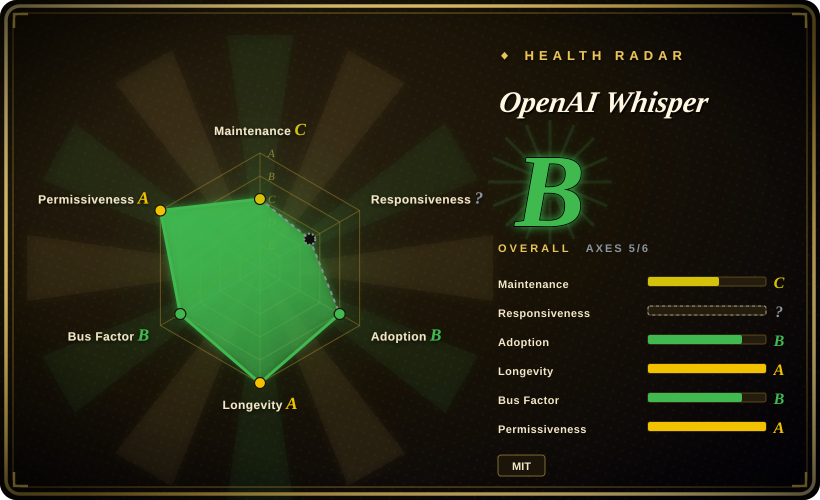

# OpenAI Whisper

OpenAI's general-purpose automatic speech recognition model that transcribes and translates audio to English across 99 languages, with multiple size/quality tradeoffs.

## When to use

You're a content creator or archivist with hundreds of hours of raw audio interviews, podcasts, or video recordings in a mix of languages, and you need searchable text transcripts. You don't have the budget for enterprise speech APIs or you need to process material on-premise for privacy. You install Whisper, pick the `medium` model for your GPU, and run a batch script over your folder. A few hours later, you have timestamped SRT/VTT files for each recording, including the ones in Spanish and Japanese that you couldn't easily outsource. When a recording is in French but your team only reads English, you pass `--task translate` and get an English transcript directly.

You also reach for it when building a speech-enabled application pipeline — you need to ingest voicemail, meeting recordings, or broadcast streams and extract text for downstream indexing, summarization, or keyword search. The MIT license means you can embed the model in commercial products without API key gymnastics.

## When NOT to use

- **Real-time / low-latency transcription.** Whisper is not designed for live streaming; even the `tiny` model incurs latency too high for real-time captioning without additional engineering (chunking, VAD gating, and a dedicated pipeline). For real-time ASR, look at optimized ports like `faster-whisper` or `whisper.cpp`.
- **No GPU and large model needed.** The `large` / `large-v3` models are painfully slow on CPU — acceptable for occasional files, but batch processing large archives on CPU-only machines is a throughput bottleneck. Use `tiny`/`base` on CPU, or move to a GPU.
- **Hallucination-sensitive content.** Long silent segments, music, or non-speech audio can trigger hallucinated text output. Whisper is not a VAD system; pre-segmenting with a voice-activity detector and chunking long files is recommended.
- **You need speaker diarization.** Whisper transcribes what was said, not who said it. For "who spoke when" (multi-speaker segmentation), combine it with a dedicated diarization tool like `pyannote.audio`.
- **Production at scale without optimization.** The reference implementation is research-oriented; for production serving at scale, community reimplementations (CTranslate2, ONNX, Core ML) are significantly faster and more resource-efficient.

## Comparison

| Alternative | In index | Our verdict | Tradeoff |
|---|---|---|---|
| faster-whisper | 未收录 | Use Whisper when you need the reference implementation or the latest model weights; choose faster-whisper when you need 2-4x speedup via CTranslate2 and quantized inference on CPU/GPU. | A community reimplementation using CTranslate2 and FasterTransformer. Significantly faster, same model weights, but lags behind OpenAI releases and is a downstream project, not the source of truth. |
| whisper.cpp | 未收录 | Use Whisper when you need the Python/PyTorch reference or the most flexible scripting; choose whisper.cpp when you need portable, CPU-optimized inference on laptops, mobile, or edge devices. | Georgi Gerganov's C++ port (the llama.cpp author). Extremely popular for on-device and edge deployment; pure C++ with no Python/PyTorch dependency. |
| Azure Speech / Google Cloud Speech | 未收录 | Use Whisper when you need self-hosted, privacy-preserving, or API-cost-free transcription; choose cloud APIs when you need production SLAs, real-time streaming, and no infrastructure burden. | Managed SaaS with real-time streaming, SLAs, and enterprise support. Higher per-minute cost, data leaves your premises, and customization is vendor-gated. |
| Wav2Vec 2.0 / HuBERT | 未收录 | Use Whisper when you need end-to-end multilingual transcription + translation out of the box; choose Wav2Vec 2.0 when you need fine-grained phonetic analysis or custom-domain fine-tuning with Meta's research tooling. | Meta's research speech models; excellent for academic and fine-tuning workflows but not a turnkey transcription product. |
| DeepSpeech (Mozilla) | 未收录 | Use Whisper; DeepSpeech is effectively abandoned since Mozilla stepped back. | Mozilla's older English-centric ASR project. Do not start new projects on it. |
| pyannote.audio | 未收录 | Use Whisper when you need transcription text; use pyannote.audio when you need speaker diarization. They are complementary, not substitutes. | Speaker diarization toolkit (who spoke when), not transcription. Often used together with Whisper. |
| ffsubsync | ✅ | Use Whisper when you need to generate subtitles from audio; use ffsubsync when you already have a subtitle file with correct text but wrong timing. | [→](../media-processing/ffsubsync.md) |

## Tech stack

- **Language:** Python 3.
- **ML framework:** PyTorch (the model and training code are PyTorch-native).
- **Model architecture:** Encoder-decoder Transformer; multiple sizes (tiny, base, small, medium, large, large-v3) ranging from ~39M to ~1.5B parameters.
- **Audio processing:** 30-second mel-spectrogram windows; the reference implementation uses standard PyTorch audio utilities and `tiktoken`-style tokenization.
- **Output formats:** Plain text, JSON (with word-level timestamps), SRT, VTT, TSV.

## Dependencies

- **Runtime:** Python 3.7–3.11, plus PyTorch (CPU or CUDA).
- **Python packages:** `torch`, `torchaudio`, `numpy`, `tqdm`, `more-itertools`, plus `tiktoken` (for the tokenizer). Installed via `pip install openai-whisper`.
- **Hardware:** Runs on CPU or NVIDIA GPU (CUDA). For the larger models, a GPU with ≥10 GB VRAM is strongly recommended; the `tiny` model can run on modest CPU.
- **No external services** — fully self-contained inference. No API key needed for the open-source model.

## Ops difficulty

**Low to medium.** Installation is `pip install openai-whisper`, but the model weights are downloaded automatically on first use (from OpenAI's CDN or Hugging Face mirrors) and can be several GB for the `large` models. The CLI is a one-shot command per file; no daemon, no database, no state. For batch processing, you wrap the CLI or Python API in a loop. The real ops burden is GPU memory management and disk space for model weights, not process orchestration.

## Health & viability

- **Maintenance (2026-07).** OpenAI actively maintains the reference repo; the last major model release was `large-v3` (2023-11), with ongoing community activity and bug fixes. The model is not abandoned, though release cadence is event-driven (new model drops) rather than continuous.
- **Governance / bus factor.** Owned by OpenAI. While the repo is open-source (MIT), the model weights and training data are proprietary. The roadmap is set by OpenAI; there is no community governance or foundation backing. Bus factor is high in terms of corporate backing, but low in terms of community control. [推断]
- **Age & Lindy verdict.** Released September 2022, actively maintained through 2026, ~82k stars, and a massive ecosystem of downstream tools (whisper.cpp, faster-whisper, speech-to-text apps) ⇒ a **strong Lindy** signal — the model has become the de-facto standard for open-source ASR.
- **Adoption & ecosystem.** Extremely high adoption: integrated into content pipelines, meeting transcription tools, podcast platforms, and subtitle workflows. The ecosystem is one of its biggest strengths.
- **Risk flags.** No relicense history (MIT from launch). The main risk is vendor concentration: OpenAI controls the model weights and could theoretically restrict future releases or change the distribution terms. The model is also not a real-time system by design, and hallucination on non-speech content is a known, documented limitation.

## Caveats (unverified)

- [未验证] ~82k stars as of 2026-07; star counts are volatile and date-sensitive.
- [未验证] Exact GPU VRAM requirements for each model size vary by implementation and batch size; the ≥10 GB figure for `large` is a rule of thumb.
- [未验证] Whisper's API (cloud) pricing and terms are separate from the open-source model; verify current rates if you are considering the hosted route.
- [推断] The "strong Lindy" verdict is based on star count and ecosystem size; long-term corporate backing from OpenAI is inferred from their continued investment in speech AI, not a contractual guarantee.
