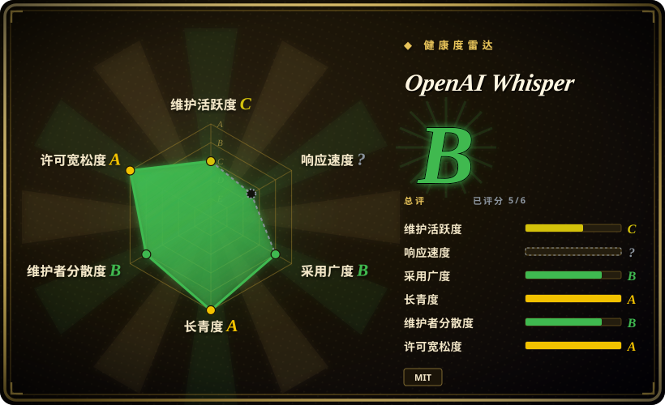

# OpenAI Whisper

OpenAI 的通用自动语音识别模型，支持 99 种语言的转写与英译，提供多种尺寸/质量权衡。

## 何时使用

你是一位内容创作者或档案管理员，手头有数百小时未经整理的音频采访、播客或视频录像，语言混杂，需要可搜索的文字稿。你没有企业级语音 API 的预算，或者出于隐私考虑必须在本地处理素材。你安装好 Whisper，针对 GPU 选择 `medium` 模型，然后对整个文件夹跑批处理脚本。几小时后，你拿到了每份录像的带时间戳 SRT/VTT 文件，包括那些西班牙语和日语的素材——它们很难轻松外包。当某段录音是法语、但你的团队只读英文时，你加上 `--task translate`，直接得到一份英文转写。

你也会在构建语音应用管线时用到它——需要把语音留言、会议录音或广播流转换成文本，供下游索引、摘要或关键词检索。MIT 授权意味着你可以把它嵌入商业产品，无需 API 密钥的繁琐操作。

## 何时不用

- **实时/低延迟转写。** Whisper 并非为直播流设计；即便是 `tiny` 模型，如果不做额外工程（分块、VAD 门控、专用管线），延迟也过高，无法满足实时字幕需求。实时 ASR 请考虑 `faster-whisper` 或 `whisper.cpp` 等优化版本。
- **无 GPU 却需要大模型。** `large` / `large-v3` 模型在 CPU 上运行极慢——偶尔处理单个文件还能接受，但在纯 CPU 机器上批量处理大量存档会成为吞吐量瓶颈。CPU 请用 `tiny`/`base`，或迁移到 GPU。
- **对幻觉敏感的内容。** 长段静音、音乐或非语音音频可能触发幻觉文本输出。Whisper 不是 VAD 系统；建议先用语音活动检测预分段，并对长文件做分块处理。
- **需要说话人分离。** Whisper 转写「说了什么」，不区分「谁说的」。要得到「谁在何时说话」（多说话人分割），请配合 `pyannote.audio` 等专用工具。
- **未经优化就投入大规模生产。** 参考实现面向研究场景；要在生产环境大规模提供服务的，社区重实现（CTranslate2、ONNX、Core ML）在速度和资源效率上显著更优。

## 横向对比

| 替代品 | 是否收录 | 我们的评价 | 取舍 |
|---|---|---|---|
| faster-whisper | 未收录 | 需要参考实现或最新模型权重时用 Whisper；需要 CTranslate2 量化推理在 CPU/GPU 上获得 2-4 倍加速时选 faster-whisper。 | 社区基于 CTranslate2 和 FasterTransformer 的重实现。显著更快，模型权重相同，但滞后于 OpenAI 发布，且是下游项目，非源头权威。 |
| whisper.cpp | 未收录 | 需要 Python/PyTorch 参考实现或最灵活脚本时用 Whisper；需要在笔记本、移动端或边缘设备上做便携、CPU 优化推理时选 whisper.cpp。 | Georgi Gerganov 的 C++ 移植（llama.cpp 作者）。在端侧和边缘部署上极受欢迎；纯 C++，无 Python/PyTorch 依赖。 |
| Azure Speech / Google Cloud Speech | 未收录 | 需要自托管、隐私优先或免 API 费用的转写时用 Whisper；需要生产 SLA、实时流和零基础设施负担时选云端 API。 | 托管 SaaS，带实时流、SLA 和企业支持。按分钟计费更高，数据离开本地，定制受厂商限制。 |
| Wav2Vec 2.0 / HuBERT | 未收录 | 需要开箱即用的端到端多语言转写+翻译时用 Whisper；需要精细语音分析或基于 Meta 研究工具做领域微调时选 Wav2Vec 2.0。 | Meta 的研究级语音模型；在学术和微调工作流中表现优秀，但不是 turnkey 转写产品。 |
| DeepSpeech（Mozilla） | 未收录 | 用 Whisper；DeepSpeech 在 Mozilla 退出后已基本废弃。 | Mozilla 早期的英语中心 ASR 项目。不要在新项目上用它。 |
| pyannote.audio | 未收录 | 需要转写文本时用 Whisper；需要说话人分离时用 pyannote.audio。两者互补，不是替代品。 | 说话人分离工具包（谁在何时说话），不负责转写。通常与 Whisper 配合使用。 |
| ffsubsync | ✅ | 需要从音频生成字幕时用 Whisper；已有正确文本但时间轴错误时用 ffsubsync。 | [→](../media-processing/ffsubsync.zh.md) |

## 技术栈

- **语言：** Python 3。
- **ML 框架：** PyTorch（模型与训练代码均为 PyTorch 原生）。
- **模型架构：** Encoder-decoder Transformer；多种尺寸（tiny、base、small、medium、large、large-v3），参数量从约 3900 万到约 15 亿不等。
- **音频处理：** 30 秒 mel-spectrogram 窗口；参考实现使用标准 PyTorch 音频工具与 `tiktoken` 风格的分词。
- **输出格式：** 纯文本、JSON（含词级时间戳）、SRT、VTT、TSV。

## 依赖

- **运行时：** Python 3.7–3.11，以及 PyTorch（CPU 或 CUDA）。
- **Python 包：** `torch`、`torchaudio`、`numpy`、`tqdm`、`more-itertools`，外加 `tiktoken`（分词器）。通过 `pip install openai-whisper` 安装。
- **硬件：** 可在 CPU 或 NVIDIA GPU（CUDA）上运行。大模型强烈建议配备 ≥10 GB 显存的 GPU；`tiny` 模型可在普通 CPU 上运行。
- **无外部服务**——完全自包含推理，无需 API 密钥。

## 运维难度

**低到中等。** 安装只需 `pip install openai-whisper`，但模型权重会在首次使用时自动下载（来自 OpenAI CDN 或 Hugging Face 镜像），`large` 模型可能占数 GB 空间。CLI 是单次单文件命令；无守护进程、无数据库、无状态。批量处理时，把 CLI 或 Python API 包进循环即可。真正的运维负担在于 GPU 显存管理和模型权重的磁盘空间，而非进程编排。

## 健康度与可持续性

- **维护（2026-07）。** OpenAI 积极维护参考仓库；上次重大模型发布为 `large-v3`（2023-11），社区持续活跃并修复 bug。模型并未被放弃，但发布节奏是事件驱动（新模型发布），而非持续迭代。
- **治理 / bus factor。** 归 OpenAI 所有。仓库本身是开源（MIT），但模型权重与训练数据为专有。路线图由 OpenAI 制定，无社区治理或基金会支持。从企业背书看 bus factor 高，从社区控制权看 bus factor 低。[推断]
- **年龄与 Lindy 判断。** 2022 年 9 月发布，活跃维护至 2026 年，约 82k star，且拥有庞大的下游工具生态（whisper.cpp、faster-whisper、语音转文字应用）⇒ **强 Lindy** 信号——该模型已成为开源 ASR 的事实标准。
- **采用度与生态。** 采用度极高：已整合进内容管线、会议转写工具、播客平台和字幕工作流。生态是其最大优势之一。
- **风险标记。** 无 relicense 历史（自发布起即为 MIT）。主要风险是厂商集中度：OpenAI 掌控模型权重，理论上可能限制未来发布或更改分发条款。该模型按设计也不是实时系统，且对非语音内容的幻觉是已知、已文档化的局限。

## 存疑（未验证）

- [未验证] 截至 2026-07 约 82k star；star 数字对时间敏感，仅供参考。
- [未验证] 各尺寸模型对 GPU 显存的精确需求因实现和 batch size 而异；`large` 模型 ≥10 GB 的数值为经验法则。
- [未验证] Whisper 的 API（云端）定价与条款与开源模型分离；如考虑托管路线，请核实当前费率。
- [推断] 「强 Lindy」判断基于 star 数与生态规模；OpenAI 的长期企业背书是从其在语音 AI 上的持续投入推断而来，并非合同保障。
