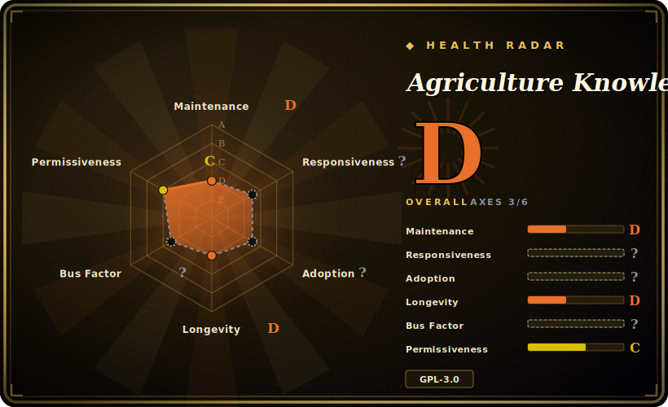

# Agriculture Knowledge Graph (AgriKG)

A Chinese-language research project (ECNU) that builds an agricultural knowledge graph end-to-end — crawlers, entity recognition, relation extraction, a Neo4j store, and a Django demo with retrieval and Q&A — published as a reference, and explicitly no longer maintained.

## When to use

You're a student or researcher building a domain knowledge graph in Chinese — say agriculture, but the pipeline generalizes — and you want a *worked example* of the whole chain: a Scrapy crawler that scrapes an encyclopedia, a KNN classifier that labels ~150k entities, relation extraction against Wikidata, loading triples into Neo4j, and a Django front-end that does entity retrieval, NER, and simple Q&A over the graph. You clone AgriKG, read its directory map, and reuse the parts you need — the pre-crawled `hudong_pedia.csv`, the hand-labeled `labels.txt`, the predicted entity labels, the weather/plant relation CSVs — as ready-made data and as a template for your own KG pipeline.

You reach for it as a **complete, readable blueprint** of a Chinese KG system (and for its bundled datasets), accepting that it's coursework-grade research code you'll adapt, not a product you'll run as-is.

## When NOT to use

- **You need maintained software.** The README states plainly that the project has stopped being maintained ("由于工作原因，该项目已停止维护"); treat it as a frozen reference, expect no fixes, and budget time to revive an old Django/py2neo stack. [推断]
- **You want a production KG platform.** This is a research demo, not a hardened service — no auth, scaling, or ops story. For production use a graph DB (Neo4j) directly with your own ingestion, or a managed KG framework.
- **Your domain or language differs substantially.** Data and labels are agriculture-specific and Chinese; the *method* transfers but the bundled corpora don't. Don't expect drop-in value outside Chinese agricultural text.
- **GPL-3.0 conflicts with your distribution.** Strong copyleft — embedding this code in a closed product carries obligations; lift the techniques/data (data is offered for non-commercial academic use per README) rather than vendoring the GPL code.
- **You need current NER/RE accuracy.** The models (KNN labels, older RE) are 2017–2019 vintage; modern Chinese NLP (transformer NER, LLM extraction) will outperform them substantially. [推断]

## Comparison

| Alternative | In index | Our verdict | Tradeoff |
|---|---|---|---|
| Neo4j (direct) | 未收录 | Use this page for its stated niche; choose Neo4j (direct) when you need the graph database this project stores into. | The graph database this project stores into; production-grade storage + Cypher, but you build the entire NLP ingestion pipeline yourself — AgriKG is precisely that pipeline as an example. |
| DeepKE | 未收录 | Use this page for its stated niche; choose DeepKE when you need maintained Chinese knowledge-extraction toolkit (NER/RE/attribute), transformer-based. | Maintained Chinese knowledge-extraction toolkit (NER/RE/attribute), transformer-based; a real library to build on, vs. AgriKG's frozen end-to-end demo. |
| OpenKG / CN-DBpedia | 未收录 | Use this page for its stated niche; choose OpenKG / CN-DBpedia when you need chinese open knowledge-graph data/resources. | Chinese open knowledge-graph data/resources; data sources rather than a runnable pipeline+UI. |
| [TaskMatrix](taskmatrix.md) | ✅ | Use this page for its stated niche; choose TaskMatrix when you need unrelated task (multimodal agent / tool orchestration) but same shelf. | Unrelated task (multimodal agent / tool orchestration) but same shelf — a research repo published mainly as a reference artifact rather than a maintained product. |

## Tech stack

- **Language:** Python; Chinese-text NLP throughout.
- **Crawling:** Scrapy spiders (`MyCrawler`, `dfs_tree_crawler`, `wikidataSpider`) to harvest encyclopedia entities and Wikidata relations.
- **NLP:** THULAC segmentation, a KNN classifier for entity-type prediction, fastText (`pyfasttext`), relation extraction module.
- **Storage:** Neo4j via `py2neo==4.1.0`; MongoDB (`pymongo`) for crawled data; bundled CSVs as intermediate data.
- **Front-end:** a Django app (`demo/`) with views for retrieval, NER, and Q&A.

## Dependencies

- **Runtime services:** Neo4j (graph store) and MongoDB (crawl store) must be running; the Django app talks to both.
- **Python libs (pinned, old):** `Django>=1.11.7`, `py2neo==4.1.0`, `thulac`, `pyfasttext==0.4.5`, `Cython>=0.28.5`, `pinyin`, `pymongo` — several are dated and may not install cleanly on a modern Python without pinning an old interpreter. [推断]
- **Data:** ships sizable CSVs (`hudong_pedia.csv`, `labels.txt`, predicted labels, weather/plant relations) so you don't have to re-crawl to explore the graph.
- **Models:** trained classifier/RE artifacts referenced by the pipeline (some may need regeneration).

## Ops difficulty

**High for what it is.** It is not a single binary or pip install — to run the full demo you must stand up Neo4j *and* MongoDB, load the bundled data, and get an old Django + py2neo 4.x + pyfasttext stack working on a compatible (old) Python. `pyfasttext` and `py2neo==4.1.0` in particular are the kind of dated, C-extension/version-pinned dependencies that fight modern environments. Because it's unmaintained, any breakage is yours to debug with no upstream help. Running just the *data* (CSVs) or a single sub-pipeline is far cheaper than reviving the end-to-end app.

## Health & viability

- **Maintenance (2026-06).** README explicitly declares maintenance has stopped. Last pushed 2025-02 (likely housekeeping, not feature work); no releases/tags. **Abandoned by author's own statement** — reference-only. [推断]
- **Governance / bus factor.** A university (ECNU) course/research project, primarily one student author (qq547276542) with a couple of contributors; bus factor ~1. The ~4.4k stars are **academic popularity on an abandoned repo** — a citation/learning signal, not a maintenance signal; flag accordingly. [推断]
- **Age & Lindy verdict.** Created 2017-11 (~8 years) but **declared unmaintained** ⇒ age does *not* confer Lindy here; it persists as a referenced artifact, not as living software. [推断]
- **Adoption.** ~4.4k stars / ~1.6k forks and an associated DASFAA 2019 paper — widely cited and forked as a Chinese-KG blueprint and dataset source. [未验证]
- **Risk flags.** **GPL-3.0** (copyleft) for code reuse; **dated/heavy dependency stack** (Neo4j+MongoDB+old py2neo/pyfasttext); and **no upstream support**. Data is offered for non-commercial academic use per the README. [推断]

## Caveats (unverified)

- [未验证] ~4.4k stars / ~1.6k forks as of 2026-06; counts are date-sensitive and indicative only.
- [未验证] Exact state/regenerability of bundled trained models is not confirmed; some artifacts may require retraining to reproduce the demo.
- [推断] "Dependencies won't install cleanly on modern Python" is inferred from the pinned old versions (`py2neo==4.1.0`, `pyfasttext==0.4.5`, `Django>=1.11.7`), not from a tested install.
- [推断] "Last push 2025-02 is housekeeping, not features" is inferred from the README's explicit unmaintained notice plus the gap to feature activity, not from inspecting each commit.
