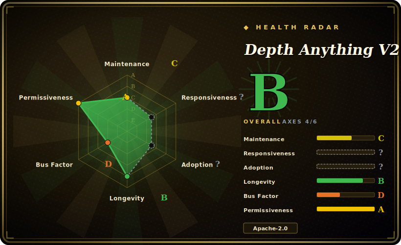

# Depth Anything V2

A foundation model for monocular depth estimation (NeurIPS 2024): one image in, a dense depth map out — four ViT-based model sizes, faster and sharper than V1 and SD-based depth models, with a small PyTorch inference repo around the released checkpoints.

## When to use

You're a CV engineer, roboticist, or creative-tools developer who needs depth from a *single* image — no stereo rig, no LiDAR — for 3D reconstruction, background segmentation/bokeh, novel-view synthesis, AR occlusion, or controllable image/video generation. You don't want to train a depth model; you want a strong off-the-shelf one. You `git clone`, `pip install -r requirements.txt`, download a checkpoint (Small 25M for speed, Large 335M for quality), and call `model.infer_image(cv2_image)` to get an `HxW` depth map in a few lines. For batch/video you use the bundled `run.py` / `run_video.py`, or load it straight from Hugging Face Transformers. There are also separate metric-depth models when you need absolute scale, not just relative depth.

You reach for it as the **current default monocular-depth foundation model** when relative-depth quality, speed, and easy PyTorch/Transformers integration matter more than building anything yourself — it's the most-cited, best-supported option in this niche right now. [推断]

## When NOT to use

- **You need metric depth out of the box from the main models.** The headline relative-depth checkpoints give *relative* depth (scale/shift ambiguous); for absolute metric depth you must use the separate `metric_depth/` models, and accuracy there is domain-dependent. Don't assume the default output is in meters. [推断]
- **You have stereo/LiDAR already.** A calibrated stereo pair or a depth sensor gives metrically-grounded depth directly; a monocular model is a fallback for the single-camera case, not a replacement for real depth hardware.
- **License: watch the model weights, not just the code.** The *code* is Apache-2.0, but per the README **only the Small model is Apache-2.0; Base/Large/Giant weights are CC-BY-NC-4.0 (non-commercial)**. For a commercial product, the larger checkpoints are off-limits unless you arrange otherwise — this is the single most important caveat.
- **Hard real-time on edge with no GPU.** The Large model is heavy; even Small benefits from a GPU. Tight latency/power budgets on CPU-only edge need a smaller/quantized model and benchmarking.
- **Guaranteed correctness on out-of-distribution scenes.** It's robust but still a learned model — transparent/reflective surfaces, extreme scenes, and unusual cameras can fail; verify on your data.

## Comparison

| Alternative | In index | Our verdict | Tradeoff |
|---|---|---|---|
| Depth Anything V1 | 未收录 | Use this page for its stated niche; choose Depth Anything V1 when you need the predecessor. | The predecessor; V2 is sharper on fine detail and more robust per the authors — use V2 unless you have a V1-pinned pipeline. |
| MiDaS / DPT (Intel ISL) | 未收录 | Use this page for its stated niche; choose MiDaS / DPT (Intel ISL) when you need earlier widely-used monocular-depth models. | Earlier widely-used monocular-depth models; mature and permissively usable, but generally surpassed by Depth Anything V2 on detail/robustness. [推断] |
| Marigold (SD-based) | 未收录 | Use this page for its stated niche; choose Marigold (SD-based) when you need diffusion-based depth. | Diffusion-based depth; can be high quality but slower with more parameters — V2 explicitly targets faster inference / fewer params. |
| ZoeDepth | 未收录 | Use this page for its stated niche; choose ZoeDepth when you need metric monocular depth. | Metric monocular depth; a direct alternative when you specifically need absolute scale rather than relative depth. |
| [CLIP](clip.md) | ✅ | Use this page for its stated niche; choose CLIP when you need different task (vision-language), but the same shelf. | Different task (vision-language), but the same shelf — a widely-adopted released foundation model where the checkpoints are the product. |

## Tech stack

- **Language:** Python.
- **Framework:** PyTorch + torchvision; OpenCV for image I/O; Gradio for the demo app.
- **Architecture:** DPT head on DINOv2 ViT encoders (vits/vitb/vitl/vitg) — four scales from 24.8M to 1.3B params.
- **Integration:** loadable via Hugging Face Transformers (`depth-anything-v2` model docs); Core ML conversions exist for Apple devices (community/official).

## Dependencies

- **Runtime:** `torch`, `torchvision`, `opencv-python`, `matplotlib`, `gradio`/`gradio_imageslider` (for the demo).
- **Hardware:** a GPU (CUDA) is the practical path for the Large model; runs on MPS/CPU for smaller models per the example device selection.
- **Weights:** checkpoints are downloaded separately from Hugging Face (Small/Base/Large; Giant "coming soon"); not bundled in the repo.
- **Optional:** Hugging Face Transformers if you load via `pipeline` instead of the repo's own loader.

## Ops difficulty

**Low-to-medium for inference.** As a model release it's easy to *use*: install requirements, pull a checkpoint, call `infer_image`. The main operational considerations are picking the size/latency tradeoff (Small vs Large), provisioning a GPU for the bigger models, and — the real gotcha — tracking which checkpoint's license fits your use. There's no service to operate; if you productionize it, the work is standard model-serving (batching, GPU memory, possibly ONNX/Core ML export), not anything specific to this repo. Training/fine-tuning is a different, heavier matter and not the common path.

## Health & viability

- **Maintenance (2026-06).** Last pushed 2026-03; active issue flow (~240 open, consistent with high usage). Code repo is **actively maintained** post-release, with follow-on projects (Video Depth Anything, Prompt Depth Anything) in the same lineage. [推断]
- **Governance / backing.** Authored by researchers at **HKU and TikTok/ByteDance** (Organization-owned repo, `DepthAnything` org). Institutional + big-vendor backing and a NeurIPS 2024 paper — strong viability signals; roadmap is research-team-led. [推断]
- **Age & Lindy verdict.** Created 2024-06 (~2 years) — **young**, so Lindy gives little prior either way; the bet rests on adoption + active maintenance + backing, which are currently strong, not on longevity. [推断]
- **Adoption.** ~8.3k stars / ~865 forks, Hugging Face Spaces demo, Transformers integration, and Apple Core ML support — broad, fast adoption as the go-to monocular-depth model. [未验证]
- **Risk flags.** The decisive flag is the **split licensing of the weights** (Small Apache-2.0 vs Base/Large/Giant CC-BY-NC-4.0) — a commercial-use trap distinct from the Apache-2.0 code. Also: young project (less track record), and a brief 2024 GitHub takedown noted in the README (repo restored). [推断]

## Caveats (unverified)

- [未验证] ~8.3k stars / ~865 forks / ~240 open issues as of 2026-06; counts are date-sensitive and indicative only.
- [未验证] Model license split (Small Apache-2.0; Base/Large/Giant CC-BY-NC-4.0) is taken from the README's LICENSE note — verify the exact license on each checkpoint's Hugging Face page before commercial use.
- [未验证] "Giant" model is listed as "coming soon"; its availability/license at any given time should be checked directly.
- [推断] "Most-cited / current default monocular-depth model" is an inference from stars + Transformers/Core ML integration + the NeurIPS paper, not a measured ranking.
- [推断] "Surpasses MiDaS/DPT on detail/robustness" reflects the authors' claims plus general reception, not an independent benchmark run here.
