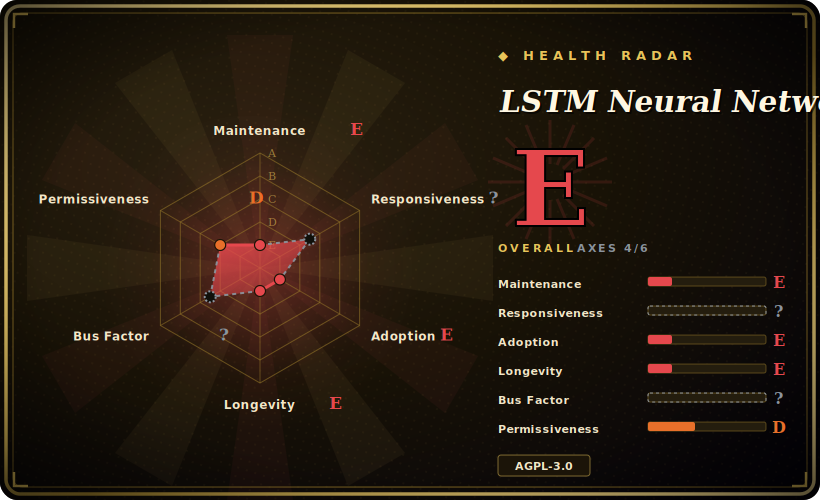

# LSTM Neural Network for Time Series Prediction

A compact, article-companion codebase showing how to build a Keras LSTM to predict time-series sequences — demoed on a sine wave and S&P 500 data — built to teach the technique, not to ship as a forecasting library.

## When to use

You're a student or engineer new to sequence models, and you've read about LSTMs for forecasting but want to *see* an end-to-end example: load a CSV window, build a stacked LSTM in Keras, train it, and plot point-by-point vs. full-sequence predictions. You clone this repo, follow its companion article on altumintelligence.com, run `run.py` against the bundled sine-wave and S&P 500 data, and watch the model predict next steps and multi-step sequences. The `config.json` exposes window length, layers, and epochs so you can tweak and re-run to build intuition about how LSTMs handle sequences.

You reach for it as a **learning artifact** — a clean, readable reference implementation tied to a written explanation — when your goal is to understand the mechanics of windowing, normalization, and sequence prediction with a recurrent net, not to deploy a production forecaster.

## When NOT to use

- **You need a production or even current forecasting library.** It's pinned to TensorFlow 1.10 / Keras 2.2 / Python 3.5-era stacks (2018 vintage); those won't install cleanly on a modern environment without significant effort. It is a frozen teaching example, not a maintained tool. [推断]
- **You want state-of-the-art time-series accuracy.** Modern forecasting uses libraries like Darts, GluonTS, Prophet, or transformer-based models; a hand-rolled stacked LSTM from 2018 is a baseline, not a competitive method.
- **Stock-price prediction in particular.** The S&P 500 demo is illustrative; financial price series are near-random-walk and this is not a trading system — treating the demo as alpha is a classic trap.
- **AGPL-3.0 is a problem for you.** This is a strong copyleft / network-copyleft license; embedding it in a closed-source or SaaS product carries obligations most teams won't want for a 200-line example. Re-implement from the article instead.
- **You expected ongoing support.** Single author, idle since 2023, ~50 open issues unanswered — file an issue and nobody is coming.

## Comparison

| Alternative | In index | Tradeoff |
|---|---|---|
| Darts | 未收录 | Modern, maintained Python forecasting library (many models incl. deep learning) with a unified API; production-oriented, far heavier than a teaching script. |
| GluonTS | 未收录 | Probabilistic time-series toolkit (AWS); strong for real forecasting at scale, steeper learning curve, not an intro example. |
| Prophet | 未收录 | Decomposition-based forecasting, trivial to use for business seasonality; not a deep-learning/LSTM demonstration. |
| Keras official RNN tutorials | 未收录 | Up-to-date, maintained, TF2 examples of the same techniques; less narrative than the companion article but won't bit-rot the same way. |
| [PyTorch-GAN](pytorch-gan.md) | ✅ | A different domain (generative images) but the same *genre* — a single-author reference-implementation collection meant to teach, not to be a maintained dependency. |

## Tech stack

- **Language:** Python (3.5.x era).
- **Framework:** Keras 2.2.2 on TensorFlow 1.10.0 (GPU build pinned in `requirements.txt`).
- **Data/plotting:** NumPy 1.15, pandas 0.23, Matplotlib 2.2.
- **Shape:** `run.py` entry point, a `core/` module (data loader + model), `config.json` for hyperparameters, bundled CSV data.

## Dependencies

- **Runtime:** a TensorFlow 1.x environment — `tensorflow-gpu==1.10.0`, `keras==2.2.2`, plus pinned NumPy/pandas/Matplotlib. Reproducing this today effectively means an old Python 3.5/3.6 + TF1 environment (Docker/conda), since TF1 is EOL.
- **Hardware:** the pinned requirement is the GPU TF build, but the model is small enough to run on CPU with the TF1 CPU package.
- **Data:** sample sine-wave and S&P 500 CSVs are bundled; bring your own CSV in the same windowed format to use it on other series.

## Ops difficulty

**Medium — entirely because of the dated stack, not the code.** The code itself is simple to run, but standing up a working TensorFlow-1.10 / Keras-2.2 / Python-3.5 environment in 2026 is the real friction: those versions predate current CUDA, won't `pip install` on a modern interpreter, and are best reproduced in an isolated old-Python container. Once the environment exists, training is a single `run.py` on a tiny model — seconds-to-minutes, no infrastructure. There is nothing to "operate"; the difficulty is purely the legacy-dependency archaeology.

## Health & viability

- **Maintenance (2026-06).** Last pushed 2023-03; no releases/tags. ~50 open issues with no recent maintainer activity ⇒ effectively **frozen/abandoned** as a maintained project — which is fine for a teaching artifact but disqualifying as a dependency. [推断]
- **Governance / bus factor.** Single author (jaungiers); bus factor = 1. The high star count (~5.2k) on a one-person, idle, ~7-year-old repo is **popularity, not health** — a classic "famous tutorial" signal, flag accordingly. [推断]
- **Age & Lindy verdict.** Created 2016-12 (~9 years) but **not still active** (idle since 2023) ⇒ age alone is *not* Lindy here; old-and-stale fails the still-active test. Its longevity is as a referenced example, not as living software. [推断]
- **Adoption.** ~5.2k stars / ~1.9k forks — widely cloned as a learning reference and forked for coursework; that's its real role. [未验证]
- **Risk flags.** **AGPL-3.0** is the headline risk for reuse (network-copyleft obligations); plus a fully EOL TF1 stack. Both push you toward re-implementing the idea rather than vendoring the repo. [推断]

## Caveats (unverified)

- [未验证] ~5.2k stars / ~1.9k forks / ~50 open issues as of 2026-06; counts are date-sensitive and indicative only.
- [未验证] Companion article and video links (altumintelligence.com / YouTube) are referenced in the README; their continued availability is not verified here.
- [推断] "Won't install cleanly on modern environments" is inferred from the pinned TF 1.10 / Python 3.5-era requirements (TF1 is EOL), not from a tested install attempt.
- [推断] "Abandoned" is inferred from last-push date + no releases + unanswered issues, not from an explicit deprecation notice.
