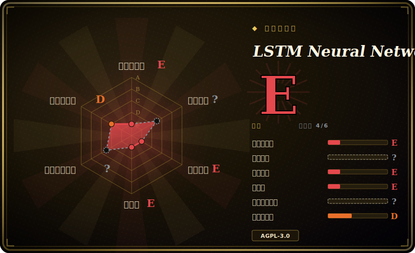

# LSTM Neural Network for Time Series Prediction

一份配套文章的精简代码库，演示如何用 Keras 搭一个 LSTM 来预测时间序列——以正弦波和标普 500 数据为例——它是用来讲明白这个技术的，不是用来当预测库交付的。

## 何时使用

你是个刚接触序列模型的学生或工程师，读过 LSTM 做预测的介绍，但想*亲眼看*一个端到端的例子：加载 CSV 窗口、用 Keras 搭一个堆叠 LSTM、训练它、画出逐点预测与整段序列预测的对比。你 clone 这个仓库，跟着它在 altumintelligence.com 的配套文章走，对着自带的正弦波和标普 500 数据跑 `run.py`，看模型预测下一步和多步序列。`config.json` 暴露了窗口长度、层数和 epoch，方便你改参数重跑，建立对 LSTM 如何处理序列的直觉。

你把它当作一件**学习品**——一份干净、可读、与文字讲解绑定的参考实现——当你的目标是理解窗口化、归一化、用循环网络做序列预测的机制，而不是部署一个生产级预测器时。

## 何时不用

- **你需要一个生产级、乃至当下能用的预测库。** 它钉死在 TensorFlow 1.10 / Keras 2.2 / Python 3.5 时代的栈上（2018 年的东西）；这些在现代环境里不下大力气是装不干净的。它是冻结的教学样例，不是维护中的工具。[推断]
- **你想要顶尖的时序精度。** 现代预测会用 Darts、GluonTS、Prophet 或基于 transformer 的模型；一个 2018 年手搓的堆叠 LSTM 是基线，不是有竞争力的方法。
- **尤其是炒股价预测。** 标普 500 的 demo 只是示意；金融价格序列近乎随机游走，这不是交易系统——把 demo 当成 alpha 是经典陷阱。
- **AGPL-3.0 对你是个问题。** 这是强 copyleft / 网络 copyleft 许可；把它嵌进闭源或 SaaS 产品会带来义务，多数团队不会为一段 200 行的样例承担。不如照着文章自己重写。
- **你以为会有持续支持。** 单一作者，自 2023 年起停摆，约 50 个 open issue 无人应答——你提 issue，没人会来。

## 横向对比

| 替代品 | 是否收录 | 我们的评价 | 取舍 |
|---|---|---|---|
| Darts | 未收录 | 当前页用于它的主场景；如果更看重“现代、维护中的 Python 预测库（含多种模型，包括深度学习），统一 API”，再选 Darts。 | 现代、维护中的 Python 预测库（含多种模型，包括深度学习），统一 API；面向生产，比一段教学脚本重得多。 |
| GluonTS | 未收录 | 当前页用于它的主场景；如果更看重“概率时序工具箱（AWS）”，再选 GluonTS。 | 概率时序工具箱（AWS）；做真实的规模化预测很强，学习曲线更陡，不是入门样例。 |
| Prophet | 未收录 | 当前页用于它的主场景；如果更看重“基于分解的预测，对业务季节性极易上手”，再选 Prophet。 | 基于分解的预测，对业务季节性极易上手；不是深度学习/LSTM 的演示。 |
| Keras 官方 RNN 教程 | 未收录 | 当前页用于它的主场景；如果更看重“同类技术的最新、维护中的 TF2 示例”，再选 Keras 官方 RNN 教程。 | 同类技术的最新、维护中的 TF2 示例；叙事不如配套文章，但不会以同样方式腐烂。 |
| [PyTorch-GAN](pytorch-gan.zh.md) | ✅ | 当前页用于它的主场景；如果更看重“领域不同（生成图像），但*体裁*相同”，再选 PyTorch-GAN。 | 领域不同（生成图像），但*体裁*相同——单一作者的参考实现合集，意在教学，而非当作维护中的依赖。 |

## 技术栈

- **语言：** Python（3.5.x 时代）。
- **框架：** Keras 2.2.2 跑在 TensorFlow 1.10.0 上（`requirements.txt` 钉死 GPU 构建）。
- **数据/绘图：** NumPy 1.15、pandas 0.23、Matplotlib 2.2。
- **形态：** `run.py` 入口，一个 `core/` 模块（数据加载器加模型），`config.json` 放超参，自带 CSV 数据。

## 依赖

- **运行时：** 一个 TensorFlow 1.x 环境——`tensorflow-gpu==1.10.0`、`keras==2.2.2`，外加钉死的 NumPy/pandas/Matplotlib。今天要复现它，实际上意味着一个老的 Python 3.5/3.6 加 TF1 环境（Docker/conda），因为 TF1 已 EOL。
- **硬件：** 钉死的依赖是 GPU 版 TF 构建，但模型够小，用 TF1 的 CPU 包在 CPU 上也能跑。
- **数据：** 自带正弦波和标普 500 的样例 CSV；想用在别的序列上，按同样的窗口格式自备 CSV。

## 运维难度

**中——完全因为栈太旧，而非代码本身。** 代码本身跑起来很简单，但在 2026 年搭起一个能用的 TensorFlow-1.10 / Keras-2.2 / Python-3.5 环境才是真正的摩擦：这些版本早于当前 CUDA，在现代解释器上 `pip install` 不动，最好在隔离的老 Python 容器里复现。环境一旦就绪，训练就是对着一个极小模型跑一次 `run.py`——秒到分钟级，无基础设施。没什么要「运维」的；难点纯粹是对遗留依赖的考古。

## 健康度与可持续性

- **维护（2026-06）。** 最后 push 于 2023-03；无 release/tag。约 50 个 open issue 且维护者近期无动作⇒ 作为维护中的项目实际上已**冻结/废弃**——对教学品无妨，但作为依赖则不合格。[推断]
- **治理 / bus factor。** 单一作者（jaungiers）；bus factor = 1。一个一人、停摆、约 7 年的仓库上有约 5.2k star，那是**人气，不是健康**——经典的「名教程」信号，照此标注。[推断]
- **年龄与 Lindy 判断。** 2016-12 创建（约 9 年）但**已不活跃**（自 2023 起停摆）⇒ 此处单凭年龄*不算* Lindy；老而停滞通不过「仍活跃」检验。它的长寿在于被当作参考样例，而非活的软件。[推断]
- **采用度。** 约 5.2k star / 约 1.9k fork——作为学习参考被广泛 clone、为课程作业被 fork；这才是它真正的角色。[未验证]
- **风险标记。** 复用时的头号风险是 **AGPL-3.0**（网络 copyleft 义务）；外加一个彻底 EOL 的 TF1 栈。两者都把你推向重写思路、而非把仓库 vendoring 进来。[推断]

## 存疑（未验证）

- [未验证] 截至 2026-06 约 5.2k star / 约 1.9k fork / 约 50 个 open issue；数字对时间敏感，仅供参考。
- [未验证] README 引用了配套文章和视频链接（altumintelligence.com / YouTube）；其是否仍可访问此处未核实。
- [推断]「现代环境装不干净」是从钉死的 TF 1.10 / Python 3.5 时代依赖推断（TF1 已 EOL），并非来自实测安装。
- [推断]「废弃」是从最后 push 日期加无 release 加无人应答的 issue 推断，并非来自明确的弃用声明。
