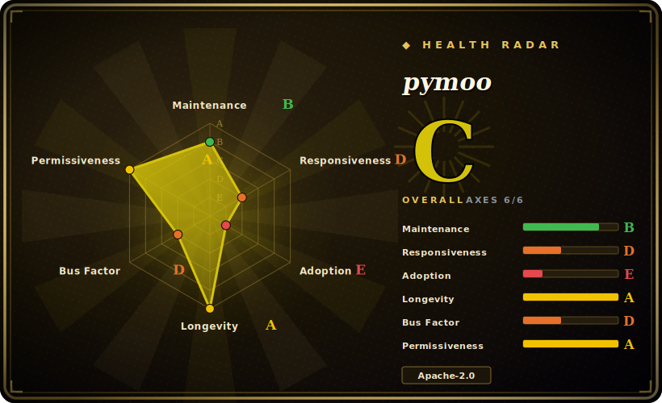

# pymoo

A Python framework for single- and multi-objective optimization: NSGA-II/III, MOEA/D, GA, DE, CMA-ES, PSO and more, plus test problems, constraint handling, visualization, and decision-making tools — built on NumPy/SciPy with optional compiled speedups.

## When to use

You're a researcher or engineer with an optimization problem that has **multiple conflicting objectives** — minimize cost *and* weight, maximize throughput *and* reliability — and you need to find the Pareto front, not a single scalar optimum. You define a `Problem` (variables, objectives, constraints), pick an algorithm like `NSGA2`, call `minimize(problem, algorithm, termination)`, and pymoo evolves a population toward the trade-off frontier; then you use its visualization (scatter, PCP) and decision-making modules (e.g. pseudo-weights, compromise programming) to pick a solution. It ships the standard benchmark suites (ZDT, DTLZ, WFG) so you can validate an algorithm before pointing it at your real problem, and it handles mixed/integer variables, constraints, and custom operators.

You reach for it as the **de-facto Python library for evolutionary multi-objective optimization** — when you want well-tested implementations of the canonical algorithms (it's the reference for NSGA-II/III in Python) with a clean, extensible API, rather than re-implementing genetic operators yourself or wiring up a heavier OR solver. [推断]

## When NOT to use

- **Your problem is convex / linear / smooth and single-objective.** For LP/QP/convex problems, a proper solver (SciPy, CVXPY, Gurobi/OR-Tools) is vastly faster and gives optimality guarantees that population metaheuristics do not. Don't bring an evolutionary algorithm to a problem gradient descent or an LP solver owns.
- **You need gradient-based / large-scale continuous optimization.** Evolutionary methods are derivative-free and sample-hungry; for high-dimensional differentiable objectives, gradient methods (PyTorch/JAX, scipy.optimize) converge far more efficiently.
- **Each evaluation is very expensive and you have a tiny budget.** Population EAs need many function evaluations; if a single objective eval costs hours, look at Bayesian/surrogate optimization (Ax/BoTorch, Optuna) instead, or pymoo's surrogate-assisted patterns with care. [推断]
- **You want hyperparameter tuning specifically.** Optuna/Ax are purpose-built for that workflow (pruning, dashboards, trial storage); pymoo is a general optimization framework, not an HPO platform.
- **You can't tolerate stochastic, non-reproducible-by-default results.** EAs are randomized; you must fix seeds and run multiple times to characterize performance — that's inherent, not a bug.

## Comparison

| Alternative | In index | Our verdict | Tradeoff |
|---|---|---|---|
| DEAP | 未收录 | Use this page for its stated niche; choose DEAP when you need flexible evolutionary-computation toolkit. | Flexible evolutionary-computation toolkit; very general/low-level, but you assemble more yourself — pymoo gives higher-level, ready multi-objective algorithms and benchmarks. |
| Platypus | 未收录 | Use this page for its stated niche; choose Platypus when you need another Python multi-objective EA library. | Another Python multi-objective EA library; smaller scope/community than pymoo's algorithm + tooling breadth. [推断] |
| Optuna / Ax (BoTorch) | 未收录 | Use this page for its stated niche; choose Optuna / Ax (BoTorch) when you need bayesian/surrogate optimization, ideal for expensive evaluations and HPO. | Bayesian/surrogate optimization, ideal for expensive evaluations and HPO; different paradigm (sample-efficient, not population-based) — complementary, not a drop-in. |
| jMetal (Java/Py) | 未收录 | Use this page for its stated niche; choose jMetal (Java/Py) when you need established multi-objective metaheuristics framework. | Established multi-objective metaheuristics framework; jMetalPy mirrors it in Python — comparable goals, different ecosystem and API style. |
| SciPy / OR-Tools / Gurobi | 未收录 | Use this page for its stated niche; choose SciPy / OR-Tools / Gurobi when you need exact/convex/MILP solvers. | Exact/convex/MILP solvers; the right tool when your problem is structured (linear/convex/integer-programming), where EAs are the wrong hammer. |

## Tech stack

- **Language:** Python (>= 3.10 per `pyproject.toml`).
- **Numeric core:** NumPy + SciPy; `autograd`, `cma`, `moocore` for specific algorithm/metric support; `matplotlib` for visualization; `alive_progress` for progress.
- **Speedups:** some modules ship optional **Cython-compiled** versions for performance (build via the included setup); pure-Python fallback exists if compilation didn't run.
- **Surface:** `Problem`/`Algorithm`/`minimize` API, operator library (sampling/crossover/mutation), test-problem suites, visualization, and MCDM/decision-making modules.

## Dependencies

- **Runtime:** `numpy`, `scipy`, `matplotlib`, `moocore`, `autograd`, `cma`, `alive_progress`, `Deprecated` — all pip-installable, no external services.
- **Build (optional):** a C compiler + `Cython` to build the compiled speedups from source; `pip install pymoo` ships wheels for the common case.
- **Hardware:** CPU-bound; no GPU required (or used) by the core algorithms.
- **Your problem:** you supply the objective/constraint evaluation — that's where real-world cost lives (e.g. wrapping a simulator).

## Ops difficulty

**Low.** It's a pip-installable library with no services, datastores, or deployment — `pip install -U pymoo` and import. The only operational nuances are: optionally compiling the Cython modules for speed (a build-time concern, with a pure-Python fallback), and the inherent cost of *your* objective function — for expensive simulators you'll manage parallel evaluation (pymoo supports parallelized/vectorized evaluation) and run-time budgets, but that's your problem's cost, not pymoo's. Reproducibility requires fixing random seeds. There is nothing to operate beyond the Python process.

## Health & viability

- **Maintenance (2026-06).** Last pushed **2026-06-28** (the day of verification) with only ~2 open issues — strong signs of an **actively maintained, well-tended** project on the v0.6.x line. Not coasting, not abandoned. [推断]
- **Governance / backing.** Developed under the `anyoptimization` org (Organization-owned) with a lead maintainer (blankjul) and a real contributor list; tied to academic work (the pymoo IEEE Access paper). Bus factor leans on the lead maintainer but with org structure and multiple contributors — healthier than a lone-author repo. [推断]
- **Age & Lindy verdict.** Created 2017-09 (~8–9 years) **and still actively shipping** ⇒ a **strong Lindy** signal: a mature, long-proven library that remains current, not a hyped newcomer. [推断]
- **Adoption.** ~2.9k stars / ~475 forks, a citable paper, and use across academic/industrial optimization work; it is a standard reference for NSGA-II/III in Python. [未验证]
- **Risk flags.** Few. Apache-2.0 (permissive, no relicense history found); the main practical caveat is the general EA caveat (stochastic, evaluation-hungry), not a project-health risk. [推断]

## Caveats (unverified)

- [未验证] ~2.9k stars / ~475 forks / ~2 open issues as of 2026-06; counts are date-sensitive and indicative only.
- [未验证] v0.6.x is the current line (tags 0.6.2 / 0.6.1.x observed); the exact latest patch version and its release date are not pinned here.
- [推断] "De-facto / reference Python library for evolutionary multi-objective optimization" is an inference from adoption + the canonical algorithm set + the paper, not a measured ranking against every alternative.
- [推断] "Wheels ship for the common case so you rarely need to compile Cython" is inferred from typical PyPI packaging; verify for your platform if compiled-speed paths matter.
