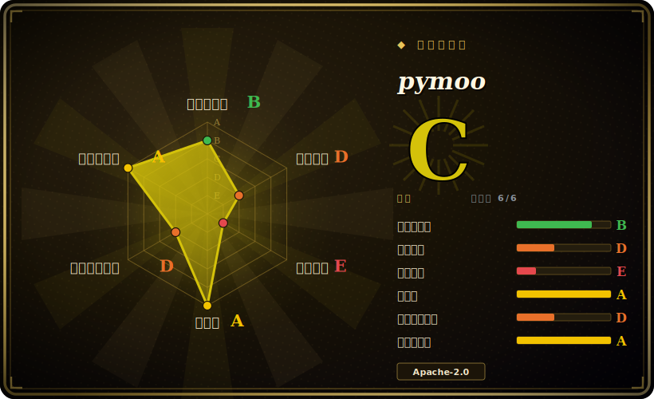

# pymoo

一个做单目标与多目标优化的 Python 框架：NSGA-II/III、MOEA/D、GA、DE、CMA-ES、PSO 等等，外加测试问题、约束处理、可视化和决策工具——建立在 NumPy/SciPy 之上，并有可选的编译加速。

## 何时使用

你是个研究者或工程师，手上的优化问题有**多个相互冲突的目标**——既要降成本*又要*减重，既要提吞吐*又要*提可靠性——你需要找出 Pareto 前沿，而非单个标量最优。你定义一个 `Problem`（变量、目标、约束），挑一个像 `NSGA2` 的算法，调 `minimize(problem, algorithm, termination)`，pymoo 就把种群朝权衡前沿演化；然后你用它的可视化（散点、PCP）和决策模块（如 pseudo-weights、折中规划）挑一个解。它自带标准基准套件（ZDT、DTLZ、WFG），让你在把算法指向真实问题前先验证它，并且支持混合/整数变量、约束和自定义算子。

你把它当作**演化式多目标优化的事实标准 Python 库**——当你想要规范算法的、经充分测试的实现（它是 Python 里 NSGA-II/III 的参考），配一个干净、可扩展的 API，而不想自己重写遗传算子或接一个更重的 OR 求解器时。[推断]

## 何时不用

- **你的问题是凸 / 线性 / 光滑且单目标。** 对 LP/QP/凸问题，正经求解器（SciPy、CVXPY、Gurobi/OR-Tools）快得多，还能给出种群元启发式没有的最优性保证。别把演化算法用在梯度下降或 LP 求解器主场的问题上。
- **你需要基于梯度的 / 大规模连续优化。** 演化方法无导数且耗样本；对高维可微目标，梯度方法（PyTorch/JAX、scipy.optimize）收敛高效得多。
- **每次评估极贵而你预算很小。** 种群 EA 需要大量函数评估；若单次目标评估要数小时，请改看贝叶斯/代理优化（Ax/BoTorch、Optuna），或谨慎用 pymoo 的代理辅助模式。[推断]
- **你专门要做超参调优。** Optuna/Ax 是为那个工作流量身打造的（剪枝、看板、trial 存储）；pymoo 是通用优化框架，不是 HPO 平台。
- **你无法容忍随机、默认不可复现的结果。** EA 是随机的；你必须固定种子并多次运行来刻画性能——这是固有特性，不是 bug。

## 横向对比

| 替代品 | 是否收录 | 我们的评价 | 取舍 |
|---|---|---|---|
| DEAP | 未收录 | 当前页用于它的主场景；如果更看重“灵活的演化计算工具箱”，再选 DEAP。 | 灵活的演化计算工具箱；非常通用/底层，但你要自己拼更多——pymoo 给的是更高层、现成的多目标算法和基准。 |
| Platypus | 未收录 | 当前页用于它的主场景；如果更看重“另一个 Python 多目标 EA 库”，再选 Platypus。 | 另一个 Python 多目标 EA 库；范围/社区比 pymoo 的算法加工具广度都小。[推断] |
| Optuna / Ax（BoTorch） | 未收录 | 当前页用于它的主场景；如果更看重“贝叶斯/代理优化，适合昂贵评估和 HPO”，再选 Optuna / Ax（BoTorch）。 | 贝叶斯/代理优化，适合昂贵评估和 HPO；范式不同（样本高效，非种群式）——互补而非可直接替换。 |
| jMetal（Java/Py） | 未收录 | 当前页用于它的主场景；如果更看重“老牌多目标元启发式框架”，再选 jMetal（Java/Py）。 | 老牌多目标元启发式框架；jMetalPy 在 Python 里镜像它——目标相当，生态和 API 风格不同。 |
| SciPy / OR-Tools / Gurobi | 未收录 | 当前页用于它的主场景；如果更看重“精确/凸/MILP 求解器”，再选 SciPy / OR-Tools / Gurobi。 | 精确/凸/MILP 求解器；当你的问题有结构（线性/凸/整数规划）时是对的工具，那里 EA 是错的锤子。 |

## 技术栈

- **语言：** Python（按 `pyproject.toml` 要求 >= 3.10）。
- **数值核心：** NumPy 加 SciPy；`autograd`、`cma`、`moocore` 支撑特定算法/指标；`matplotlib` 做可视化；`alive_progress` 做进度。
- **加速：** 部分模块自带可选的 **Cython 编译**版以求性能（用附带的 setup 构建）；若未编译，有纯 Python 回退。
- **接口：** `Problem`/`Algorithm`/`minimize` API、算子库（采样/交叉/变异）、测试问题套件、可视化，以及 MCDM/决策模块。

## 依赖

- **运行时：** `numpy`、`scipy`、`matplotlib`、`moocore`、`autograd`、`cma`、`alive_progress`、`Deprecated`——全部可 pip 安装，无外部服务。
- **构建（可选）：** 用 C 编译器加 `Cython` 从源码构建编译加速；`pip install pymoo` 在常见情形下提供 wheel。
- **硬件：** CPU 密集；核心算法不需要（也不用）GPU。
- **你的问题：** 目标/约束的评估由你提供——真实世界的成本就在那里（例如封装一个仿真器）。

## 运维难度

**低。** 它是可 pip 安装的库，无服务、无数据存储、无部署——`pip install -U pymoo` 然后 import。仅有的运维细节是：为求速可选地编译 Cython 模块（一个构建期事项，有纯 Python 回退），以及*你的*目标函数的固有成本——对昂贵仿真器你要管并行评估（pymoo 支持并行/向量化评估）和运行时预算，但那是你问题的成本，不是 pymoo 的。可复现性要求固定随机种子。除了 Python 进程，没什么要运维的。

## 健康度与可持续性

- **维护（2026-06）。** 最后 push 于 **2026-06-28**（核实当天），且只有约 2 个 open issue——是一个**积极维护、打理良好**的项目在 v0.6.x 线上的强信号。不在吃老本，也未废弃。[推断]
- **治理 / 背书。** 在 `anyoptimization` 组织下开发（Organization 拥有），有一位主维护者（blankjul）和真实的贡献者列表；与学术工作绑定（pymoo 的 IEEE Access 论文）。bus factor 偏向主维护者，但有组织结构和多名贡献者——比孤身作者的仓库更健康。[推断]
- **年龄与 Lindy 判断。** 2017-09 创建（约 8 到 9 年）**且仍在活跃发布**⇒ **强 Lindy** 信号：一个成熟、久经验证、又保持时新的库，而非被炒作的新秀。[推断]
- **采用度。** 约 2.9k star / 约 475 fork，有一篇可引用的论文，并在学术/工业优化工作中被使用；它是 Python 里 NSGA-II/III 的标准参考。[未验证]
- **风险标记。** 不多。Apache-2.0（宽松，未发现 relicense 历史）；主要的实务注意点是 EA 的通病（随机、耗评估），而非项目健康风险。[推断]

## 存疑（未验证）

- [未验证] 截至 2026-06 约 2.9k star / 约 475 fork / 约 2 个 open issue；数字对时间敏感，仅供参考。
- [未验证] v0.6.x 是当前线（观察到 tag 0.6.2 / 0.6.1.x）；确切的最新补丁版本及其发布日期此处未钉死。
- [推断]「演化式多目标优化的事实标准 / 参考 Python 库」是从采用度加规范算法集加论文推断，并非对每个替代品的实测排名。
- [推断]「常见情形下提供 wheel、故很少需要编译 Cython」是从典型 PyPI 打包推断；若编译加速路径要紧，请在你的平台上核实。
