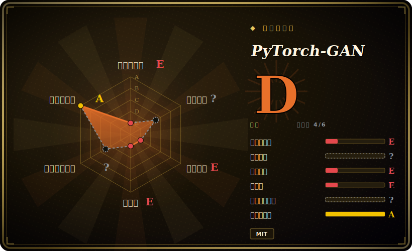

# PyTorch-GAN

一份单作者维护的合集，用 PyTorch 从零干净实现了大量 GAN 论文（DCGAN、CycleGAN、WGAN、pix2pix 等几十种）——目的是*供人阅读和学习*，每个架构一个自包含脚本，而不是当依赖来 import。

## 何时使用

你是一名学生、研究者或工程师，读过那些 GAN 论文，但想看看这些架构在真实、可运行的代码里是怎么接线的——生成器/判别器的定义、损失函数、训练循环——而不想被一个重量级框架的间接层挡住视线。你克隆这个仓库，打开 `implementations/dcgan/dcgan.py`（或 `cyclegan/`、`wgan_gp/`、`pix2pix/`……），拿到一个紧凑的单脚本，可以一口气从头读到尾：每个模型都自包含，用纯 PyTorch，并且和对应论文里的公式贴得很近。你在玩具数据集（MNIST/CIFAR）上跑一跑、观察训练动态，改一层或改一个损失项来建立直觉，再把这套范式抄进自己的代码。

当你想要*在统一风格下的参考广度*时，你会选这个具体的仓库：同一个作者用一套共享结构实现了许多 GAN 变体，于是读完一个再读下一个就很快，还能对比——比如 WGAN 的损失和原版 GAN 的损失差在哪。它是经典 GAN 时代的一张学习地图，而不是你拿来做产品的工具箱。

## 何时不用

- **你想要一个可 import、可在其上构建的库。** 这是*抄了学*的代码，不是打包好的依赖——没有 PyPI release、没有稳定 API、没有抽象层。你读脚本、改脚本；你不会 `import pytorch_gan`。
- **你需要生产级或 SOTA 的生成质量。** 这些是忠实但最小化的教学实现（小数据集、简单训练循环，没有分布式训练、没有混合精度、没有 serving）。要真实的生成质量，这个领域早已大幅转向**扩散模型**——GAN 已不再是图像合成的默认选项。
- **你需要当下的架构。** 这份合集覆盖的是 2014—2018 的经典 GAN 论文；它**不包含**现代 GAN（StyleGAN2/3 等），也没有任何扩散时代之后的东西。也不会再加新架构。
- **你想要一个受维护的代码库。** 它实质上已经做完了——最后一次 push 约在 2024-06，此后一直闲置，老的 PyTorch 写法在当前版本上可能需要小修。[推断] 别指望 bug 修复、依赖升级或支持。
- **你想要官方、对论文准确的权重/数字。** 这些是为学习而写的干净重实现，不是作者们的原始仓库——别拿它来复现某篇论文确切报告的指标；那件事请去各论文的官方实现。

## 横向对比

| 替代方案 | 是否已收录 | 取舍 |
|---|---|---|
| `diffusers`（Hugging Face） | 未收录 | 面向**扩散**模型（当下生成的默认选项）的受维护库，带预训练 pipeline 和真正的 API；解决的是今天的生成问题，但属于不同模型家族，也不是一份「读代码」的从零阅读材料。 |
| 各论文官方仓库（StyleGAN、CycleGAN……） | 未收录 | 作者们自己的实现——权重和数字对论文准确，但每个都是各自的代码库、各有风格和怪癖；不是一份风格统一、可并排浏览多种 GAN 的合集。 |
| lucidrains 的实现 | 未收录 | 另一位高产单作者写的大量干净 PyTorch 重实现，覆盖许多架构（含较新的）；通常更新更勤，类似的「读代码」价值，范围更广也更新。 |
| torchgan | 未收录 | 一个真正的 GAN *库/框架*（模块化 trainer、损失、指标），你 import 并配置它；想要可复用的积木时更合适，想端到端读懂某篇论文的架构则不如本仓库。 |

## 技术栈

- **语言：** Python，纯 **PyTorch**——没有更高层的训练框架（无 Lightning/Accelerate），所以训练循环是显式且可读的。
- **结构：** `implementations/` 下每个架构一个目录，通常是一个自包含脚本，定义生成器、判别器、损失和训练循环。
- **覆盖：** 经典 GAN 家族——DCGAN、CGAN、WGAN / WGAN-GP、CycleGAN、pix2pix、ACGAN、InfoGAN、BEGAN、ESRGAN 等等（README 逐个列出并链到对应论文）。
- **数据：** 示例跑在小型标准数据集上（如 MNIST/CIFAR），由 helper 脚本下载而非随仓库打包。

## 依赖

- **运行时：** Python 3、PyTorch + torchvision，加上常见数值栈（numpy）和图像 helper；确切的版本钉死在仓库的 `requirements.txt` 里，可能已经过时。[未验证]
- **硬件：** 训练任何超出最小玩具规模的东西都建议用 CUDA GPU；许多示例能在 CPU 上*跑*，但很慢。
- **无服务/基础设施：** 没有要部署的东西——就是你本地跑的脚本。主要的实际依赖风险是版本漂移：老的 PyTorch 写法在当前 PyTorch/CUDA 栈上可能需要小修。[推断]

## 运维难度

**低——没有什么要运维的。** 它是一堆你手动运行的训练脚本（`python implementations/<name>/<name>.py`），不是服务。唯一的真实摩擦在环境搭建：配出一套能在你机器上跑通的 PyTorch/CUDA 组合，并修补任何已被弃用的 API 调用，因为这份代码没有跟进近期的 PyTorch 发布。没有部署、没有数据存储、没有扩容方案——这是设计使然，因为它的产物是*理解*，而不是一个运行中的系统。

## 健康度与可持续性

- **维护（DATED，截至 2026-06）：** 最后一次 push 约在 **2024-06**，即闲置约 **2 年**——应读作**躺平/实质做完**，而非持续维护。[推断] 它仍能安装、能跑（需要版本小修），但别指望修复、依赖升级或新架构。
- **治理 / bus factor：** 这是一个**单作者**仓库（Erik Linder-Norén，User 账号而非组织）。典型的高 bus-factor / 单维护者情形——背后没有团队或基金会；它能继续存在是「出名且冻结」，并非有人在维护。
- **年龄与 Lindy 判定（创建于 2018-04，约 8 年）：** 老，但它的价值是**冻结的参考**，而非持续维护——所以单纯的年龄 × *仍活跃*在这里并不按常规套用。这里的 Lindy 信号是「这份阅读材料多年来一直有用、且不会消失」，而不是「这是一个仍在演进的活项目」。把它当成一份稳定的教学制品来判断，而不是一个值得押注系统的依赖。
- **相关性衰减（标记）：** 领域往前走了。GAN 在生成上已**被扩散模型大幅取代**，所以*教学*价值（理解 GAN 时代）仍在，而对新生成工作的*实用*价值已经下降。如果你的目标是今天造点东西、而非学习脉络，请权衡这一点。
- **风险标记：** MIT 许可（无 relicense 风险）；真正的风险是闲置和老 API，而非治理陷阱。[推断]

## 存疑（未验证）

- [未验证] 截至 2026-06，约 17.5k GitHub star、最后一次 push 约在 2024-06；star 数不可靠且对日期敏感——仅作参考。
- [推断]「闲置约 2 年 / 躺平 / 实质做完」与「单作者 User 仓库」是从本任务给出的 push 日期和 owner 类型推断的——依赖前请对照线上仓库核实近期 commit/issue 活跃度与归属。
- [未验证] 已实现架构的确切清单（DCGAN、CycleGAN、WGAN-GP、pix2pix 等）是从 README 转述的；确切集合请对照仓库的 `implementations/` 目录确认。
- [未验证] 依赖钉版（`requirements.txt` 里的 PyTorch/torchvision/numpy 版本）此处未引用，可能已陈旧——搭建环境前请查看实际文件。
- [推断]「每个架构一个自包含脚本」与数据集下载行为是从项目描述的结构推断的，并非逐文件核实。
- [推断]「GAN 被扩散模型取代」的表述是对生成式建模领域的一般性概括，并非针对本仓库内容的具体断言。
