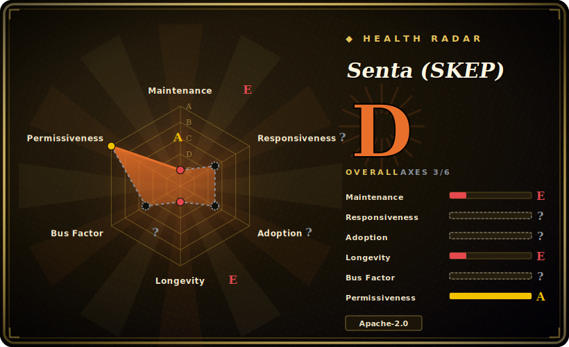

# Senta (SKEP)

Baidu's open-source sentiment-analysis toolkit built on SKEP — a sentiment-knowledge-enhanced pretraining method (ACL 2020) — shipping Chinese/English pretrained models and a one-line prediction tool, all on the PaddlePaddle 1.x framework.

## When to use

You're an NLP researcher or a product engineer working primarily in Chinese, and you need sentiment analysis — sentence-level polarity, aspect-level sentiment, or opinion-role extraction — with strong reported accuracy on Chinese benchmarks (ChnSentiCorp, NLPCC). You want to *reproduce or build on the SKEP paper* rather than train from scratch. You clone Senta, install PaddlePaddle, download the released SKEP Chinese/English checkpoints (initialized from ERNIE/RoBERTa), and use the bundled one-click predictor to score text in a few lines, or fine-tune on your own data using the provided training scripts.

You reach for it specifically when you're inside the **PaddlePaddle / ERNIE ecosystem** and want a sentiment-specialized pretrained model with a published method behind it — the value is the SKEP models and the reproducible benchmark setup, not a general-purpose, framework-agnostic library.

## When NOT to use

- **You're not on PaddlePaddle.** It targets PaddlePaddle 1.6.3 specifically — an old, pre-2.0 Paddle release. If your stack is PyTorch/TF/HF Transformers, the integration cost is high and there's no first-class port here. For most teams a Hugging Face sentiment model is the lower-friction path. [推断]
- **You need a maintained, current toolkit.** Idle since ~2024-08, pinned to a long-superseded Paddle 1.x and old NLP deps; expect environment archaeology and no upstream fixes. Baidu's newer NLP work lives in PaddleNLP/ERNIE repos, not here.
- **You want easy, modern install.** PaddlePaddle 1.6.3 + CUDA 10.1 + cuDNN 7.4 + NCCL2 with hand-set `LD_LIBRARY_PATH` (per `env.sh`) is a heavy, dated GPU setup, not a `pip install` and go. [推断]
- **English-first or multilingual-broad needs.** It does ship English SKEP, but the project's emphasis and strongest story is Chinese sentiment; broad multilingual sentiment is better served elsewhere.
- **Production serving at scale.** This is research/reference code; you'd wrap and harden it yourself, and you'd be doing so on an EOL framework version.

## Comparison

| Alternative | In index | Tradeoff |
|---|---|---|
| Hugging Face sentiment models | 未收录 | Huge catalog of fine-tuned sentiment models (incl. Chinese) on PyTorch/Transformers with trivial install; not the specific SKEP method, but far easier to adopt and maintain. |
| PaddleNLP / ERNIE | 未收录 | Baidu's actively-maintained successor NLP stack on Paddle 2.x; where current Baidu NLP (incl. sentiment) development actually happens — Senta is the older, frozen sibling. |
| SnowNLP / cnsenti | 未收录 | Lightweight Chinese sentiment libraries (lexicon/classic ML); trivial to run, far weaker than pretrained transformers — opposite end of the accuracy/effort tradeoff. |
| [CLIP](clip.md) | ✅ | Unrelated modality (vision-language) but the same shelf — an org-published reference model release where the *checkpoints + paper* are the asset, not active library maintenance. |

## Tech stack

- **Language:** Python.
- **Framework:** PaddlePaddle 1.6.3 (Baidu's deep-learning framework, 1.x line).
- **Method/models:** SKEP sentiment pretraining; released Chinese/English checkpoints initialized from ERNIE 1.0/2.0 and RoBERTa.
- **Supporting libs:** `nltk`, `numpy`, `scikit-learn`, `sentencepiece`, `six` (pinned, older versions).
- **Surface:** training (`train.py`), inference (`infer.py`), a one-click prediction tool, and config/data scaffolding.

## Dependencies

- **Framework:** PaddlePaddle 1.6.3 (the README pins `paddlepaddle-gpu==1.6.3.post107`); a GPU build is the expected path.
- **System (GPU path):** CUDA 10.1, cuDNN 7.4, NCCL2, with library paths exported manually via `env.sh`.
- **Models:** SKEP Chinese/English checkpoints must be downloaded separately into `model_files/` (not in-repo).
- **Python libs:** `nltk==3.4.5`, `numpy==1.14.5`, `scikit-learn==0.20.4`, `sentencepiece==0.1.83`, `six` — all old pins. [推断]

## Ops difficulty

**High, driven by the framework.** The model usage itself is straightforward (download checkpoint, run the predictor), but the *environment* is the burden: PaddlePaddle 1.6.3 is a pre-2.0 release tied to CUDA 10.1 / cuDNN 7.4 / NCCL2, configured by hand-editing `env.sh` and `LD_LIBRARY_PATH`. Reproducing that GPU stack in 2026 means pinning old CUDA and an EOL Paddle, almost certainly inside a container. Because the project is idle, you get no help when the dated stack breaks. Inference on a single GPU is light; the difficulty is purely getting the legacy framework to run.

## Health & viability

- **Maintenance (2026-06).** Last pushed 2024-08; no releases/tags; ~74 open issues. Effectively **idle/coasting** — the SKEP work is "published and frozen", with active Baidu NLP development moved to PaddleNLP/ERNIE. [推断]
- **Governance / backing.** Backed by **Baidu** (Organization owner) — real institutional weight and a peer-reviewed method (ACL 2020) behind it. But big-vendor backing doesn't equal *this repo* being maintained; Baidu has clearly moved its NLP roadmap elsewhere. Bus-factor concern is "superseded by sibling project", not "lone hobbyist". [推断]
- **Age & Lindy verdict.** Created 2018-07 (~8 years) but **not currently active** ⇒ age is not Lindy on its own here; its durable value is the SKEP method/checkpoints, not living maintenance. [推断]
- **Adoption.** ~2.0k stars / ~365 forks; cited via the SKEP ACL 2020 paper and used in the Paddle/ERNIE community. [未验证]
- **Risk flags.** **EOL framework pin** (PaddlePaddle 1.6.3) is the dominant risk — it gates every other thing; license itself (Apache-2.0) is permissive and not a concern. [推断]

## Caveats (unverified)

- [未验证] ~2.0k stars / ~365 forks / ~74 open issues as of 2026-06; counts are date-sensitive and indicative only.
- [未验证] Exact availability/locations of the SKEP checkpoint downloads are not re-verified here; the README points to `model_files/` download steps.
- [推断] "PaddlePaddle 1.6.3 + CUDA 10.1 won't install easily on a modern machine" is inferred from the pinned versions and `env.sh`, not from a tested install on current hardware.
- [推断] "Development moved to PaddleNLP/ERNIE" is inferred from this repo's idleness plus Baidu's known active NLP repos, not from an explicit deprecation notice in Senta.
