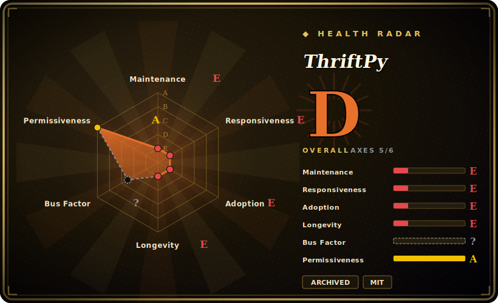

# ThriftPy

A pure-Python implementation of Apache Thrift that loads a `.thrift` file at runtime and generates the RPC client/server code on the fly — **deprecated and archived**, superseded by [thriftpy2](https://github.com/Thriftpy/thriftpy2).

## When to use

Honestly, you almost never reach for *this* repo new in 2026 — but here's the scenario where its lineage matters. You're a Python backend engineer at a shop that talks Apache Thrift between services, and the official `thrift` Python binding annoys you: it needs a code-generation step (`thrift --gen py`), the generated code is verbose, and building it can drag in a compiler. You want to just point at the `.thrift` IDL and have working client/server objects appear. ThriftPy's pitch was exactly that: `pingpong = thriftpy.load("pingpong.thrift")` and you get the module in-process, no codegen build step, wire-compatible with upstream Thrift servers/clients. You set up a server with `make_server` and a client with `make_client` in a handful of lines.

In practice today, that pitch lives on in **thriftpy2**, the maintained fork. You'd land on *this* page when you inherit a legacy service still importing `thriftpy` (Python 2.7 era), need to understand what it does before migrating, or are choosing the family and need to know that the active member is thriftpy2, not this archived original.

## When NOT to use

- **It is deprecated and the repo is archived.** The README's first line says migrate to thriftpy2; the GitHub repo is archived (read-only, no new commits/issues). Do not start anything new on it. [推断]
- **No releases since 2016, no pushes since 2018.** Last tag `v0.3.9` is 2016-08; last push 2018-12. It predates modern Python — written for Python 2.7 / 3.4+ — and has no fixes for newer interpreters or CVEs. [未验证]
- **You want the maintained version.** Use **thriftpy2** instead — same load-`.thrift`-at-runtime model, still actively pushed (2026-06), supports current Python.
- **You need protocols/transports beyond its set.** It implements binary/compact/JSON protocols and buffered/framed/tornado/http transports as of 2016; anything newer in Apache Thrift won't be here.
- **You depend on the old tornado integration.** Its async server/client are pinned to `tornado>=4.0,<5.0` and `toro` — both long obsolete; this will not coexist with a modern async stack.
- **You need vendor/foundation support.** It is a community project (originally from eleme), now frozen; no support channel.

## Comparison

| Alternative | In index | Tradeoff |
|---|---|---|
| thriftpy2 | 未收录 | The maintained successor by the same org — same runtime-load-`.thrift` model, current Python, active in 2026. The drop-in reason to leave this repo. |
| Apache Thrift (official `thrift` Python lib) | 未收录 | Canonical, multi-language, foundation-governed; requires a code-generation build step and is heavier, but is the reference implementation and broadly supported. |
| gRPC + Protocol Buffers | 未收录 | Different IDL/wire protocol (HTTP/2, protobuf); far larger ecosystem and tooling, the common modern choice for new RPC, but not Thrift-compatible. |
| Apache Avro | 未收录 | Schema-based serialization with RPC; JSON-defined schemas, strong in data/Hadoop ecosystems; not wire-compatible with Thrift. |

## Tech stack

- **Language:** pure Python (CPython 2.7 / 3.4+, PyPy per the 2016 README), with **optional Cython** extensions for the binary/compact protocols and buffered transport to speed up the hot path.
- **Parser:** `ply` (Python Lex-Yacc) is the one hard runtime dependency — it parses the `.thrift` IDL at load time.
- **Protocols:** binary (py + cython), compact (py + cython), JSON. **Transports:** buffered (py + cython), framed, tornado, http.
- **Model:** loads the `.thrift` file into a Python module object at runtime (`thriftpy.load`), optionally via an import hook, instead of an offline codegen step.

## Dependencies

- **Runtime:** `ply>=3.4,<4.0` (required). That's the only mandatory dependency.
- **Optional:** `tornado>=4.0,<5.0` + `toro>=0.6` for the async tornado server/client; `cython>=0.23` at build time to compile the native protocol/transport extensions (falls back to pure Python on PyPy / non-UNIX / when Cython is absent).
- **External services:** none of its own — it's a client/server RPC library; you supply the services that speak Thrift on the wire.

## Ops difficulty

**Low to operate, but high *risk* because it's frozen.** As a library there's nothing to deploy or run beyond `pip install` and your own service process — no datastore, no daemon. The operational burden is entirely the staleness: it targets Python 2.7/3.4 and pins obsolete tornado; on a modern interpreter you may hit incompatibilities, and there will be no upstream fix because the repo is archived. The realistic "ops" task here is **migration to thriftpy2**, not running this. [推断]

## Health & viability

- **Maintenance (2026-06).** **Abandoned / archived.** Last release `v0.3.9` 2016-08, last push 2018-12, repo flagged `archived` on GitHub. The README explicitly deprecates it in favor of thriftpy2. [推断]
- **Governance / bus factor.** Lives under the `Thriftpy` GitHub org (Organization owner), originally created at eleme. Maintainer effort has fully moved to the thriftpy2 repo; this one receives nothing. [推断]
- **Age × Lindy.** Created 2014-02 (~12 years old) but **not still active** — a long-*abandoned* project fails the Lindy test rather than passing it. Longevity here is history, not a safety signal. [推断]
- **Successor health.** **thriftpy2** (same org) is the live continuation: pushed 2026-06, not archived, ~587 stars, ~43 open issues — the bet to make if you want this family. [未验证]
- **Risk flags.** Deprecation notice (explicit), archived repo, Python 2-era code, obsolete pinned async deps. No relicense history (MIT throughout). The dominant risk is simply that it is end-of-life.

## Caveats (unverified)

- [未验证] ~1,148 stars / 281 forks / 72 open issues as of 2026-06 from the GitHub API — star/issue counts are date-sensitive and indicative only; an archived repo's open-issue count is effectively frozen.
- [未验证] Python version support (2.7 / 3.4+ / PyPy) and the exact protocol/transport list are taken from the 2016-era README and `setup.py`; behavior on current Python 3.12+ is not verified and likely degraded.
- [未验证] thriftpy2 facts (active in 2026, ~587 stars) are from the GitHub API snapshot and assumed to be the maintained successor based on the README's migration link; feature parity vs this repo was not exhaustively diffed.
- [推断] "Frozen / will not be fixed" is inferred from the `archived` flag plus deprecation notice, not from a maintainer statement enumerating dropped support.
- [推断] The optional-Cython build fallback behavior is read from `setup.py` logic (UNIX + CPython only), not run/verified here.
