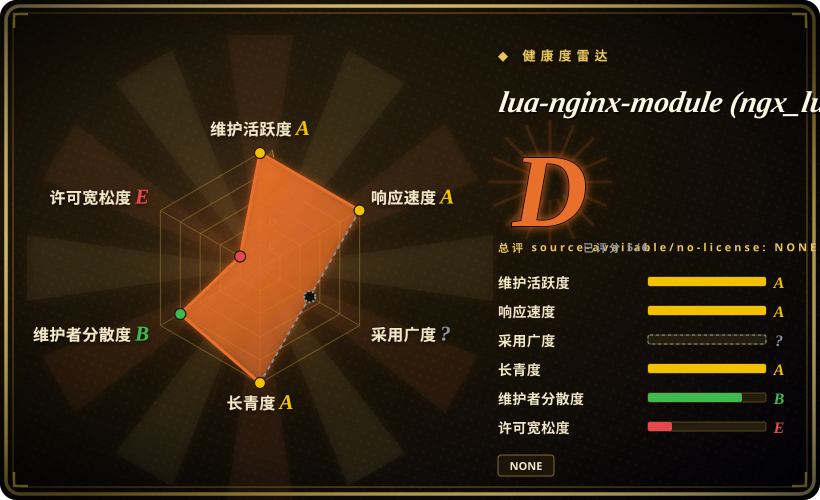

# lua-nginx-module (ngx_lua)

一个把 LuaJIT（或 Lua）虚拟机嵌入服务器的 NGINX 模块，让你在请求处理的每个阶段——rewrite、access、content、log——运行 Lua，并配一套非阻塞 cosocket API，使你的 Lua 能与上游 TCP/UDP 服务通信而不卡住 worker。

## 何时使用

你在 NGINX 之上构建网关/边缘逻辑——鉴权、请求整形、A/B 路由、动态上游选择、限流、自定义 header——你已经撞到了静态 `nginx.conf` 指令能表达的天花板。你不想为每次行为变更去写 C 模块再重编 NGINX，也不想只为做个路由决策就在请求路径上塞一个单独的应用服务器。你引入 `ngx_lua`（几乎总是通过 OpenResty 套件），于是这些逻辑都用 Lua 写：`access_by_lua_block { ... }` 拦请求、`content_by_lua_block { ... }` 直接出响应、`rewrite_by_lua` 改 URI——全部跑在 NGINX worker 内、带着 LuaJIT 的速度。

决定性的特性是 **cosocket** API：你的 Lua 能在请求中途对 Redis、数据库或某个内部 HTTP 服务开非阻塞 TCP/UDP 连接，`await` 结果再继续——而不阻塞事件循环。正是它把 NGINX 从静态代理变成可编程平台，也是 API 网关（Kong、APISIX）、WAF 和定制边缘逻辑的底座。当你想要 NGINX 的性能、又需要真正的逐请求可编程时，就选它。

## 何时不用

- **你只需要静态配置。** 若 `proxy_pass`、`map`、`limit_req` 之类已经表达了你的路由，再加一个 Lua VM 就是多余复杂度和新的故障面。配置能声明的就别去写脚本。
- **你不走 OpenResty/LuaJIT 路线。** 这个模块与特定 NGINX 版本和 LuaJIT 紧耦合；你几乎从不单独构建它——你用 OpenResty。把它 pin 到某个最前沿或厂商打过补丁的 NGINX 上很痛、也容易搞错。
- **在 Lua 里做阻塞 I/O。** 整个模型依赖 cosocket 和非阻塞调用。在处理器里调阻塞 C 库、`os.execute` 或同步 DB 驱动，会卡死整个 worker——刚接触事件模型的团队最容易踩的雷。
- **逐请求做 CPU 密集工作。** Lua 跑在 worker 里；逐请求做重型加密、大数据运算或长循环，会拖累该 worker 上所有人的延迟。把它下放给上游服务。
- **你想要开箱即用的网关。** 这是*基质*，不是产品。若你想要现成的路由、插件、鉴权和管理 API，请用基于它构建的网关（Kong/APISIX），而不是从裸 `ngx_lua` 拼一个。
- **对维护者集中度敏感。** 开发高度集中在 OpenResty 核心（见健康度）；对一个久经沙场的模块没问题，但若你需要广泛的独立治理，要掂量。

## 横向对比

| 替代品 | 是否收录 | 我们的评价 | 取舍 |
|---|---|---|---|
| OpenResty（套件） | 未收录 | 想要匹配好的 NGINX、LuaJIT、本模块和 lua-resty 库一起交付时，选 OpenResty。 | 实际上很多团队就是这样消费 ngx_lua；本仓库只是这个发行版里的一个组件。 |
| njs（nginx JavaScript） | 未收录 | 第一方 NGINX JavaScript 脚本比 Lua/OpenResty 生态更重要时，选 njs。 | 它安装更简单且官方支持，但生态更小，也不如 Lua/OpenResty 世界成熟。 |
| nginx C 模块 | 未收录 | 最大控制力和性能值得用 C 编写并每次变更重编 NGINX 时，选 C 模块。 | 这正是 ngx_lua 试图绕开的高摩擦路线。 |
| Envoy + Lua/Wasm 过滤器 | 未收录 | 代理平台本身应是 Envoy，且需要 xDS、可观测性和 Lua/Wasm 扩展点时，选 Envoy 过滤器。 | 控制面故事更丰富，但运维比 NGINX+Lua 更重。 |
| Caddy + 插件（Go） | 未收录 | 自动 TLS 和 Go 插件生态比 NGINX 边缘脚本深度更重要时，选 Caddy 插件。 | 语言和生态不同，缺少 ngx_lua 那种请求阶段脚本深度。 |
| [lua-resty-redis](lua-resty-redis.zh.md) | ✅ | 不要把 lua-resty-redis 当替代品；需要跑在 ngx_lua cosocket 上的 Redis 客户端时才用它。 | 它是互补库，不是提供运行时 API 的 ngx_lua 模块替代品。 |

## 技术栈

- **语言：** C（NGINX 模块），嵌入 **LuaJIT**（首选）或标准 Lua 5.1。
- **执行模型：** 在 NGINX 请求各阶段挂 Lua 处理器（`set_by_lua`、`rewrite_by_lua`、`access_by_lua`、`content_by_lua`、`header_filter_by_lua`、`body_filter_by_lua`、`log_by_lua`，外加 `init_by_lua`/定时器）。
- **cosocket API：** 与 NGINX 事件循环集成的非阻塞 TCP/UDP socket——`lua-resty-*` 驱动生态的基础。
- **分发：** 编译期内建进 NGINX 二进制；实际上通过 OpenResty 套件消费（匹配的 NGINX + LuaJIT + lua-resty 库）。

## 依赖

- **一棵匹配的 NGINX 源码树**和 **ngx_devel_kit（NDK）**模块，一起编译——你是把本模块编进 NGINX，而非默认动态加载（动态模块构建可行，但对版本敏感）。[未验证]
- **LuaJIT**（推荐）或 Lua 5.1 的头文件/运行时，构建期需要。
- **实际上：OpenResty**——几乎所有人都消费预打包、版本匹配的发行版，而非手工把 NGINX + NDK + LuaJIT + 本模块接起来。
- **运行时：** 你的 Lua 通过 cosocket 连的东西（Redis、DB、HTTP 上游）——你自己跑。

## 运维难度

**中。** 日常它就跟 NGINX 一样跑——你运维一个服务进程，Lua 写在配置文件里。成本集中在边缘：（1）**构建**对版本敏感——模块 ⇄ NGINX ⇄ LuaJIT 版本必须对齐，这正是强烈建议用 OpenResty 套件（而非手工编译）的原因；（2）**编程模型不饶人**——处理器里一个阻塞调用就卡死一个 worker，团队必须理解 cosocket/非阻塞纪律；（3）**可观测性**——在请求路径里调试 Lua 需要 `lua_code_cache`、error-log 纪律，以及对 shared dict 状态的小心。升级意味着重新验证那个版本三元组。一旦稳定，它跑起来和 NGINX 本身一样无聊。

## 健康度与可持续性

- **维护活跃度**：Grade A——最近 13 周中 10 周有提交；最后提交距今 5 天。
- **响应速度**：Grade A——中位首次响应时间 22.3 小时，基于 3 个 qualifying issues/PRs。
- **采用广度**：无法计算——ambiguous。
- **长青度**：Grade A——仓库已创建 5922 天。
- **治理集中度**：Grade B——前三贡献者占比 71.6%（?）。
- **许可风险**：Grade E——source_available/no-license: NONE。

## 存疑（未验证）

- [未验证] 截至 2026-06 约 11.8k star / 约 393 open issue / 最后 push 2026-06，tag 在 v0.10.31–v0.10.32rc 附近——易变，请重新核实。
- [未验证] 许可：GitHub API 未返回 SPDX id（`license: null`）；README 的「Copyright and License」小节写明 **BSD**（2 句文本，版权 2009–2025 chaoslawful / agentzh / OpenResty Inc.）——此处依据阅读该小节记为 BSD-2-Clause，但未通过 API 定位到专门的 `LICENSE`/`COPYRIGHT` 文件。
- [未验证] 动态模块与静态编译的构建细节，以及确切的 NGINX/LuaJIT 版本矩阵，对版本敏感、此处未 pin；请查 OpenResty 套件文档。
- [推断]「核心团队集中 / 厂商主导治理」由贡献者列表和 OpenResty Inc. 的角色推断，而非已发布的治理文档。
