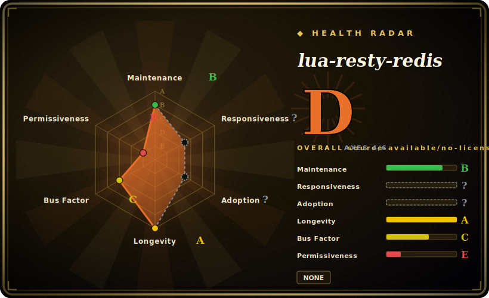

# lua-resty-redis

A non-blocking Redis client driver for OpenResty / ngx_lua — pure Lua on top of the ngx_lua cosocket API, so your NGINX worker can talk to Redis mid-request without blocking the event loop, with connection pooling and pipelining built in.

## When to use

You're writing edge logic in OpenResty — a rate limiter, a session/token check, a feature-flag lookup, a cache-aside in front of your origin — and you need to hit Redis on the hot path of a request. You can't use a normal blocking Redis client, because a synchronous call inside an NGINX worker would stall every other connection that worker is serving. You `local redis = require "resty.redis"`, create a client, `red:connect("127.0.0.1", 6379)`, and call commands as Lua methods (`red:get(key)`, `red:set(...)`, `red:incr(...)`) — every call yields cooperatively on the cosocket so the worker keeps serving other requests while it waits for Redis.

It's the standard way to reach Redis from `access_by_lua`/`content_by_lua` handlers, and it ships the ergonomics you need for production: `set_keepalive()` to return the socket to a connection pool instead of reconnecting per request, and `init_pipeline()`/`commit_pipeline()` to batch commands into one round trip. When your gateway logic — Kong/APISIX style or hand-rolled — needs Redis-backed state, this is the driver underneath.

## When NOT to use

- **You're not inside OpenResty/ngx_lua.** It depends on the cosocket API; it is **not** a general-purpose Lua Redis client for plain Lua, a CLI, or another runtime. Outside the NGINX worker it doesn't work.
- **You need Redis Cluster slot-routing built in.** This driver speaks the Redis wire protocol to one connection; cluster topology, slot mapping, and failover are not its job. For Cluster you layer a separate `lua-resty-redis-cluster`-style library or handle routing yourself. [未验证]
- **High-level abstractions / ORMs.** It's a thin command driver, not a caching framework, lock manager, or object mapper. Patterns like distributed locks or cache stampede protection are yours to build on top.
- **Heavy per-request Redis chatter.** Many sequential round trips per request add latency to the worker; pipeline them or rethink the access pattern — the driver is fast, but the network model still applies.
- **You forget connection pooling.** Skipping `set_keepalive()` means a new TCP connect (and possibly auth) per request — a common performance footgun, not a defect of the library.

## Comparison

| Alternative | In index | Tradeoff |
|---|---|---|
| [lua-nginx-module](lua-nginx-module.md) | ✅ | The module this driver *runs on* (provides the cosocket API) — foundation, not an alternative. |
| lua-resty-redis-cluster | 未收录 | Community libraries adding Redis Cluster slot-routing on top of this driver — what you reach for when single-node isn't enough. |
| resty.redis via OpenResty bundle | 未收录 | The same library as shipped inside OpenResty — usually how you actually get it, version-matched with ngx_lua. |
| A blocking Lua Redis client (redis-lua) | 未收录 | Works in plain Lua but **blocks** — unusable inside an NGINX worker; opposite design goal. |
| Gateway-native Redis plugins (Kong/APISIX) | 未收录 | Higher-level rate-limit/cache plugins that often use this driver underneath; product features vs raw driver. |

## Tech stack

- **Language:** pure Lua (LuaJIT under OpenResty), no C extension of its own.
- **Built on:** the ngx_lua **cosocket** API (`ngx.socket.tcp`) — non-blocking sockets integrated with NGINX's event loop.
- **Protocol:** speaks the Redis wire protocol (RESP) directly; commands are exposed as Lua methods.
- **Production helpers:** connection pooling via `set_keepalive()`, pipelining via `init_pipeline()`/`commit_pipeline()`.

## Dependencies

- **OpenResty / ngx_lua** providing the cosocket API — the hard requirement; this library does nothing without it.
- **A reachable Redis server** (the thing it's a client for) — yours to run.
- **No external Lua packages required** beyond what OpenResty bundles; it's typically already present in the OpenResty distribution.
- **Runtime:** runs inside the NGINX worker process — no separate process or service of its own.

## Ops difficulty

**Low (as a library).** There's nothing to deploy or operate for the driver itself — it's Lua code loaded by OpenResty, almost always already bundled. The operational care is in *how you use it*: always `set_keepalive()` to reuse connections (sizing the pool to your worker count and Redis `maxclients`), set sensible connect/read timeouts so a slow Redis doesn't pile up requests, handle auth/TLS if your Redis requires it, and pipeline where you'd otherwise do chatty sequential calls. The hard thing to run is **Redis itself** (HA, persistence, memory) — the driver just connects to it.

## Health & viability

- **Maintenance (2026-06) — active.** Last push **2026-05**; tag line through **v0.33** (the GitHub releases UI lists an older v0.29 from 2020, but the tag list and recent push show ongoing work). README states "considered production ready." Not archived. [推断]
- **Governance / backing.** `Organization`-owned (OpenResty / OpenResty Inc.); same core team as ngx_lua (agentzh et al.). Development is **concentrated in the OpenResty core** — vendor/founder-led, a bus-factor consideration, but it's first-party tooling for the platform it targets, which lowers abandonment risk. [推断]
- **Age × Lindy.** Created **2012-02** (~14 years) and **still maintained** ⇒ a **strong Lindy** signal; it's the canonical, long-proven Redis driver for the OpenResty ecosystem, embedded under major gateways. Old-and-active. [推断]
- **Adoption.** Broad within the OpenResty/gateway world (the default Redis driver there); ~2.0k stars understates real usage because it ships inside OpenResty and gateway products. License BSD-2-Clause (read from README: "licensed under the BSD license", 2-clause text, © 2012–2017 agentzh / OpenResty Inc.). [推断]
- **Risk flags.** Tight coupling to OpenResty (useless outside it) and OpenResty-core concentration are the real ones; no Cluster routing built in is a scope boundary, not a health flag. No relicense history found. [推断]

## Caveats (unverified)

- [未验证] ~2.0k stars / ~75 open issues / last push 2026-05 / tags through ~v0.33 as of 2026-06 — the GitHub releases page shows v0.29 (2020) as the latest *release*, while tags go higher; volatile, re-check.
- [未验证] License: GitHub's API returned no SPDX id (`license: null`); the README's "Copyright and License" states **BSD** (2-clause text) — recorded as BSD-2-Clause from reading that section; no standalone `LICENSE` file located via the API.
- [未验证] Redis Cluster support is not built in; cluster routing requires a separate library — exact options/versions not verified here.
- [推断] "OpenResty-core concentration / vendor-led" is inferred from the shared OpenResty contributor base, not a governance document.
