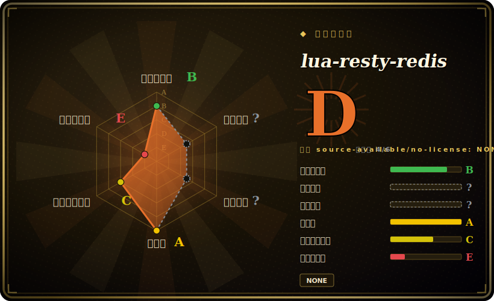

# lua-resty-redis

一个面向 OpenResty / ngx_lua 的非阻塞 Redis 客户端驱动——纯 Lua，跑在 ngx_lua cosocket API 之上，让你的 NGINX worker 能在请求中途连 Redis 而不阻塞事件循环，内建连接池和 pipeline。

## 何时使用

你在 OpenResty 里写边缘逻辑——限流器、会话/令牌校验、特性开关查询、源站前的 cache-aside——需要在请求热路径上访问 Redis。你不能用普通的阻塞 Redis 客户端，因为在 NGINX worker 里的同步调用会卡住该 worker 正在服务的所有其它连接。你 `local redis = require "resty.redis"`，建一个客户端，`red:connect("127.0.0.1", 6379)`，把命令当 Lua 方法调（`red:get(key)`、`red:set(...)`、`red:incr(...)`）——每次调用都在 cosocket 上协作式让出，所以 worker 在等 Redis 时仍继续服务其它请求。

它是从 `access_by_lua`/`content_by_lua` 处理器里访问 Redis 的标准方式，并自带生产所需的工效：`set_keepalive()` 把 socket 归还连接池而非每请求重连，`init_pipeline()`/`commit_pipeline()` 把命令批量打成一次往返。当你的网关逻辑——Kong/APISIX 风格或手写——需要 Redis 支撑的状态时，底下就是这个驱动。

## 何时不用

- **你不在 OpenResty/ngx_lua 内。** 它依赖 cosocket API；它**不是**给普通 Lua、CLI 或其它运行时用的通用 Lua Redis 客户端。在 NGINX worker 之外它不工作。
- **你需要内建的 Redis Cluster 槽位路由。** 这个驱动对单个连接讲 Redis 线协议；集群拓扑、槽位映射、故障转移不归它管。要用 Cluster 就叠一个单独的 `lua-resty-redis-cluster` 之类的库，或自己处理路由。[未验证]
- **高层抽象 / ORM。** 它是薄命令驱动，不是缓存框架、锁管理器或对象映射。分布式锁、缓存击穿保护这类模式得你自己在它之上搭。
- **逐请求与 Redis 频繁来回。** 每请求多次顺序往返会给 worker 加延迟；把它们 pipeline 起来或重想访问模式——驱动很快，但网络模型仍在。
- **你忘了连接池。** 跳过 `set_keepalive()` 意味着每请求一次新 TCP 连接（可能还有 auth）——是常见的性能雷，不是库的缺陷。

## 横向对比

| 替代品 | 是否收录 | 我们的评价 | 取舍 |
|---|---|---|---|
| [lua-nginx-module](lua-nginx-module.zh.md) | ✅ | 当前页用于它的主场景；如果更看重“本驱动*跑在其上*的模块（提供 cosocket API）”，再选 lua-nginx-module。 | 本驱动*跑在其上*的模块（提供 cosocket API）——基础，不是替代。 |
| lua-resty-redis-cluster | 未收录 | 当前页用于它的主场景；如果更看重“在本驱动之上加 Redis Cluster 槽位路由的社区库”，再选 lua-resty-redis-cluster。 | 在本驱动之上加 Redis Cluster 槽位路由的社区库——单节点不够用时的去处。 |
| OpenResty 套件里的 resty.redis | 未收录 | 当前页用于它的主场景；如果更看重“与 OpenResty 内置的同一个库”，再选 OpenResty 套件里的 resty.redis。 | 与 OpenResty 内置的同一个库——通常你就是这么拿到它的，与 ngx_lua 版本匹配。 |
| 阻塞式 Lua Redis 客户端（redis-lua） | 未收录 | 当前页用于它的主场景；如果更看重“在普通 Lua 里能用但会**阻塞**”，再选 阻塞式 Lua Redis 客户端（redis-lua）。 | 在普通 Lua 里能用但会**阻塞**——在 NGINX worker 里不可用；设计目标相反。 |
| 网关原生 Redis 插件（Kong/APISIX） | 未收录 | 当前页用于它的主场景；如果更看重“更高层的限流/缓存插件，底下常用本驱动”，再选 网关原生 Redis 插件（Kong/APISIX）。 | 更高层的限流/缓存插件，底下常用本驱动；产品功能 vs 裸驱动。 |

## 技术栈

- **语言：** 纯 Lua（OpenResty 下为 LuaJIT），自身无 C 扩展。
- **构建于：** ngx_lua 的 **cosocket** API（`ngx.socket.tcp`）——与 NGINX 事件循环集成的非阻塞 socket。
- **协议：** 直接讲 Redis 线协议（RESP）；命令以 Lua 方法暴露。
- **生产辅助：** 通过 `set_keepalive()` 做连接池，通过 `init_pipeline()`/`commit_pipeline()` 做 pipeline。

## 依赖

- **OpenResty / ngx_lua** 提供 cosocket API——硬性要求；没有它本库什么都干不了。
- **一个可达的 Redis 服务**（它是其客户端）——你自己跑。
- **无需 OpenResty 之外的额外 Lua 包**；它通常已在 OpenResty 发行版里。
- **运行时：** 跑在 NGINX worker 进程里——没有自己的独立进程或服务。

## 运维难度

**低（作为库）。** 驱动本身没东西要部署或运维——它是 OpenResty 加载的 Lua 代码，几乎总是已经打包好。运维上的讲究在*你怎么用*：始终 `set_keepalive()` 复用连接（按 worker 数和 Redis `maxclients` 给连接池定容）、设合理的 connect/read 超时以免慢 Redis 堆积请求、若 Redis 需要就处理 auth/TLS，并在本会频繁顺序调用处做 pipeline。难跑的是 **Redis 本身**（HA、持久化、内存）——驱动只是连上去。

## 健康度与可持续性

- **维护（2026-06）——活跃。** 最后 push 在 **2026-05**；tag 线到 **v0.33**（GitHub releases 界面列的是 2020 年的较旧 v0.29，但 tag 列表和近期 push 显示仍在干）。README 写「considered production ready」。未归档。[推断]
- **治理 / 背书。** `Organization` 所有（OpenResty / OpenResty Inc.）；与 ngx_lua 同一核心团队（agentzh 等）。开发**集中在 OpenResty 核心**——厂商/创始人主导，是个 bus-factor 考量，但它是其所服务平台的第一方工具，这降低了被弃风险。[推断]
- **年龄 × Lindy。** 2012-02 创建（约 14 年）且**仍在维护** ⇒ **强 Lindy** 信号；它是 OpenResty 生态里规范、久经验证的 Redis 驱动，嵌在主流网关底下。老而活跃。[推断]
- **采用度。** 在 OpenResty/网关世界里很广（那里默认的 Redis 驱动）；约 2.0k star 低估了真实使用，因为它随 OpenResty 和网关产品一起分发。许可 BSD-2-Clause（读自 README：「licensed under the BSD license」，2 句文本，© 2012–2017 agentzh / OpenResty Inc.）。[推断]
- **风险标记。** 与 OpenResty 紧耦合（之外无用）和 OpenResty 核心集中是真正的风险；不内建 Cluster 路由是范围边界，而非健康红旗。未发现 relicense 历史。[推断]

## 存疑（未验证）

- [未验证] 截至 2026-06 约 2.0k star / 约 75 open issue / 最后 push 2026-05 / tag 到约 v0.33——GitHub releases 页把 v0.29（2020）显示为最新*发布*，而 tag 更高；易变，请重新核实。
- [未验证] 许可：GitHub API 未返回 SPDX id（`license: null`）；README 的「Copyright and License」写 **BSD**（2 句文本）——此处依据阅读该小节记为 BSD-2-Clause；未通过 API 定位到独立的 `LICENSE` 文件。
- [未验证] 不内建 Redis Cluster 支持；集群路由需要单独的库——具体方案/版本此处未核实。
- [推断]「OpenResty 核心集中 / 厂商主导」由共享的 OpenResty 贡献者群推断，而非治理文档。
