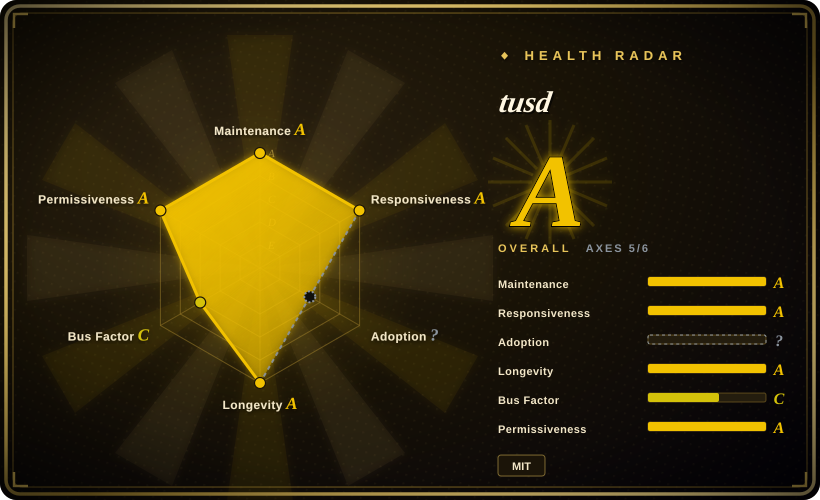

# tusd

The official reference server for the **tus** resumable upload protocol — a high-performance Go binary that receives large file uploads over HTTP, supports resuming from any byte offset, and streams them to local disk or cloud storage (S3, GCS, Azure, Alibaba Cloud, R2) without your application ever buffering the raw bytes.

## When to use

You're building a web or mobile app where users upload large files — videos, high-res images, backups — and the upload frequently fails due to spotty Wi-Fi, mobile network handoffs, or users killing the app mid-transfer. You need a robust, protocol-based solution so that when a transfer breaks, the client can resume exactly where it left off instead of restarting from byte zero. You deploy tusd as a standalone HTTP server (or embed it as a Go library), point your client at its `/files/` endpoint, and configure the backend you want — local disk for staging, or S3/GCS for permanent storage. The tus protocol is supported by client libraries in JavaScript, Java, Python, Go, and more, so your front-end team plugs in `tus-js-client` or Uppy and gets resumable uploads with retry logic for free. It fits when you want the resumable-upload behavior without implementing the protocol state machine yourself.

## When NOT to use

- **Simple, small-file uploads on reliable networks.** If your uploads are under a few MB and happen on stable corporate LANs, the complexity of a dedicated resumable-upload server is overkill — a standard multipart form POST handled by your framework is simpler and has fewer moving parts.
- **You can go direct-to-object-storage.** If your clients can upload straight to S3/GCS via presigned URLs, you bypass tusd entirely and save the infrastructure hop. Modern SDKs handle retry and multipart upload for you; tusd adds value when you need the open protocol and cross-client compatibility.
- **You're not running Go or HTTP.** tusd is a Go server; while it exposes a plain HTTP protocol, if your stack is deeply gRPC or WebSocket-native and you don't want an HTTP upload tier, this is friction.
- **You need real-time collaboration on uploads.** tusd handles single-client resumable streams; it is not a real-time sync or multi-participant upload service. For collaborative upload scenarios, look elsewhere.
- **No ops bandwidth for another service.** Even as a single binary, tusd is a separate service to deploy, monitor, secure, and upgrade. If your team is already stretched and uploads are not a core pain point, the added infrastructure may not justify the benefit.
- **You need NGINX module-level integration.** tusd is a standalone HTTP server, not an NGINX module. It typically sits behind NGINX as a reverse proxy, but the bytes still traverse your infrastructure stack. If you need NGINX itself to handle the upload stream directly (e.g., to avoid proxy buffering), this is not that tool.

## Comparison

| Alternative | In index | Our verdict | Tradeoff |
|---|---|---|---|
| [nginx-upload-module](nginx-upload-module.md) | ✅ | Use this page for its stated niche; choose nginx-upload-module when you need NGINX itself to stream multipart uploads to disk at the edge — but it is an aging C fork with low activity. | NGINX streams uploads to disk directly; no separate service. But it's a low-activity third-party C module you compile into NGINX, with limited resumable support compared to the full tus protocol. |
| NGINX `client_body_*` buffering + app handling | 未收录 | Use this page for its stated niche; choose NGINX client-body buffering when you want first-party, no-extra-module handling. | First-party, no extra module — NGINX buffers the body and your app parses it. Simpler, but your app still processes the upload and you build resumability yourself. |
| Direct-to-S3 presigned uploads | 未收录 | Use this page for its stated niche; choose direct-to-S3 when you can bypass your servers entirely for the bytes. | Bypasses your servers entirely; best scalability. But ties you to AWS SDK/client logic and doesn't give you an open, cross-vendor resumable protocol. |
| Application framework upload handling (Django/Rails/Express) | 未收录 | Use this page for its stated niche; choose framework upload handling when uploads are small, rare, and your team has no ops bandwidth. | Zero infra beyond your app. But the app server absorbs slow-client cost and you build resumability/retry yourself. |
| tus JavaScript client (tus-js-client) | 未收录 | This is the *client* companion, not a server alternative. You use tus-js-client in the browser to talk to tusd. | A client library, not a substitute. It pairs with tusd (or any tus server). |
| Uppy | 未收录 | Use this page for its stated niche; choose Uppy when you need a full-featured upload widget with UI, but tusd is the *server* it can talk to. | A polished upload widget with many plugins; often used with tusd as the backend. Not a server replacement. |
| Resumable.js | 未收录 | Use this page for its stated niche; choose Resumable.js when you need an older, simpler resumable upload library with wider legacy browser support. | Older library, not a protocol reference implementation. Less active ecosystem than tus. |

## Tech stack

- **Language:** Go — compiles to a single static binary.
- **Protocol:** tus resumable upload protocol over HTTP/1.1 and HTTP/2 (PATCH, HEAD, OPTIONS for upload control).
- **Storage backends:** local disk, Amazon S3, Google Cloud Storage, Azure Blob Storage, Alibaba Cloud OSS, Cloudflare R2.
- **Hooks:** emits events (pre-create, post-create, pre-finish, post-finish, pre-terminate, post-terminate) to external HTTP endpoints or Go functions so you can validate, transform, or trigger workflows.
- **Go library:** can be imported as a package (`github.com/tus/tusd/v2/pkg/handler`) to embed the protocol into your own Go service.

## Dependencies

- **A place to run the binary** — tusd is a single Go binary; run it as a container, systemd service, or k8s deployment.
- **A storage backend** — local disk (with a `data/` directory) or credentials for S3/GCS/Azure/etc.
- **A reverse proxy** (optional but typical) — NGINX, Traefik, or Caddy in front for TLS termination and path routing.
- **No external database** — tusd stores upload state in the storage backend itself (e.g., S3 multipart info or local `.info` files). [未验证]

## Ops difficulty

**Low to medium.** As a single Go binary, deployment is straightforward: one container, one port, one config file. The operational surface is in three places. First, **storage backend credentials and permissions**: getting IAM policies right for S3 multipart uploads and abort rules is the part that takes the most time. Second, **hook reliability**: if you configure webhooks for upload validation, a slow or failing hook endpoint stalls the upload — you need timeouts and circuit-breakers. Third, **reverse proxy tuning**: if NGINX sits in front, you must ensure `client_max_body_size` and proxy timeouts are generous enough for large chunked uploads. Once configured, it runs quietly with minimal memory and CPU.

## Health & viability

- **Maintenance (2026-07) — active.** Regular releases through v2.6.x, active issue triage, and ongoing feature work. The project is the reference implementation of the tus protocol and is maintained by the same team that stewards the protocol. [推断]
- **Governance / bus factor.** Maintained by the `tus` GitHub organization (Transloadit-backed), not a single individual. The protocol has a community of implementers across multiple languages, so the server is not a one-off. [推断]
- **Age × Lindy.** The tus protocol and tusd have been in production use for roughly a decade (first commit ~2013). A long-lived, still-active project with a stable protocol is a strong Lindy signal. [推断]
- **Adoption.** ~6k stars, used in production by many file-transfer and media pipelines. The protocol is supported by major client libraries (Uppy, tus-js-client, tus-java-client, etc.) and storage backends. [推断]
- **Risk flags.** MIT license with no relicense history. No open-core feature gating observed. The principal risk is not project abandonment but rather architectural fit — adding a dedicated upload tier is a commitment. [推断]

## Caveats (unverified)

- [未验证] ~6k stars / exact open issue count as of 2026-07 — volatile, re-check.
- [未验证] Storage backends beyond S3 and GCS (Azure, Alibaba, R2) are documented but their exact current stability and feature parity not verified against the code here.
- [未验证] Hook/event system behavior and exact configuration surface from v2.6.x not verified against running code.
- [未验证] The claim that tusd stores state without an external database is from the documentation; exact behavior for all backends not verified.
- [推断] "Active maintenance" and "Transloadit-backed" are inferred from GitHub activity and org ownership, not a stated corporate guarantee.
