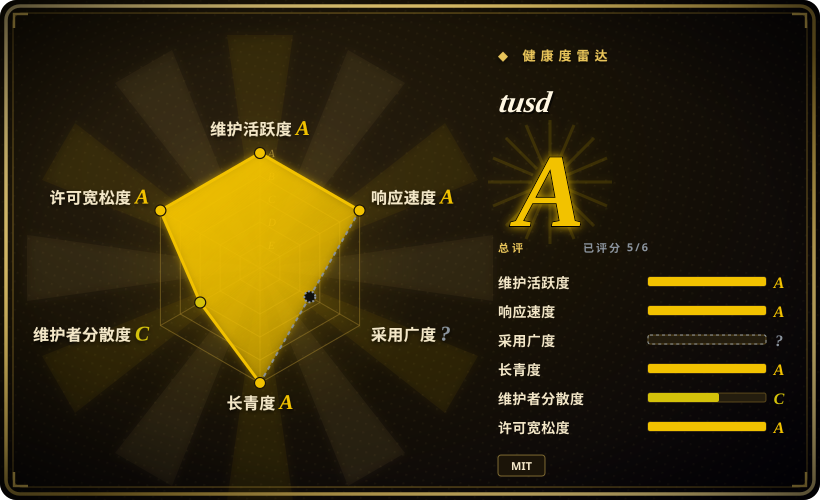

# tusd

tus 可续传上传协议的**官方参考服务器**——一个高性能 Go 二进制程序，通过 HTTP 接收大文件上传，支持从任意字节偏移处续传，并将文件流式写入本地磁盘或云存储（S3、GCS、Azure、阿里云、R2），而你的应用永远不必缓冲原始字节。

## 何时使用

你正在构建一个 Web 或移动应用，用户需要上传大文件——视频、高分辨率图片、备份文件——而上传经常因为 Wi-Fi 不稳定、移动网络切换或用户中途关闭应用而失败。你需要一个基于协议的稳健方案，使得传输中断后，客户端能从断点精确续传，而不是从零重新开始。你把 tusd 部署为一个独立的 HTTP 服务器（或作为 Go 库嵌入），将客户端指向它的 `/files/` 端点，并配置你想要的后端——本地磁盘做暂存，或 S3/GCS 做永久存储。tus 协议被 JavaScript、Java、Python、Go 等多种客户端库支持，因此你的前端团队接入 `tus-js-client` 或 Uppy 后，就能免费获得带重试逻辑的断点续传。当你希望拥有断点续传能力，又不想自己实现协议状态机时，它很合适。

## 何时不用

- **简单、小文件上传，且网络可靠。** 如果你的上传文件只有几 MB，并在稳定的企业内网进行，那么部署一个专门的断点续传服务器是过度设计——标准的多部分表单 POST 由框架直接处理更简单，活动部件也更少。
- **你能直传对象存储。** 如果客户端可以通过预签名 URL 直接上传到 S3/GCS，你就完全绕过了 tusd，省掉了一层基础设施。现代 SDK 已经自带重试和分块上传；tusd 的价值在于提供开放协议和跨客户端兼容性。
- **你的技术栈不是 Go 或 HTTP。** tusd 是 Go 服务器；虽然它暴露的是纯 HTTP 协议，但如果你的栈深度绑定 gRPC 或 WebSocket，不想再加一层 HTTP 上传层，那这就是摩擦。
- **你需要实时协作上传。** tusd 处理的是单客户端续传流；它不是实时同步或多参与者上传服务。协作上传场景请另寻他处。
- **没有运维带宽再管一个服务。** 即便只是单个二进制文件，tusd 也是独立的服务，需要部署、监控、加固和升级。如果你的团队已经捉襟见肘，且上传不是核心痛点，新增的基础设施可能得不偿失。
- **你需要 NGINX 模块级别的集成。** tusd 是独立 HTTP 服务器，不是 NGINX 模块。它通常坐在 NGINX 反向代理后面，但字节仍然要经过你的基础设施栈。如果你需要 NGINX 自己直接在边缘处理上传流（比如为了避免代理缓冲），这不是该工具。

## 横向对比

| 替代品 | 是否收录 | 我们的评价 | 取舍 |
|---|---|---|---|
| [nginx-upload-module](nginx-upload-module.zh.md) | ✅ | 当前页用于它的主场景；如果更看重「让 NGINX 自己在边缘把 multipart 上传流式落盘」，再选 nginx-upload-module——但它是一个老化、低活跃的 C 分叉。 | NGINX 直接把上传落到磁盘；无需额外服务。但它是低活跃的第三方 C 模块，要编进 NGINX，续传支持也不如完整的 tus 协议。 |
| NGINX `client_body_*` 缓冲 + 应用处理 | 未收录 | 当前页用于它的主场景；如果更看重「第一方、无额外模块」，再选 NGINX client-body 缓冲 + 应用处理。 | 第一方、无额外模块——NGINX 缓冲请求体、你的应用解析它。更简单，但应用仍要处理上传，且续传需要自己实现。 |
| 直传 S3 预签名上传 | 未收录 | 当前页用于它的主场景；如果更看重「字节完全绕过你的服务器」，再选 直传 S3 预签名上传。 | 字节完全绕过你的服务器；扩展性最佳。但绑定 AWS SDK/客户端逻辑，且不提供开放的跨厂商续传协议。 |
| 应用框架上传处理（Django/Rails/Express） | 未收录 | 当前页用于它的主场景；如果上传小且少、团队无运维带宽，再选应用框架上传处理。 | 零基础设施，只要你的应用。但应用服务器要吸收慢客户端成本，且续传/重试得自己实现。 |
| tus JavaScript 客户端（tus-js-client） | 未收录 | 这是*客户端*伴侣，不是服务器替代品。你在浏览器里用 tus-js-client 与 tusd 通信。 | 是客户端库，不是替代品。它与 tusd（或任何 tus 服务器）配对使用。 |
| Uppy | 未收录 | 当前页用于它的主场景；如果需要功能完善的带 UI 上传组件，再选 Uppy——但 tusd 是它可对接的*服务器*。 | 精致的上传组件，带很多插件；常与 tusd 搭配做后端。不是服务器替代品。 |
| Resumable.js | 未收录 | 当前页用于它的主场景；如果需要更老、更简单的续传库并支持更广泛的旧浏览器，再选 Resumable.js。 | 更老的库，不是协议参考实现。生态活跃度不如 tus。 |

## 技术栈

- **语言：** Go——编译成单个静态二进制文件。
- **协议：** tus 可续传上传协议，基于 HTTP/1.1 和 HTTP/2（用 PATCH、HEAD、OPTIONS 控制上传）。
- **存储后端：** 本地磁盘、Amazon S3、Google Cloud Storage、Azure Blob Storage、阿里云 OSS、Cloudflare R2。
- **钩子：** 向外部 HTTP 端点或 Go 函数发送事件（pre-create、post-create、pre-finish、post-finish、pre-terminate、post-terminate），以便你做校验、转换或触发工作流。
- **Go 库：** 可以作为包引入（`github.com/tus/tusd/v2/pkg/handler`），把协议嵌入你自己的 Go 服务。

## 依赖

- **一个运行二进制文件的地方**——tusd 是单个 Go 二进制；可以跑成容器、systemd 服务或 K8s 部署。
- **一个存储后端**——本地磁盘（带 `data/` 目录）或 S3/GCS/Azure 等的凭证。
- **一个反向代理**（可选但常见）——前面放 NGINX、Traefik 或 Caddy 做 TLS 终结和路径路由。
- **不需要外部数据库**——tusd 把上传状态存在存储后端本身（如 S3 分块信息或本地 `.info` 文件）。[未验证]

## 运维难度

**低到中等。** 作为单个 Go 二进制，部署很直接：一个容器、一个端口、一个配置文件。运维分量在三处。其一，**存储后端凭证与权限**：给 S3 分块上传和终止规则配好 IAM 策略是最花时间的部分。其二，**钩子可靠性**：如果你配置了上传校验用的 webhook，慢或失败的钩子端点会卡住上传——你需要超时和熔断。其三，**反向代理调参**：如果 NGINX 在前面，必须确保 `client_max_body_size` 和代理超时对大的分块上传足够宽松。配好之后，它跑起来很安静，内存和 CPU 占用都很低。

## 健康度与可持续性

- **维护（2026-07）——活跃。** 持续发布到 v2.6.x，活跃的问题分类，持续的功能迭代。本项目是 tus 协议的参考实现，由维护协议本身的团队维护。[推断]
- **治理 / bus factor。** 由 `tus` GitHub 组织（Transloadit 背书）维护，而非个人。协议拥有跨语言的实现者社区，因此这个服务器不是一次性项目。[推断]
- **年龄 × Lindy。** tus 协议和 tusd 已在生产环境使用约十年（首次提交约 2013 年）。一个长期存在且仍活跃的项目，配合稳定的协议，是强劲的 Lindy 信号。[推断]
- **采用度。** 约 6k star，被许多文件传输和媒体管线用于生产。协议被主流客户端库（Uppy、tus-js-client、tus-java-client 等）和存储后端支持。[推断]
- **风险标记。** MIT 许可，未发现 relicense 历史。未观察到 open-core 功能阉割。主要风险不是项目弃置，而是架构契合度——增加一个专门的上传层是一种承诺。[推断]

## 存疑（未验证）

- [未验证] 截至 2026-07 约 6k star / 确切的 open issue 数——易变，请重新核实。
- [未验证] 除 S3 和 GCS 之外的存储后端（Azure、阿里云、R2）在文档中有列出，但其确切的当前稳定性与功能对等性未对此处代码核实。
- [未验证] 钩子/事件系统的具体行为与 v2.6.x 的确切配置面未对运行中代码核实。
- [未验证]「tusd 不需要外部数据库存储状态」来自文档；对所有后端的确切行为未核实。
- [推断]「活跃维护」和「Transloadit 背书」由 GitHub 活跃度与组织所有权推断，而非官方企业担保。
