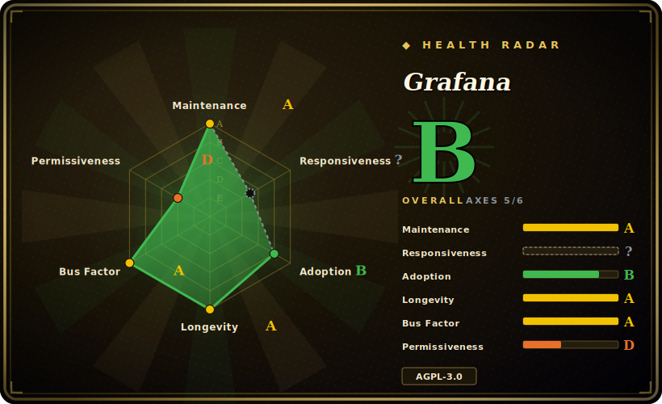

# Grafana

A dashboard and observability platform that queries metrics, logs, and traces from data sources you already run (Prometheus, Loki, Elasticsearch, InfluxDB, Postgres, and many more) and renders them as panels, with alerting on top — it stores almost nothing itself.

## When to use

You're an SRE or platform engineer running a stack that has already sprawled across stores: Prometheus for metrics, Loki for logs, Tempo or Jaeger for traces, a Postgres for business data, and maybe a cloud provider's metrics on the side. Each one ships its own UI, and your on-call rotation is tab-juggling four consoles at 3 a.m. trying to correlate a latency spike with a log line and a deploy. You stand up one Grafana, add each backend as a data source, and build a handful of dashboards where a metrics panel, a logs panel, and a trace view sit side by side over the same time range — click a spike, jump to the logs for that window, follow a trace ID. The collection and storage stay where they are; Grafana is the single query-and-visualize pane in front of all of it.

You also reach for it when you want dashboards and alert rules to live in version control rather than being hand-clicked. Dashboards are JSON, data sources and alert rules can be provisioned from files, and the whole thing can be templated with variables so one dashboard serves every environment. It is the de-facto visualization layer downstream of a collector like [Telegraf](../dev-utilities/telegraf.md) or a scraper like Prometheus — those get the data into a store, Grafana is what your team actually looks at.

## When NOT to use

- **You think it's a datastore.** It is not. Grafana holds dashboards, users, and alert config in a small relational DB (SQLite/Postgres/MySQL) — your actual time-series, logs, and traces live in Prometheus/Loki/Elasticsearch/etc., which you still have to run and pay for. Adopting Grafana does not reduce your storage footprint; it adds a query layer on top of it.
- **You want a turnkey, all-in-one monitoring product.** A hosted SaaS like Datadog, New Relic, or Grafana's own Grafana Cloud bundles collection + storage + UI + alerting with one bill and no infra to run; self-hosted Grafana is only the front end and assumes you operate the backends.
- **Your job is BI / SQL analytics and reporting.** Grafana is time-series-and-operational-dashboard shaped; for ad-hoc SQL exploration, cross-tab reports, and business dashboards, a BI tool like Apache Superset (`未收录`) or Metabase fits better.
- **You need a metrics collector or an agent.** Grafana does not scrape hosts or tail logs — that's the job of [Telegraf](../dev-utilities/telegraf.md), Prometheus exporters, Grafana Alloy, or the OTel Collector. Grafana sits downstream of whatever ships the data.
- **AGPL-3.0 and Enterprise feature-gating are a problem for you.** Grafana relicensed from Apache-2.0 to AGPL-3.0 in 2021. [推断] If you embed or expose a modified Grafana as part of a network service, AGPL copyleft can reach your changes — get legal review before shipping it inside a SaaS. Several enterprise features (fine-grained RBAC, reporting, enterprise data-source plugins, SSO/SAML in some configs) are gated behind the commercial Grafana Enterprise / Cloud tiers rather than the OSS build. [未验证]

## Comparison

| Alternative | In index | Tradeoff |
|---|---|---|
| [Telegraf](../dev-utilities/telegraf.md) | ✅ | A *collection/routing agent*, not a viz layer — it gets metrics into a store; Grafana is what reads them out. Complementary, not substitutes; commonly used together. |
| Kibana | 未收录 | Tightly coupled to Elasticsearch/OpenSearch; superb for log search and the Elastic stack, but narrower as a multi-backend dashboarding tool than Grafana's data-source-agnostic model. |
| Datadog / Grafana Cloud | 未收录 | Hosted all-in-one (collection + storage + dashboards + alerting); zero infra to run but per-host/per-metric billing and vendor lock-in vs. self-hosted Grafana over your own backends. |
| Apache Superset | 未收录 | BI/SQL-analytics dashboarding over warehouses and SQL databases; stronger for exploratory reporting and charts, weaker for operational time-series, logs, traces, and on-call alerting. |
| Metabase | 未收录 | Friendly self-service BI for business users querying SQL sources; not built for ops time-series, log/trace correlation, or PromQL/LogQL-style backends. |

## Tech stack

- **Frontend:** TypeScript + React (the dashboard UI, panels, and Scenes-based dashboarding).
- **Backend:** Go (data-source proxying, auth, alerting engine, provisioning, plugin host).
- **Plugin model:** pluggable data sources, panels, and apps; many backends ship as core or signed plugins. Dashboards are JSON; data sources and alert rules are provisionable from config files.
- **Query languages (pass-through):** Grafana does not invent one — it speaks each backend's language (PromQL for Prometheus, LogQL for Loki, SQL for relational sources, Elasticsearch DSL, InfluxQL/Flux, etc.).
- **Editions:** an OSS/AGPL build plus a commercial Grafana Enterprise build that adds gated features over the same core. [未验证]

## Dependencies

- **A relational DB for Grafana's own state:** SQLite by default (fine for single-node), or external Postgres/MySQL for HA / shared state.
- **The data sources are yours to run:** Grafana is useless without backends — Prometheus, Loki, Tempo/Jaeger, Elasticsearch/OpenSearch, InfluxDB, Postgres, cloud-provider sources, etc. These are the heavy infra; Grafana is the light part.
- **Runtime:** ships as a single Go binary, an official Docker image, and RPM/DEB/Helm-chart distributions. No external language runtime required for the server itself.
- **Optional services for full alerting:** to deliver alerts you wire up notification channels (email/SMTP, Slack, PagerDuty, webhooks); Grafana's unified alerting can also pair with an external Alertmanager.

## Ops difficulty

**Low for a single node, medium-to-high at scale.** Getting a Grafana up is genuinely easy: `docker run`, point it at a Prometheus, import a community dashboard, done — SQLite means there's no DB to provision for a quick start. The cost climbs when you make it production-grade: moving to external Postgres for HA, running multiple replicas behind a load balancer with shared session/state, wiring SSO/LDAP/SAML (some of which is Enterprise-gated), managing dashboards-as-code and provisioning across environments, keeping data-source plugins and the alerting config in order, and upgrading across releases that occasionally change dashboard/alerting schemas. The recurring truth: Grafana itself is rarely the hard part — the **backends** it queries (scaling Prometheus, sharding Loki, sizing Elasticsearch) are where the real operational weight lives.

## Health & viability

- **Maintenance (as of 2026-06):** last pushed 2026-06, latest release v13.0.2 (2026-06-09) — **actively maintained** on a steady major-version cadence. [推断] One of the most actively developed projects in observability; no abandonment risk.
- **Governance / backing:** organization-owned and driven by **Grafana Labs**, a venture-funded company; this is a **single-vendor open-source** project, not a foundation-governed one. The roadmap and commercial Enterprise/Cloud tiers are controlled by one company — strong resourcing, but the vendor sets direction and gates features.
- **Age & Lindy verdict (created 2013-12, ~13 yr):** old *and* still active — a **strong Lindy** signal. It is the de-facto dashboarding layer of the observability ecosystem and has survived more than a decade of stack churn; safe to bet on for longevity.
- **Adoption / ecosystem:** ubiquitous in SRE/platform stacks, huge plugin/data-source ecosystem, dashboards-as-code, and a large community dashboard library — deep entrenchment and integration breadth.
- **Risk flags:** **relicensed Apache-2.0 → AGPL-3.0 in 2021** — copyleft can reach a modified Grafana served over a network, so get legal review before embedding it in a SaaS. **Open-core feature-gating**: fine-grained RBAC, reporting, enterprise data-source plugins, and some SSO/SAML configs sit in the commercial tier, not the OSS build. [未验证]

## Caveats (unverified)

- [未验证] ~75.1k GitHub stars and latest release v13.0.2 (2026-06-09) as of 2026-06; star counts and version numbers are date-sensitive and shift release-to-release — treat as indicative.
- [未验证] Which features are OSS vs. Grafana Enterprise/Cloud (fine-grained RBAC, reporting, enterprise data-source plugins, certain SSO/SAML configs) moves between releases and tiers — verify the current edition matrix before assuming a feature is in the free build.
- [推断] AGPL-3.0 copyleft reaching modifications served over a network is the general nature of AGPL; the actual obligation depends on what you modify and how you distribute/serve it — this is not legal advice, get review.
- [推断] The exact default and supported state DBs, alerting/Alertmanager wiring, and minimum runtime versions are governed by the current release docs and change over time; specifics are not pinned here.
- [未验证] "Prometheus, Loki, Elasticsearch, InfluxDB, Postgres, and many more" is from the project's own README framing; the full, current data-source list and their core-vs-plugin status shift over time — check the docs for the source you need.
