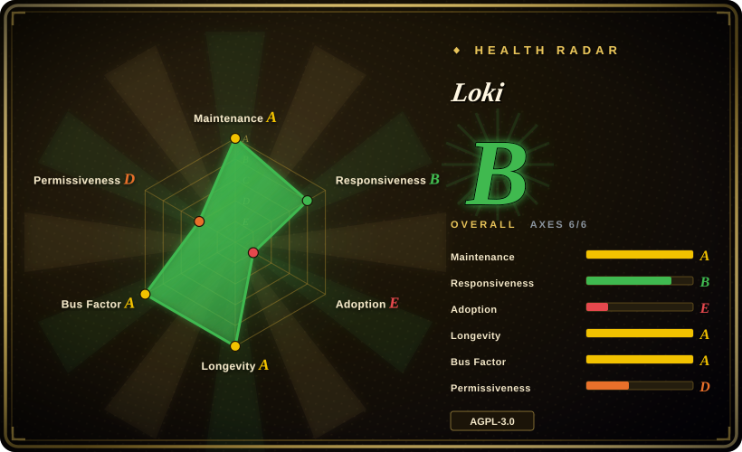

# Loki

Like Prometheus, but for logs.

## When to use

You're choosing open-source infrastructure for a task that falls into `observability` and you need a real repository to evaluate, not just a product name from a comparison table. You reach for Loki when its upstream description matches the job and when adopting an existing project is preferable to writing custom glue from scratch.

This first-pass page exists because Loki was repeatedly useful as a comparison candidate in the atlas backlog. Use it as an intake-backed starting point: verify the upstream README and license, then compare it against the linked neighboring pages before committing to the dependency.

## When NOT to use

- **You need a fully reviewed, deeply researched atlas page today.** Use a more mature in-index page from the comparison table until this intake page has been semantically reviewed with the upstream docs.
- **The GitHub metadata flags a blocker for your environment.** If license, archival status, or maintenance cadence is load-bearing, choose a better-verified alternative in this category instead of relying on Loki.
- **Your task needs a narrower or more specialized substitute.** Prefer the existing page whose `When NOT to use` section names your exact constraint; this page is a broad first-pass entry.
- **You cannot afford upstream churn or operational unknowns.** Pick an older in-index project with a clearer Lindy record and documented ops profile.

## Comparison

| Alternative | In index | Our verdict | Tradeoff |
|---|---|---|---|
| [Grafana](grafana.md) | ✅ | When you need the established in-index option for this category, compare it against Loki before switching. | Loki is newly indexed from the intake backlog; use the existing page when its documented constraints match better, and choose Loki only after verifying the repo-specific caveats below. |
| [OpenTelemetry Collector](opentelemetry-collector.md) | ✅ | When you need the established in-index option for this category, compare it against Loki before switching. | Loki is newly indexed from the intake backlog; use the existing page when its documented constraints match better, and choose Loki only after verifying the repo-specific caveats below. |
| [Prometheus](prometheus.md) | ✅ | When you need the established in-index option for this category, compare it against Loki before switching. | Loki is newly indexed from the intake backlog; use the existing page when its documented constraints match better, and choose Loki only after verifying the repo-specific caveats below. |
| Hand-rolled integration | 未收录 | Choose custom code only when the needed scope is tiny and the maintenance burden is clearly lower than adopting this repo. | Custom code avoids a dependency but loses the upstream project, ecosystem, and documented tradeoffs captured here. |

## Tech stack

- **Primary language:** Go per GitHub metadata.
- **Repository:** `grafana/loki`.
- **Project shape:** categorized as `service` for atlas routing; verify upstream architecture before treating this as a stable API contract.
- **Upstream state:** default branch `main`, last pushed `2026-07-06T13:40:58Z`, archived `false`.

## Dependencies

- **Runtime dependencies:** not exhaustively verified in this intake pass; inspect the upstream dependency manifest before production use.
- **External services:** not exhaustively verified in this intake pass; check whether the project requires databases, queues, cloud APIs, browser runtimes, GPUs, or model-provider credentials.
- **Operational input:** at minimum, you depend on the GitHub repository and its release/update process.

## Ops difficulty

**Unknown to medium until the upstream docs are reread.** Library-style entries may be low effort to try but still need version pinning and upgrade review. App/service/framework entries can carry hidden database, worker, storage, auth, browser, GPU, or cloud-provider requirements, so treat this first-pass entry as an intake marker rather than an ops runbook.

## Health & viability

- **Maintenance snapshot:** GitHub reports `archived=false` and `pushed_at=2026-07-06T13:40:58Z` as of 2026-07-06.
- **Adoption snapshot:** ~28,505 GitHub stars as of 2026-07; stars are only a noisy adoption signal.
- **License snapshot:** `AGPL-3.0` from GitHub API; inspect repository license files when the license matters.
- **Lindy and governance:** not fully reviewed in this intake pass. Treat org ownership, project age, release cadence, and bus factor as open review items before long-term adoption.
- **Risk flags:** first-pass page generated from backlog metadata.

## Caveats (unverified)

- [未验证] This is a first-pass intake page generated from GitHub metadata and the 2026-07-06 backlog; before relying on it for a high-stakes selection, reread the upstream README, docs, license file, and release notes.
- [推断] The comparison table uses nearby in-index pages as a starting point; a later semantic review should replace generic neighboring rows with the closest true substitutes.
