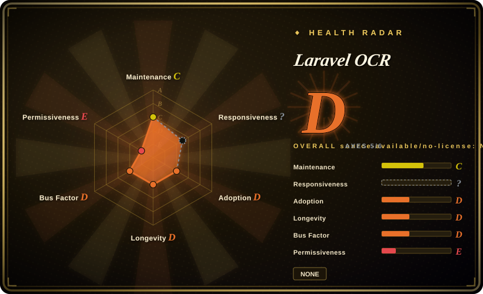

# Laravel OCR

A Laravel package that wraps Tesseract, Google Vision, AWS Textract, and Azure OCR behind one manager, then adds DTOs, regex/template extraction, database persistence, Artisan commands, and optional LLM cleanup.

> **License status:** `composer.json` declares MIT, but the repository contains no `LICENSE`, `LICENSE.md`, `LICENSE.txt`, or `COPYING` file, and the README links to a missing `LICENSE.md`. This page therefore records `NOASSERTION` rather than treating the manifest claim as independently confirmed.

## When to use

You're adding invoice or receipt intake to an existing Laravel application. You want one service-provider/facade integration that can start with an on-premises Tesseract binary, switch a request to Google Vision, AWS Textract, or Azure OCR, return an `OcrResult` DTO, apply database-backed templates and regex field extraction, and optionally persist the processed document. The package also supplies Artisan diagnostics and processing commands plus a Blade component for reviewing extracted fields.

Choose Laravel OCR over calling Tesseract directly when Laravel-native dependency injection, configuration, migrations, models, commands, templates, and driver switching save more work than maintaining your own integration. Its best fit is controlled business documents with stable field patterns; it is not a substitute for a mature layout-aware Document AI engine.

## When NOT to use

- **You need complete OCR of multi-page scanned PDFs.** Use [OCRmyPDF](../pdf-tools/ocrmypdf.md) or a dedicated multi-page OCR pipeline; Laravel OCR's Tesseract driver converts only page `[0]` of a scanned PDF through Imagick.
- **You need measured word-level bounding boxes or trustworthy confidence scores.** Use PaddleOCR or the cloud provider's native SDK directly; the current drivers return empty bounds and mostly `0.0` confidence, while text-layer PDF extraction uses a hard-coded `0.90` value.
- **You need reliable complex-table, form, or reading-order reconstruction.** Use [Docling](../document-parsing/docling.md), [Unstructured](../document-parsing/unstructured.md), or AWS Textract's native structured APIs; this package's table methods primarily split OCR lines on repeated whitespace.
- **Your application is not Laravel on PHP 8.2+.** Use [Tesseract](tesseract.md), PaddleOCR, or a standalone [Docling](../document-parsing/docling.md) service; the package is coupled to Illuminate, Eloquent, Artisan, Facades, and Laravel's service container.
- **You expect its configured workflows to execute validators and post-processors today.** Use explicit Laravel jobs around [Tesseract](tesseract.md) or a document-parsing service; `parseWithWorkflow()` currently skips the configured post-processors and validators, and `parseBatch()` is a serial loop.
- **Your legal process requires a repository license file.** Use [Tesseract](tesseract.md) or [Docling](../document-parsing/docling.md); Laravel OCR only declares MIT in Composer metadata and does not ship the referenced license text.

## Comparison

| Alternative | In index | Our verdict | Tradeoff |
|---|---|---|---|
| [Tesseract](tesseract.md) | ✅ | Pick Tesseract directly for a stable offline OCR engine and full control of preprocessing/output; pick Laravel OCR when Laravel integration, driver switching, templates, models, and commands justify an additional abstraction layer. | Laravel OCR inherits Tesseract's recognition limits and currently discards most geometry/confidence data, but saves application plumbing. |
| [OCRmyPDF](../pdf-tools/ocrmypdf.md) | ✅ | Pick OCRmyPDF for producing searchable, multi-page scanned PDFs; pick Laravel OCR when OCR text must immediately flow into Laravel DTOs, templates, persistence, and business fields. | OCRmyPDF is a document-processing tool with stronger PDF semantics; Laravel OCR is an application library with narrower PDF handling. |
| [Docling](../document-parsing/docling.md) | ✅ | Pick Docling for layout, tables, reading order, and structured Markdown/JSON; pick Laravel OCR for a Laravel-native wrapper around OCR providers and rule-based business extraction. | Docling has a heavier Python/model stack but deeper document understanding; Laravel OCR is easier inside PHP but structurally shallow. |
| [Unstructured](../document-parsing/unstructured.md) | ✅ | Pick Unstructured for multi-format production ingestion, partitioning, and downstream connectors; pick Laravel OCR for invoice/receipt workflows already centered on Laravel models and migrations. | Unstructured is a larger ETL platform; Laravel OCR is smaller but its extraction logic is more template/regex-dependent. |
| PaddleOCR | not indexed | Pick PaddleOCR for modern detection-plus-recognition, CJK-heavy inputs, scene text, or layout/table models; pick Laravel OCR when framework-native PHP integration matters more than OCR depth. | PaddleOCR brings ML runtime and model operations; Laravel OCR can use a local Tesseract binary or managed APIs but offers less direct control over vision models. |

## Tech stack

- **Framework:** PHP `^8.2`, Illuminate/Laravel 9 through 13, service provider, facade, manager, configuration, migrations, Eloquent models, Blade component, and Artisan commands.
- **OCR drivers:** Tesseract through `thiagoalessio/tesseract_ocr`, Google Cloud Vision, AWS Textract, and Azure Computer Vision implementations behind an `OCRDriver` contract.
- **Document parsing:** Smalot PDF Parser for text-layer PDFs, Imagick for scanned-PDF first-page rasterization, regex-based document classification and common-field extraction, and template matching.
- **Optional AI cleanup:** `laravel/ai` `CleanupAgent` integration for provider-backed JSON cleanup, plus a local basic-rule mode for typo and field normalization.
- **Persistence/UI:** database tables for templates, fields, and processed documents, with a Blade/Alpine-style preview component and editable extracted fields.

## Dependencies

- **Composer core:** `thiagoalessio/tesseract_ocr`, `smalot/pdfparser`, `intervention/image`, Guzzle, AWS SDK for PHP, Illuminate support, and `ext-json`.
- **System runtime:** the default driver needs a Tesseract executable and language data; scanned PDF conversion additionally calls Imagick/Ghostscript, but `ext-imagick` is not declared in Composer metadata.
- **Optional providers:** Google Vision requires `google/cloud-vision`; Azure and AWS need network credentials; AI cleanup requires a compatible `laravel/ai` version and provider credentials.
- **Application infrastructure:** templates and processed-document persistence require a Laravel database; queue settings exist, but the read source did not show an implemented asynchronous processing job.
- **Input boundary:** local Tesseract can keep images on the host, while cloud drivers and optional AI cleanup send document-derived data to external providers.

## Ops difficulty

**Medium, rising to high with all providers enabled.** A Tesseract-only Laravel installation is manageable but still needs the binary, language packs, Imagick/Ghostscript for scanned PDFs, storage cleanup, file validation, and worker resource limits. Cloud drivers add four separate credential/configuration surfaces and provider-specific cost, format, size, and privacy behavior. Database templates and optional persistence require migrations and retention decisions. Before production use, add explicit integration tests for every enabled driver, fail-fast checks for extensions and binaries, queue the long-running work in application code, and validate extraction against the document layouts the regexes are expected to parse.

## Health & viability

- **Maintenance, 2026-07:** the repository was not archived, the default branch was pushed on 2026-06-22, and releases v1.0.0 through v1.3.0 were published between 2026-02 and 2026-03.
- **Governance:** the repository belongs to an individual user, and GitHub's contributor endpoint showed one human contributor, creating a high bus-factor risk.
- **Age and Lindy:** created in 2026-02, the project has only months of public history and should be treated as early-stage even though it has already published several releases. [推断]
- **Implementation maturity:** tests exist, but source inspection found placeholder or incomplete behavior in bounds, confidence, workflows, validation, queueing, and security policy documentation; evaluate code paths rather than selecting from the README feature list alone.
- **Risk flags:** license text is absent, the security policy is an unedited template naming unrelated versions, and several runtime requirements are not expressed in Composer metadata.

## Caveats (unverified)

- [未验证] `composer.json` says MIT, but no license file exists and the README's `LICENSE.md` target is missing; upstream licensing intent was not independently confirmed, so the page uses `NOASSERTION`.
- [未验证] The test suite was not run, and no real Tesseract, Google, AWS, Azure, Imagick, Ghostscript, or `laravel/ai` integration was exercised in this research pass.
- [未验证] Configuration keys for encryption, malware scanning, queueing, rate limiting, preprocessing, and cleanup were not proven to be fully wired into executable behavior.
- [推断] The single-contributor, very young repository has a high maintenance-continuity risk despite recent releases; future support is not guaranteed.
- [未验证] OCR and invoice-extraction accuracy was not benchmarked on target documents, currencies, languages, or layouts.
