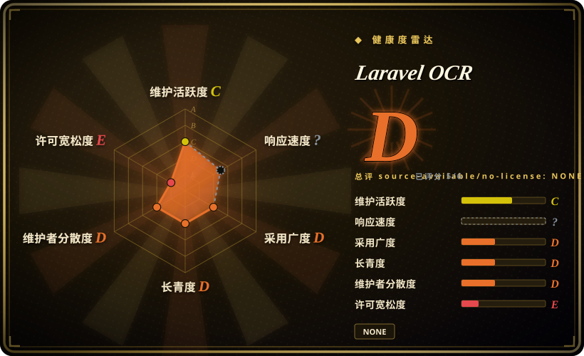

# Laravel OCR

一个 Laravel package，把 Tesseract、Google Vision、AWS Textract 和 Azure OCR 封装到统一 manager 后面，再增加 DTO、正则/template 抽取、数据库持久化、Artisan 命令和可选 LLM cleanup。

> **许可证状态：** `composer.json` 声明 MIT，但仓库没有 `LICENSE`、`LICENSE.md`、`LICENSE.txt` 或 `COPYING` 文件，README 还链接到不存在的 `LICENSE.md`。因此本页记录 `NOASSERTION`，不把 manifest 声明当作独立确认。

## 何时使用

你要给现有 Laravel 应用增加 invoice 或 receipt 摄取。你希望用一套 service-provider/facade 集成先接入内网 Tesseract binary，也能按请求切换到 Google Vision、AWS Textract 或 Azure OCR，返回 `OcrResult` DTO，应用数据库 template 和正则字段抽取，并可选持久化处理结果。这个 package 还提供 Artisan 环境诊断与处理命令，以及查看和编辑抽取字段的 Blade component。

如果 Laravel-native 依赖注入、配置、migration、model、command、template 与 driver switching 能节省比自建集成更多的工作，选 Laravel OCR 而不是直接调用 Tesseract。它最适合字段模式稳定、输入受控的业务文档，不是成熟 layout-aware Document AI engine 的替代品。

## 何时不用

- **需要完整 OCR 多页扫描 PDF。** 请改用 [OCRmyPDF](../pdf-tools/ocrmypdf.zh.md) 或专用多页 OCR 管线；Laravel OCR 的 Tesseract driver 只通过 Imagick 转换扫描 PDF 的第 `[0]` 页。
- **需要实测 word-level bounding box 或可信 confidence score。** 请直接使用 PaddleOCR 或云 provider 原生 SDK；当前 driver 返回空 bounds 和多数 `0.0` confidence，文本层 PDF 抽取则使用硬编码 `0.90`。
- **需要可靠恢复复杂表格、表单或阅读顺序。** 请改用 [Docling](../document-parsing/docling.zh.md)、[Unstructured](../document-parsing/unstructured.zh.md)，或 AWS Textract 原生结构化 API；本包 table method 主要按重复空白切分 OCR 行。
- **应用不是 Laravel，或不能使用 PHP 8.2+。** 请改用 [Tesseract](tesseract.zh.md)、PaddleOCR，或独立 [Docling](../document-parsing/docling.zh.md) 服务；该包耦合 Illuminate、Eloquent、Artisan、Facade 和 Laravel service container。
- **现在就要求配置中的 workflow 真正执行 validator 与 post-processor。** 请围绕 [Tesseract](tesseract.zh.md) 或文档解析服务写明确的 Laravel job；`parseWithWorkflow()` 当前跳过配置的 post-processor 与 validator，`parseBatch()` 也只是串行循环。
- **法律流程要求仓库内必须存在许可证正文。** 请改用 [Tesseract](tesseract.zh.md) 或 [Docling](../document-parsing/docling.zh.md)；Laravel OCR 只在 Composer metadata 里声称 MIT，没有附带 README 引用的许可证文本。

## 横向对比

| 替代品 | 是否收录 | 我们的评价 | 取舍 |
|---|---|---|---|
| [Tesseract](tesseract.zh.md) | ✅ | 需要稳定离线 OCR engine，并完全控制 preprocessing/output 时直接选 Tesseract；Laravel integration、driver switching、template、model 和 command 值得增加抽象层时选 Laravel OCR。 | Laravel OCR 继承 Tesseract 的识别边界，当前还会丢失多数 geometry/confidence 数据，但节省应用 plumbing。 |
| [OCRmyPDF](../pdf-tools/ocrmypdf.zh.md) | ✅ | 目标是生成可搜索的多页扫描 PDF 时选 OCRmyPDF；OCR 文本要立即进入 Laravel DTO、template、persistence 和业务字段时选 Laravel OCR。 | OCRmyPDF 是 PDF 语义更强的文档处理工具；Laravel OCR 是 PDF 处理更窄的应用 library。 |
| [Docling](../document-parsing/docling.zh.md) | ✅ | 需要 layout、table、reading order 和结构化 Markdown/JSON 时选 Docling；需要围绕 OCR provider 和规则型业务抽取的 Laravel-native wrapper 时选 Laravel OCR。 | Docling 的 Python/模型栈更重，但文档理解更深；Laravel OCR 在 PHP 内更容易用，但结构理解较浅。 |
| [Unstructured](../document-parsing/unstructured.zh.md) | ✅ | 多格式生产 ingestion、partition 和下游 connector 选 Unstructured；invoice/receipt 工作流已经围绕 Laravel model 与 migration 时选 Laravel OCR。 | Unstructured 是更大的 ETL 平台；Laravel OCR 更小，但抽取逻辑更依赖 template 和正则。 |
| PaddleOCR | 未收录 | 现代 detection-plus-recognition、中日韩重输入、scene text 或 layout/table model 选 PaddleOCR；framework-native PHP integration 比 OCR 深度更重要时选 Laravel OCR。 | PaddleOCR 带 ML runtime 和模型运维；Laravel OCR 可以使用本地 Tesseract 或托管 API，但对视觉模型控制更少。 |

## 技术栈

- **框架：** PHP `^8.2`，支持 Illuminate/Laravel 9 至 13，包含 service provider、facade、manager、配置、migration、Eloquent model、Blade component 和 Artisan command。
- **OCR driver：** 通过 `thiagoalessio/tesseract_ocr` 接入 Tesseract，并实现 Google Cloud Vision、AWS Textract 和 Azure Computer Vision，共用 `OCRDriver` contract。
- **文档解析：** 文本层 PDF 使用 Smalot PDF Parser，扫描 PDF 首页面通过 Imagick rasterize，另有正则型文档分类、公共字段抽取和 template matching。
- **可选 AI cleanup：** 使用 `laravel/ai` 的 `CleanupAgent` 做 provider-backed JSON cleanup，也提供本地 basic-rule 模式做 typo 与字段规范化。
- **持久化/UI：** 数据库表保存 template、field 和 processed document，Blade/Alpine 风格 preview component 支持查看和编辑抽取字段。

## 依赖

- **Composer core：** `thiagoalessio/tesseract_ocr`、`smalot/pdfparser`、`intervention/image`、Guzzle、AWS SDK for PHP、Illuminate support 和 `ext-json`。
- **系统运行时：** 默认 driver 需要 Tesseract executable 和语言数据；扫描 PDF 转换还调用 Imagick/Ghostscript，但 Composer metadata 没有声明 `ext-imagick`。
- **可选 provider：** Google Vision 需要 `google/cloud-vision`；Azure 与 AWS 需要网络凭据；AI cleanup 需要兼容版本的 `laravel/ai` 与 provider credential。
- **应用基础设施：** template 和 processed-document persistence 需要 Laravel database；虽然有 queue 配置，但已读源码没有显示已实现的异步处理 job。
- **输入边界：** 本地 Tesseract 可把图片留在主机上；cloud driver 和可选 AI cleanup 会把文档衍生数据发送给外部 provider。

## 运维难度

**中，全部 provider 开启后升到高。** 只用 Tesseract 的 Laravel 安装仍需要 binary、语言包、扫描 PDF 所需 Imagick/Ghostscript、storage cleanup、文件校验和 worker 资源限制。Cloud driver 会增加四套 credential/configuration surface，以及 provider 特定成本、格式、大小与隐私行为。Database template 和可选 persistence 还要求 migration 与保留策略。生产前应为每个启用 driver 增加明确 integration test，为扩展与 binary 做 fail-fast 检查，在应用代码里把长任务放进 queue，并用实际文档版式验证正则预期。

## 健康度与可持续性

- **维护，2026-07：** 仓库未归档，默认分支在 2026-06-22 有 push，v1.0.0 至 v1.3.0 在 2026-02 至 2026-03 之间发布。
- **治理：** 仓库属于个人用户，GitHub contributor endpoint 只显示一名人类贡献者，bus factor 很高。
- **年龄与 Lindy：** 2026-02 创建，公开历史只有数月；即使已经发布多个版本，也应按早期项目对待。[推断]
- **实现成熟度：** 仓库有测试，但源码检查发现 bounds、confidence、workflow、validation、queue 和 security policy 文档存在 placeholder 或未完整接通行为；选型时应看代码路径，不应只看 README feature list。
- **风险标记：** 缺少许可证正文，security policy 是未编辑模板并列出无关版本，若干运行时要求也没有写进 Composer metadata。

## 存疑（未验证）

- [未验证] `composer.json` 声称 MIT，但没有许可证文件，README 的 `LICENSE.md` 目标也不存在；本次无法独立确认上游授权意图，因此页面使用 `NOASSERTION`。
- [未验证] 本次没有运行测试套件，也没有实际接入 Tesseract、Google、AWS、Azure、Imagick、Ghostscript 或 `laravel/ai`。
- [未验证] encryption、malware scanning、queue、rate limiting、preprocessing 和 cleanup 等配置项没有被证明已完整接入可执行行为。
- [推断] 单贡献者且非常年轻，即使近期有 release，也存在较高维护连续性风险，未来支持不受保证。
- [未验证] OCR 与 invoice extraction 准确率没有在目标文档、币种、语言或版式上做 benchmark。
