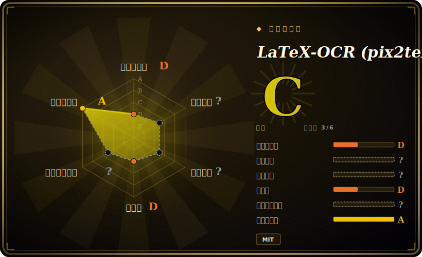

# LaTeX-OCR (pix2tex)

一个 ViT 编码器 + Transformer 解码器的模型，把数学公式的图片转成能编译出它的 LaTeX 源码——以 Python 库的形式发布，外加一个 CLI（`pix2tex`）、一个截图 GUI（`latexocr`），以及一个小型 REST/Streamlit API。

## 何时使用

你是研究生或研究者，正在用 LaTeX 写论文，而你的参考资料里到处是困在 PDF、讲义截图和扫描教材页里的公式。手敲一个三行的对齐推导或一坨乱糟糟的求和又慢又容易出错，而通用 OCR 引擎只会给你一堆乱码，因为它根本不知道 `\frac` 或 `\sum_{i=1}^{n}` 是什么意思。你装上 `pix2tex`，打开 GUI，在屏幕上的公式上拖一个选框，它就把可编译的 LaTeX 还给你，直接粘进文档——还带一个实时 MathJax 预览，让你在采信之前先扫一眼结果。要批量处理一堆裁好的公式图，你就跳过 GUI，从脚本里调 `pix2tex` 的 CLI 或 Python API。

当工作单元是*一个已经裁好（或可裁出）的数学公式*、而你要的输出是 *LaTeX 源码*而非散文时，你才会专门选它。它在你自己机器上本地跑（CPU 或 GPU），所以来自未发表或敏感材料的公式不会离开你的笔记本；MIT 许可意味着你能把这个库接进自己的笔记或文档工具，且没有按次计费的云账单。

## 何时不用

- **你需要通用文档 OCR，而不只是数学公式。** 这是最锋利的边界：pix2tex *只*识别公式。正文文字、扫描页、表格或混排文档，请用通用 OCR 引擎如 [Tesseract](tesseract.zh.md) 或云端 OCR/Vision 服务——pix2tex 不会替你转录普通散文。
- **手写体、复杂多行块或大矩阵。** 它主要在渲染/印刷体公式上训练；手写公式、大段 `align`/`cases` 块、密集矩阵正是准确率掉链子的地方，你修输出的时间会比自己敲还多。
- **你无法容忍准确率天花板 / 必须每次校验的工作流。** 它是模型，不是解析器：它产出的是*最可能的* LaTeX 字符串，不是保证正确的（项目自报的 token 准确率约 0.60、BLEU 约 0.88）。[未验证] 下标、定界符、运算符出现细微错误很常见——每个输出都得人眼对着渲染预览扫一遍。
- **你押注于长期维护。** 这是个单作者项目，一直在**滑行**（最后一次 push 在 2025-01——截至 2026-06 大约空闲了 1.5 年）。Issue 和 PR 在堆积；别指望有新功能或积极的 triage。
- **现代 VLM 可能已经赢它了。** 通用多模态模型（GPT-4o、Qwen-VL、Gemini 之类）能零样本把公式转成 LaTeX，往往还更能扛脏输入和上下文；如果你已经在为某个付费，专门的模型可能不值得再加一个依赖。

## 横向对比

| 替代品 | 是否收录 | 我们的评价 | 取舍 |
|---|---|---|---|
| [Tesseract](tesseract.zh.md) | ✅ | 当前页用于它的主场景；如果更看重“通用印刷体文字 OCR”，再选 Tesseract。 | 通用印刷体文字 OCR——正相反的活：擅长散文/文档，但**完全不懂数学记号**，也不会吐 LaTeX。把它俩搭着用（Tesseract 管文字，pix2tex 管公式），别拿一个替另一个。 |
| Mathpix | 未收录 | 当前页用于它的主场景；如果更看重“商业数学 OCR 服务/API”，再选 Mathpix。 | 商业数学 OCR 服务/API；在数学 + 手写 + 多行上通常是准确率领头羊，有移动端和文档导出——但它是付费 SaaS（按次计费、数据离开你的机器），不是 MIT 的可自托管仓库。 |
| texify | 未收录 | 当前页用于它的主场景；如果更看重“开源的公式转 LaTeX 模型（VikParuchuri）”，再选 texify。 | 开源的公式转 LaTeX 模型（VikParuchuri）；瞄准同一任务、维护更近的直接替代——值得在你的数据和维护活跃度上做对比。 |
| GPT-4o / Qwen-VL / Gemini（VLM） | 未收录 | 当前页用于它的主场景；如果更看重“通用视觉语言模型，零样本把公式转 LaTeX”，再选 GPT-4o / Qwen-VL / Gemini（VLM）。 | 通用视觉语言模型，零样本把公式转 LaTeX；在脏/带上下文输入上更强、且在持续进步，但更重（API 费用或大体积本地权重），不是一个专门、轻量的公式工具。 |

## 技术栈

- **语言：** Python（约 97%），基于 **PyTorch** 构建。
- **模型：** 一个 Vision Transformer（ViT）图像编码器（带 ResNet 式骨干）喂给一个 Transformer **解码器**，自回归地生成 LaTeX token 序列——一个图像到序列（"pix2tex"）架构。
- **接口：** `pix2tex` CLI 做批量/脚本化的图像→LaTeX；一个基于 Qt 的截图 **GUI**（`latexocr`），带屏幕区域捕获和 MathJax 渲染；一个小型 **REST API** 加 Streamlit demo；以及可导入的 Python 库供嵌入。
- **分词器 / 训练：** 自带 LaTeX 分词器和训练/评估脚本（数据集生成、BLEU / 编辑距离 / token 准确率指标），所以模型可被重训或微调。

## 依赖

- **PyTorch**——核心运行时依赖；CPU 能跑，CUDA GPU 在推理上更快、在（重）训练上基本是刚需。
- **预训练模型权重**——首次运行时单独下载；你需要的是 checkpoint，不只是代码，才能拿到预测。
- **GUI 额外依赖**——截图 GUI 会拉进 Qt/PyQt 加一条 LaTeX/MathJax 渲染路径来做实时预览；这些是可选安装项，纯无头/CLI 用法可跳过。
- **无外部服务或数据存储**——权重就位后完全本地运行；每次推理不联网，无数据库。

## 运维难度

**使用层面低到中；再往外是中。** 作为单机上的库/CLI，它就是 `pip install` 加一次性的权重下载——没有常驻服务、没有数据存储、没有集群。它能在 CPU 上跑；GPU 主要帮你降延迟。摩擦在别处：输入得是单个公式相对紧的裁切（裁切由你来搭或来做），每个结果都想对着渲染预览人工核一遍；而因为项目在滑行，随着时间推移你可能在更新的 Python 或 PyTorch 版本上撞到依赖固定/安装腐化问题，得自己解决而不是等上游修。[推断] 重训或微调模型是另一件单独、吃 GPU、更费劲的事。

## 健康度与可持续性

- **维护（截至 2026-06）：** **滑行中。** 最后一次 push 在 2025-01-18——大约空闲 1.5 年；未归档，但没有近期提交，open issue（约 159）在没有积极 triage 的情况下堆积。[未验证] 把它当成“现状可用”，而非“在积极开发”。
- **治理 / bus factor：** 一个**单作者**项目（owner `lukas-blecher`，一个个人 User 账号，不是组织也不是基金会）。单人 bus factor——作者一旦离开，没有团队或赞助方接手。[推断]
- **年龄与 Lindy 判定：** 创建于 2020-12（约 6 岁）。年龄给了它一些 Lindy 分量，*而且*它在自己的小众领域里是个真正有用、广为人知的工具——但 Lindy 只在 **年龄 × 仍活跃** 时才算数，而这里“仍活跃”这一半很弱。一个长寿但如今空闲的单作者仓库，是个*可用*的押注，不是个*耐久*的押注。
- **采用度 / 生态：** 约 16.5k star，被广泛认作开源公式 OCR 的首选仓库；MIT 许可让嵌入它没有摩擦。[未验证] 在笔记和学术工具里有真实采用。
- **风险标记：** 主导风险是**相关性，而非许可**——通用 VLM（GPT-4o/Qwen-VL/Gemini）和维护更积极的替代（texify、Mathpix）在快速进步，而这个仓库在原地空闲；模型的准确率天花板叠加维护断档，才是投入采用前该重新评估的真正理由。无 relicense 历史、无开放核心闸门（干净的 MIT）。[推断]

## 存疑（未验证）

- [未验证] 约 16.5k GitHub star、最后 push 于 2025-01-18、约 159 个 open issue、最新 tag 约 v0.0.31、创建于 2020-12-11——据仓库/GitHub API 截至 2026-06；star/issue 数对时间敏感，仅供参考。
- [未验证] “滑行 / 约 1.5 年空闲”是从最后 push 日期推断的；依赖它之前请重核仓库近期的提交与发版活动——维护者可能恢复。
- [未验证] 自报指标（token 准确率约 0.60、BLEU 约 0.88、归一化编辑距离约 0.10）是项目在自己测试集上的自报数字，不是在你输入上的实测——请在你真实的公式上跑基准。
- [推断] 在手写、大段多行块和矩阵上的准确率下滑，是从训练数据偏重渲染/印刷体公式以及常见反馈推断的，不是对你文档的实测。
- [推断] ViT 编码器 + ResNet 骨干 + Transformer 解码器架构，以及 GUI/CLI/API/训练脚本的特性集，是按项目 README 和惯例描述的；请对照当前仓库核实确切组件与安装额外项。
- [未验证] 现代 VLM（GPT-4o/Qwen-VL/Gemini）和 texify 在公式→LaTeX 上胜过 pix2tex，是从它们的发展轨迹得出的一般预期，不是一对一基准——请在你自己的数据上对比。
