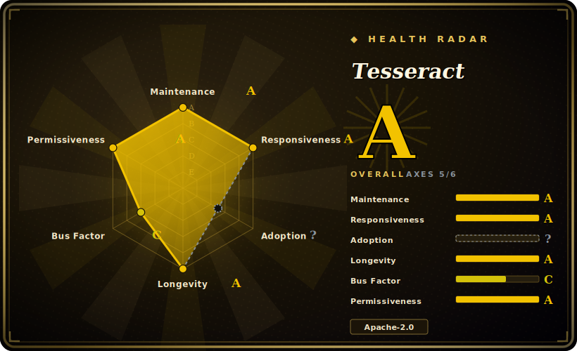

# Tesseract

The classic open-source OCR engine: a C++ `libtesseract` library plus a CLI that turns images of text into machine-readable text, runs fully offline, and recognizes 100+ languages via separately-downloaded trained data.

## When to use

You're a backend developer wiring OCR into a document pipeline — a stream of scanned PDFs, faxes, and TIFFs from a records system, mostly clean printed text in a handful of known languages. You need the text extracted on your own servers (no data leaving the building, no per-page cloud bill), and you need it as a library call you can embed, not a SaaS you POST to. You install the `tesseract` binary (or link `libtesseract`), pull the `tessdata` trained models for the languages you expect, and call it through a thin wrapper like `pytesseract` from your worker. For clean, deskewed, high-DPI scans of printed text it does the job with no GPU, no network, and a permissive Apache-2.0 license — and it emits not just plain text but hOCR, ALTO, PAGE, TSV, and searchable-PDF, so you can keep word-level bounding boxes for downstream indexing.

You also reach for it when you control the input quality. Tesseract rewards preprocessing: binarize, deskew, denoise, and feed it 300 DPI line images and the LSTM line recognizer (default since v4) is accurate and cheap to run at scale across a fleet of CPU workers. When a language or font isn't covered well, it is trainable — you can fine-tune or build new `tessdata` — so a long-lived, in-house pipeline over predictable document types is its sweet spot.

## When NOT to use

- **Photos in the wild, complex layouts, or handwriting.** This is the sharp edge: Tesseract expects clean, mostly-printed, mostly-deskewed text. On phone photos with perspective and uneven lighting, on magazine/newspaper multi-column layouts, or on any handwriting, modern deep-learning OCR — PaddleOCR, EasyOCR, cloud Vision/Textract, or TrOCR — typically wins by a wide margin. [推断]
- **You don't want a preprocessing burden.** Accuracy is highly sensitive to input quality; the README itself says you'll often need to *improve the image* first. If you can't invest in binarization/deskew/DPI normalization, expect disappointing results.
- **You need document layout, tables, or reading order.** Tesseract's page segmentation is basic — it is a text *recognizer*, not a layout/table/structure extractor. For parsing document structure (tables, columns, reading order, key-value), reach for a document-parsing layer like docling (`未收录`) on top of, or instead of, raw OCR.
- **You need LaTeX / math / equation recognition.** Tesseract does not understand math notation; use a dedicated tool such as LaTeX-OCR (`未收录`).
- **You want a turnkey GUI or end-to-end app.** It ships no GUI — it is an engine and CLI. Pair it with a frontend (e.g. an OCRmyPDF-style wrapper) yourself.

## Comparison

| Alternative | In index | Our verdict | Tradeoff |
|---|---|---|---|
| PaddleOCR | 未收录 | Use this page for its stated niche; choose PaddleOCR when you need deep-learning OCR + layout/table/structure models. | Deep-learning OCR + layout/table/structure models; far stronger on complex layouts, photos, and CJK, but heavier deps (PaddlePaddle), Apache-2.0, GPU-helpful — a fuller pipeline vs Tesseract's single recognizer. |
| EasyOCR | 未收录 | Use this page for its stated niche; choose EasyOCR when you need pyTorch-based, 80+ languages, easy install, good on scene/photo text out of the box. | PyTorch-based, 80+ languages, easy install, good on scene/photo text out of the box; bigger runtime and GPU-friendly, less battle-tested at extreme scale than Tesseract's C++ core. |
| Google Cloud Vision / AWS Textract | 未收录 | Use this page for its stated niche; choose Google Cloud Vision / AWS Textract when you need managed cloud OCR. | Managed cloud OCR; best-in-class accuracy on messy input plus Textract's table/form extraction, but per-page cost, data leaves your network, and no offline/self-host — the opposite of Tesseract's deployment model. |
| TrOCR | 未收录 | Use this page for its stated niche; choose TrOCR when you need transformer (encoder-decoder) OCR from Microsoft. | Transformer (encoder-decoder) OCR from Microsoft; strong on handwriting and hard lines, but model-heavy and GPU-oriented, and it is line-level recognition without Tesseract's full page/format tooling. |
| docTR | 未收录 | Use this page for its stated niche; choose docTR when you need deep-learning OCR (detection + recognition) in TF/PyTorch with a clean Python API. | Deep-learning OCR (detection + recognition) in TF/PyTorch with a clean Python API; better on varied layouts than Tesseract, heavier deps, smaller language coverage. |

## Tech stack

- **Language:** C++ (the `libtesseract` engine and `tesseract` CLI); widely consumed from Python via `pytesseract`, and from many other languages through bindings.
- **Recognition engine:** LSTM-based line recognizer (default since Tesseract 4), with the older character-pattern "legacy" engine still available for backward compatibility.
- **Trained data:** language/script models live in separate `tessdata` files (variants: `tessdata`, `tessdata_fast`, `tessdata_best`); models are not bundled with the engine and must be downloaded per language.
- **Output formats:** plain text, hOCR (HTML), searchable/invisible-text PDF, TSV, ALTO, and PAGE — word/line bounding boxes available, not just flat text.
- **Trainable:** supports training/fine-tuning to add languages or fonts via the Tesseract training tools.

## Dependencies

- **`libtesseract`:** the core engine you link against (or invoke via the CLI).
- **Leptonica:** required image-processing library — Tesseract uses it to open and manipulate input images. This is the key build/runtime dependency.
- **`tessdata` models:** trained-data files per language/script, downloaded separately; pick `tessdata_fast` (speed) or `tessdata_best` (accuracy) per your need. [推断]
- **Language packs:** one `*.traineddata` file per language you intend to recognize (e.g. `eng.traineddata`); the engine errors if the requested language's data isn't installed.
- **No GPU, no network, no datastore:** runs CPU-only and fully offline once models are present.

## Ops difficulty

**Low-to-medium.** The engine itself is easy to operate: a static-ish CPU binary, no service to run, no GPU, no network, distributed as OS packages and Docker images. The cost is in two places. First, **input preprocessing** — to get usable accuracy you typically build a binarize/deskew/denoise/DPI-normalize stage in front of it, and that pipeline (not Tesseract) is where most engineering and tuning goes. Second, **model management** — you must fetch and version the right `tessdata` files for each language and decide between the `fast`/`best` variants, which is a deployment-artifact concern. Scaling is embarrassingly parallel across CPU workers, so throughput is a fan-out problem, not a clustering one. The hard part is rarely running Tesseract; it's getting the images clean enough that Tesseract does well.

## Health & viability

- **Maintenance (as of 2026-06):** last pushed 2026-06, latest release v5.5.2 (2025-12-26) — **actively maintained**, with regular point releases on the 5.x line. [推断] Cadence is steady but mature/incremental rather than fast-moving; it's a stable engine, not a churning one.
- **Governance / bus factor:** organization-owned (`tesseract-ocr`) and **community-maintained** after a long institutional lineage — originally HP, then open-sourced and stewarded by Google for years, now a community org. [推断] Distributed enough that it isn't a single-maintainer bus-factor risk, but it is volunteer/community-driven, not vendor-resourced.
- **Age & Lindy verdict (created 2014-08 on GitHub, ~12 yr there; codebase lineage to the 1980s):** old *and* still active and shipping releases — a **very strong Lindy** signal. This is one of the longest-lived OCR engines in existence; for clean printed text it is a safe, durable bet.
- **Adoption / ecosystem:** the default offline OCR engine across countless pipelines, OS packages, and language bindings (`pytesseract` and many others); 100+ language models, multiple output formats, and trainable `tessdata` — deeply entrenched.
- **Risk flags:** none of the usual ones — permissive Apache-2.0, no relicense history, no open-core gating. The real ceiling is *capability*, not viability: it trails modern deep-learning OCR on messy input. [推断]

## Caveats (unverified)

- [未验证] ~75.0k GitHub stars and latest release v5.5.2 (2025-12-26) per the repo as of 2026-06 — star counts are date-sensitive and indicative only.
- [未验证] "100+ languages out of the box" and the list of output formats (hOCR/PDF/TSV/ALTO/PAGE) are the README's own framing; the exact language count and per-language model quality vary.
- [推断] The accuracy gap vs modern deep-learning OCR (PaddleOCR/EasyOCR/cloud Vision/TrOCR/docTR) on complex layouts, photos, and handwriting is an inference from architecture and common benchmarks, not a measured claim for your specific documents — benchmark on your own data.
- [推断] `tessdata` / `tessdata_fast` / `tessdata_best` variants and per-language `*.traineddata` packaging are described from project conventions; verify the current download layout and required version compatibility against the active repo.
- [推断] Page-segmentation / layout capability is characterized as "basic" relative to dedicated document-parsing tools; this is a relative judgment, not a measurement of any specific PSM mode.
