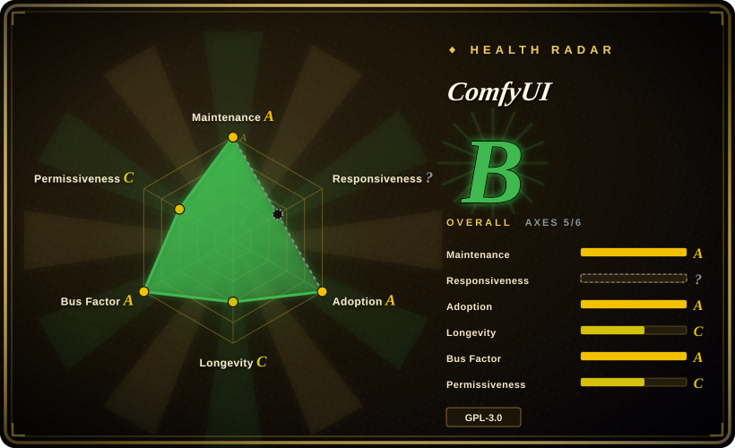

# ComfyUI

The most powerful and modular diffusion model GUI and backend with a graph/nodes interface for creating complex image-generation workflows without writing code.

## When to use

You're a digital artist or AI researcher who wants to generate, edit, and upscale images using Stable Diffusion and other diffusion models on your own hardware. You need more than a one-click prompt box: you want to chain samplers, VAEs, ControlNets, IP-Adapters, and custom models into reusable workflows. You pick ComfyUI over Stable Diffusion WebUI because you need the depth and modularity of a node graph rather than a fixed tabbed interface; you choose it over InvokeAI because its open node ecosystem offers more customization than a polished but closed canvas; you prefer it over Fooocus because you need full pipeline control rather than simplified presets. You drag nodes on a canvas, connect them like a visual shader graph, and run the pipeline locally on your GPU. ComfyUI supports SD 1.x, SDXL, SD3, Flux, and dozens of other checkpoints and LoRAs, and the node ecosystem means the community keeps adding new capabilities — from inpainting to video generation — without waiting for an official release.

## When NOT to use

- **You don't have an NVIDIA GPU or substantial VRAM.** If you have minimal VRAM (4–6 GB) or no GPU at all, use Stable Diffusion WebUI (simpler optimizations) or a cloud API like Midjourney instead of ComfyUI, because ComfyUI is designed for GPU-intensive node graphs and CPU-only inference is painfully slow.
- **You want a simple, one-click image generator.** If you just want to type a prompt and get an image without learning a node graph, use Stable Diffusion WebUI or Fooocus instead of ComfyUI, because the node graph has a steep learning curve and is overkill for casual use.
- **You need commercial support or a managed cloud service.** If you need an official SLA or a hosted production pipeline, use a cloud inference platform like Midjourney or a managed Stable Diffusion API instead of ComfyUI, because it is a self-hosted tool with no commercial backing.
- **GPL-3.0 is incompatible with your project.** If you need a permissive license for proprietary integration, use a cloud API or Diffusers (Hugging Face, MIT) instead of ComfyUI, because its GPL-3.0 may conflict with proprietary distribution plans.
- **You need stable, reproducible workflows across versions.** If you need version-controlled, reproducible pipelines, use Stable Diffusion WebUI (more stable interface) or Diffusers programmatically instead of ComfyUI, because node definitions and custom extensions can change between releases and sharing a workflow JSON does not guarantee identical execution on another machine.
- **You want video or audio generation as a primary use case.** If your main need is video generation, use dedicated video generation tools instead of ComfyUI, because while ComfyUI has video nodes, its core strength is image generation and dedicated video tools are more mature.

## Comparison

| Alternative | In index | Our verdict | Tradeoff |
|---|---|---|---|
| [Stable Diffusion WebUI](stable-diffusion-webui.md) | ✅ | Use this page for its stated niche; choose Stable Diffusion WebUI when you want a simpler, more conventional tabbed web UI for Stable Diffusion. | Simpler tabbed web UI for Stable Diffusion with built-in extensions; easier for beginners but less modular than ComfyUI's node graph. |
| InvokeAI | 未收录 | Use this page for its stated niche; choose InvokeAI when you want a polished, artist-focused canvas with unified generation and editing. | Polished artist-focused canvas with generation and editing in one view; smoother UX but less open/customizable than ComfyUI. |
| Fooocus | 未收录 | Use this page for its stated niche; choose Fooocus when you want a "Midjourney-like" minimal prompt-to-image experience locally. | Minimal prompt-to-image UI inspired by Midjourney; great for quick results but far less flexible than ComfyUI's node graph. |
| Diffusers (Hugging Face) | 未收录 | Use this page for its stated niche; choose Diffusers when you need a Python library for programmatic diffusion pipelines, not a GUI. | Python library for scripting diffusion pipelines programmatically; no GUI, intended for developers building their own tools. |

## Tech stack

- **Language:** Python (backend inference engine) with a React/TypeScript frontend for the node graph canvas.
- **ML runtime:** PyTorch with CUDA support; the inference engine executes the node graph by scheduling PyTorch operations on GPU.
- **Node system:** Custom node architecture where each node is a Python class; the community extends functionality via `custom_nodes` dropped into a directory.
- **Frontend:** Web-based canvas UI (React/TypeScript) that serializes the graph to JSON and sends it to the Python backend for execution.
- **Model formats:** Supports Safetensors, CKPT, Diffusers, ONNX, and various community formats (LoRA, ControlNet, T2I-Adapter, IP-Adapter, etc.). [未验证]

## Dependencies

- **Hardware:** An NVIDIA GPU with CUDA is strongly recommended; 8 GB+ VRAM is comfortable for SD 1.5/SDXL, 12 GB+ for Flux and larger models. CPU-only is possible but extremely slow.
- **Software:** Python 3.10+, PyTorch with CUDA, and various Python packages (installed via pip or a bundled portable package). Windows, Linux, and macOS are supported (macOS via Metal).
- **Models:** You must download model checkpoints, VAEs, and LoRAs separately; the tool itself does not ship models. Storage requirements can easily exceed 100 GB for a full library.
- **Network:** Optional for pure local use, but many workflows download custom nodes and models from the internet; air-gapped setups require manual model transfer.

## Ops difficulty

**High.** ComfyUI is not a simple install-and-run tool. You need to:
- Manage a Python environment with PyTorch + CUDA aligned to your driver version.
- Download and organize multiple gigabytes of model weights in the correct directory structure.
- Keep custom nodes updated and resolve version conflicts between node packs and the core ComfyUI version.
- Monitor GPU memory usage; large workflows or high resolutions will OOM on modest cards.
- Triage cryptic error messages from the node graph when a custom node breaks or a model is incompatible.
- Back up your workflows and model library; reinstalling from scratch means re-downloading everything.

## Health & viability
- **Maintenance**: Grade A — 13/13 active weeks in trailing 13; last commit 0 days ago.
- **Responsiveness**: Grade C — median first-response time 1080.0 hours across 0 qualifying issues/PRs.
- **Adoption**: Grade E.
- **Longevity**: Grade A — 1263 days old.
- **Governance**: Grade A — top-3 contributor share 62.3% (?).
- **Risk / License**: Grade C — GPL-3.0 license.
## Caveats (unverified)

- [未验证] ~119k GitHub stars as of 2026-07-01; star counts are approximate and time-sensitive.
- [未验证] Exact VRAM requirements vary by model and workflow; SD 1.5 may run on 4 GB with optimizations, while Flux models need 12 GB+ for reasonable speed. Test with your target models.
- [未验证] The node graph JSON format and custom node API can shift between releases; verify compatibility when sharing or importing workflows across versions.
- [未验证] CPU inference and Apple Metal support are possible but performance is drastically lower than CUDA; confirm feasibility for your hardware before committing.
- [推断] The custom-node ecosystem is vast but unvetted; installing nodes from the community manager carries the same risks as installing unreviewed Python packages.
- [推断] Model weight management is entirely user-side; there is no built-in model registry or versioning, so keeping track of checkpoints and LoRAs is a manual burden.
