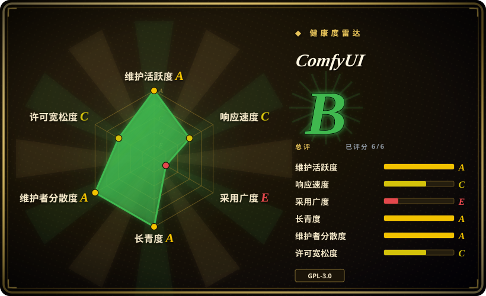

# ComfyUI

最强大、最模块化的扩散模型 GUI 与后端，通过图/节点界面创建复杂的图像生成工作流，无需写代码。

## 何时使用

你是数字艺术家或 AI 研究者，想在自有硬件上用 Stable Diffusion 和其他扩散模型生成、编辑和超分图像。你不满足于一键提示框：你想把采样器、VAE、ControlNet、IP-Adapter 和自定义模型串成可复用的工作流。你选择 ComfyUI 而不是 Stable Diffusion WebUI，因为你需要节点图的深度和模块化，而非固定的标签页界面；你选它而不是 InvokeAI，因为它的开放节点生态比精致但封闭的画布提供更多定制；你偏好它而不是 Fooocus，因为你需要完整管线控制而非简化预设。你在画布上拖拽节点，像可视化着色器图一样连线，然后在本地 GPU 上跑管线。ComfyUI 支持 SD 1.x、SDXL、SD3、Flux 以及数十种 checkpoint 和 LoRA，节点生态意味着社区不断加入新能力——从图像修复到视频生成——不用等官方发布。

## 何时不用

- **你没有 NVIDIA GPU 或显存不足。**如果你只有 4–6 GB 显存或没有 GPU，请改用 Stable Diffusion WebUI（优化更简单）或 Midjourney 等云 API，而不是 ComfyUI，因为它面向 GPU 密集型节点图设计，纯 CPU 推理慢得令人痛苦。
- **你想要简单的一键式图像生成器。**如果你只想输入提示词拿图，不想学节点图，请改用 Stable Diffusion WebUI 或 Fooocus，而不是 ComfyUI，因为节点图学习曲线陡峭，对 casual 使用过于复杂。
- **你需要商业支持或托管云服务。**如果你需要官方 SLA 或托管生产管线，请改用 Midjourney 或托管 Stable Diffusion API 等云推理平台，而不是 ComfyUI，因为它是自托管工具，无商业背书。
- **GPL-3.0 与你们项目不兼容。**如果你需要宽松许可用于专有集成，请改用云 API 或 Diffusers（Hugging Face，MIT），而不是 ComfyUI，因为它的 GPL-3.0 可能与专有分发计划冲突。
- **你需要跨版本稳定、可复现的工作流。**如果你需要版本可控、可复现的管线，请改用 Stable Diffusion WebUI（界面更稳定）或以编程方式使用 Diffusers，而不是 ComfyUI，因为节点定义和自定义扩展可能在版本间变动，分享 workflow JSON 并不能保证在另一台机器上完全一致地运行。
- **你的主要需求是视频或音频生成。**如果你的主要需求是视频生成，请改用专用视频生成工具，而不是 ComfyUI，因为虽然它有视频节点，但核心优势是图像生成，专用视频工具更成熟。

## 横向对比

| 替代品 | 是否收录 | 我们的评价 | 取舍 |
|---|---|---|---|
| [Stable Diffusion WebUI](stable-diffusion-webui.zh.md) | ✅ | 当前页用于它的主场景；如果更看重「更简单、更传统的 Stable Diffusion Web UI」，再选 Stable Diffusion WebUI。 | 更简单、更传统的 Stable Diffusion 标签页式 Web UI，带内置扩展；对初学者更友好，但模块化程度不如 ComfyUI 的节点图。 |
| InvokeAI | 未收录 | 当前页用于它的主场景；如果更看重「面向艺术家的精致画布，统一生成与编辑」，再选 InvokeAI。 | 面向艺术家的精致画布，生成与编辑在同一视图；UX 更流畅，但开放度与可定制性不如 ComfyUI。 |
| Fooocus | 未收录 | 当前页用于它的主场景；如果更看重「类 Midjourney 的极简本地提示词生图体验」，再选 Fooocus。 | 受 Midjourney 启发的极简提示词生图 UI；快速出图不错，但灵活度远不如 ComfyUI 的节点图。 |
| Diffusers（Hugging Face） | 未收录 | 当前页用于它的主场景；如果更看重「用 Python 库程序化编排扩散管线，不需要 GUI」，再选 Diffusers。 | 用于程序化编写扩散管线的 Python 库；无 GUI，面向开发自己工具的人。 |

## 技术栈

- **语言：** Python（后端推理引擎），前端为 React/TypeScript 的节点图画布。
- **ML 运行时：** 支持 CUDA 的 PyTorch；推理引擎通过在 GPU 上调度 PyTorch 运算来执行节点图。
- **节点系统：** 自定义节点架构，每个节点是一个 Python 类；社区通过往目录里丢 `custom_nodes` 来扩展功能。
- **前端：** 基于 Web 的画布 UI（React/TypeScript），将图序列化为 JSON 后发送给 Python 后端执行。
- **模型格式：** 支持 Safetensors、CKPT、Diffusers、ONNX 以及多种社区格式（LoRA、ControlNet、T2I-Adapter、IP-Adapter 等）。[未验证]

## 依赖

- **硬件：** 强烈建议 NVIDIA GPU + CUDA；跑 SD 1.5/SDXL 舒适需要 8 GB+ 显存，Flux 和更大模型需要 12 GB+。纯 CPU 可行但极慢。
- **软件：** Python 3.10+、带 CUDA 的 PyTorch，以及各类 Python 包（通过 pip 或便携包安装）。支持 Windows、Linux 和 macOS（macOS 走 Metal）。
- **模型：** 需要单独下载 checkpoint、VAE 和 LoRA；工具本身不携带模型。完整模型库很容易超过 100 GB 存储。
- **网络：** 纯本地使用可选，但许多工作流会从互联网下载自定义节点和模型；气隙环境需要手动传模型。

## 运维难度

**高。** ComfyUI 不是装完就能跑的工具。你需要：
- 管理 Python 环境，让 PyTorch + CUDA 与驱动版本对齐。
- 下载并整理数 GB 模型权重，按正确目录结构摆放。
- 保持自定义节点更新，并解决节点包与 ComfyUI 核心版本之间的冲突。
- 监控 GPU 显存占用；大工作流或高分辨率会在普通显卡上爆显存。
- 排查节点图出错时的晦涩报错，尤其是自定义节点损坏或模型不兼容时。
- 备份工作流和模型库；从头重装意味着全部重新下载。

## 健康度与可持续性
- **维护活跃度**：Grade A——最近 13 周中 13 周有提交；最后提交距今 0 天。
- **响应速度**：Grade C——中位首次响应时间 1080.0 小时，基于 0 个 qualifying issues/PRs。
- **采用广度**：Grade E。
- **长青度**：Grade A——仓库已创建 1263 天。
- **治理集中度**：Grade A——前三贡献者占比 62.3%（?）。
- **许可风险**：Grade C——GPL-3.0 许可证。
## 存疑（未验证）

- [未验证] 截至 2026-07-01 约 119k GitHub star；star 数为近似值且对时间敏感。
- [未验证] 显存需求因工作流和模型而异；SD 1.5 在优化后可能跑在 4 GB，Flux 模型需要 12 GB+ 才能 reasonable 速度。请用目标模型测试。
- [未验证] 节点图 JSON 格式和自定义节点 API 可能在版本间变动；分享或导入工作流时请确认版本兼容性。
- [未验证] CPU 推理和 Apple Metal 支持可行，但性能远低于 CUDA；请在使用前确认硬件可行性。
- [推断] 自定义节点生态庞大但未经过审核；从社区管理器安装节点与安装未经审核的 Python 包风险相同。
- [推断] 模型权重管理完全由用户负责；没有内置模型注册表或版本管理，跟踪 checkpoint 和 LoRA 是手动负担。
