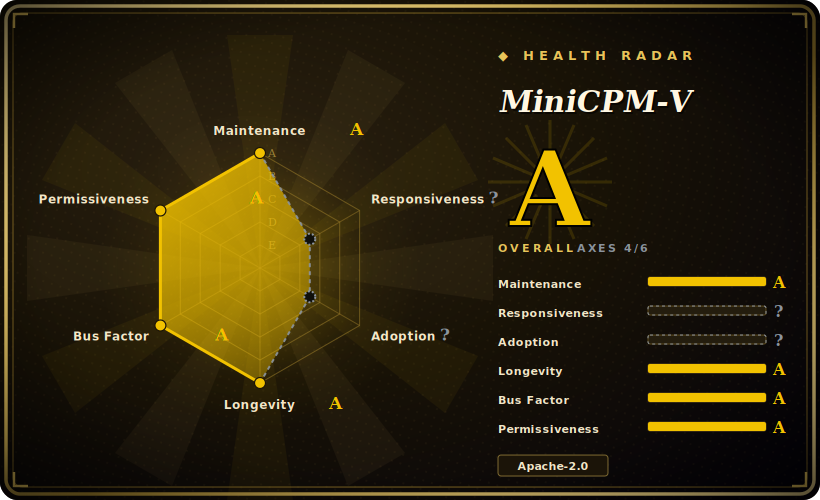

# MiniCPM-V

A series of efficient, "pocket-sized" multimodal LLMs from OpenBMB — small vision-language models for image, multi-image and video understanding (the MiniCPM-o line adds speech), designed for strong performance-per-parameter so they can run on phones and edge hardware. Open weights plus inference/deployment code.

## When to use

You're building a product feature that has to *see* — read a receipt, describe a photo, answer questions about a short video clip, OCR a form — and it has to run **on the device**, not in your cloud. Maybe it's a mobile app where users scan documents and you can't ship every image to a server (privacy, offline use, per-call cost), or an embedded/edge box with a modest GPU or just a capable CPU. A frontier cloud VLM would be overkill and would mean a network round-trip and an API bill that scales with usage; a text-only small model can't see at all.

So you reach for MiniCPM-V. You pick one of the small models (e.g. a ~1–9B MiniCPM-V / MiniCPM-o generation), pull the open weights, and deploy it down the edge path: a GGUF build runs under llama.cpp with reported few-token-per-second decoding on a phone, or you use the int4/AWQ/GPTQ quantized variants, Ollama, or the project's open-sourced iOS/Android/HarmonyOS adaptation code. Because the models are tuned for high perf-per-param, you get usable image/video understanding in a couple of GB of footprint instead of needing a datacenter GPU, and the whole pipeline stays local.

## When NOT to use

- **You want frontier multimodal quality.** For the hardest vision/video reasoning, top cloud models (GPT-4o, Gemini) still lead — a pocket-sized VLM trades absolute quality for footprint. If accuracy is the binding constraint and you can afford the cloud, use the big model.
- **You haven't checked the weight license.** The *code* is Apache-2.0, but per-model **weight** licenses and usage terms can differ generation to generation (commercial-use clauses, registration, acceptable-use). Verify the specific model card you intend to ship — don't assume the Apache code license covers the weights. [未验证]
- **You expected plug-and-play.** Getting a VLM onto a phone or edge box is real work: choosing a quantization (GGUF/int4/AWQ/GPTQ), wiring the runtime, fitting the memory/latency budget, and validating quality after quantization. Budget integration effort.
- **Your task is text-only.** This is a *multimodal* model; if you don't need vision/audio, a text-only small language model (SLM) will be smaller and faster for the same job — don't pay the vision tax you won't use.
- **You need an audited, frozen, supported SDK.** It reads as a fast-moving research-org release with rapid model turnover, not a long-term-supported product SDK with stability guarantees.

## Comparison

| Alternative | In index | Our verdict | Tradeoff |
|---|---|---|---|
| Qwen-VL / Qwen2.5-VL (Alibaba) | 未收录 | Use this page for its stated niche; choose Qwen-VL / Qwen2.5-VL (Alibaba) when you need strong open vision-language family across sizes. | Strong open vision-language family across sizes; broader size range and ecosystem, but the smallest tiers aren't as single-mindedly tuned for phone-class on-device footprint as MiniCPM-V. |
| LLaVA | 未收录 | Use this page for its stated niche; choose LLaVA when you need the influential open VLM recipe/lineage. | The influential open VLM recipe/lineage; great for research and fine-tuning, but generally larger / less optimized for edge deployment out of the box. |
| SmolVLM (Hugging Face) | 未收录 | Use this page for its stated niche; choose SmolVLM (Hugging Face) when you need explicitly tiny VLMs for on-device. | Explicitly tiny VLMs for on-device; comparable "small + multimodal" niche, often even smaller, but typically less capable on video and a narrower model lineup than MiniCPM-V's generations. |
| Phi-3.5-vision (Microsoft) | 未收录 | Use this page for its stated niche; choose Phi-3.5-vision (Microsoft) when you need small, capable vision model with strong MS tooling/backing. | Small, capable vision model with strong MS tooling/backing; competitive on image tasks, weaker/narrower video-and-speech story than the MiniCPM-o line. |
| GPT-4o / Gemini (cloud) | 未收录 | Use this page for its stated niche; choose GPT-4o / Gemini (cloud) when you need frontier multimodal quality and zero deployment effort, but cloud-only. | Frontier multimodal quality and zero deployment effort, but cloud-only — network dependency, per-call cost, no offline/on-device, and your data leaves the device. The opposite tradeoff from MiniCPM-V. |
| [BitNet](bitnet.md) | ✅ | Use this page for its stated niche; choose BitNet when you need 1. | 1.58-bit *text* LLM inference framework for CPU energy efficiency — a different layer/modality; not a vision model, complementary rather than a substitute. |

## Tech stack

- **Models:** transformer vision-language models (a vision encoder + LLM backbone) in the MiniCPM-V (image/multi-image/video) and MiniCPM-o (adds speech/omnimodal) lines, spanning roughly ~1B to ~9B parameters across generations.
- **Training/inference code:** Python on PyTorch / Hugging Face Transformers; weights distributed via Hugging Face.
- **Quantization & edge formats:** GGUF (for llama.cpp), int4 (bitsandbytes), AWQ, GPTQ.
- **Serving paths:** llama.cpp, Ollama, vLLM, SGLang for server/desktop; open-sourced iOS / Android / HarmonyOS adaptation code for mobile.

## Dependencies

- **Runtime:** Python + PyTorch + Transformers for the reference path; or llama.cpp / Ollama for the GGUF edge path (no Python needed at inference time there).
- **Weights:** downloaded separately from Hugging Face per model generation — not bundled in the repo. Disk/RAM scales with model size and quantization (a quantized small model is a couple of GB; [未验证] ~2GB GGUF cited for a 4.x tier).
- **Hardware:** a GPU helps for the full-precision path; the quantized/GGUF path targets CPU and mobile (phone-class decoding is the headline use). Memory budget is the real constraint on small devices.
- **No single install package for "the model"** — you assemble weights + a runtime; the repo provides scripts, demos and the edge adaptation code.

## Ops difficulty

**Medium.** The reference path (load a HF model, run the demo) is easy on a capable machine. The *edge* path — the reason you'd pick this — is where the work is: select a quantization format, build/run under llama.cpp or Ollama, fit the device memory and latency budget, and re-validate quality after quantization (small VLMs degrade visibly if quantized too aggressively). Mobile shipping uses the project's open-sourced iOS/Android/HarmonyOS adaptation code, which is integration work, not a drop-in SDK. There's no datastore or cluster to run for single-device inference; the friction is deployment engineering and per-model license/usage diligence, not operating a service.

## Health & viability

- **Maintenance (2026-06).** Last push 2026-06 and the repo spans several model generations (MiniCPM-V 4.x, MiniCPM-o 4.5/2.6) shipped over time — reads as **actively iterating**, fast cadence, not coasting. [推断]
- **Governance / backing.** OpenBMB (an open-model org with Tsinghua-affiliated/academic roots). [推断] That's organizational rather than single-maintainer backing, but academic/research-org continuity is its own risk — research groups can re-prioritize or wind down a line; this is not a large-vendor SLA.
- **Age & Lindy (created 2024-01, ~2.5yr).** Young but moving fast across generations. **Lindy-unproven** — too new to call a long-lived safe bet; the value rides on OpenBMB continuing the line. Use age × still-active: currently active, not yet proven durable. [推断]
- **Adoption.** ~25.7k stars and visible presence in the open on-device-VLM conversation (GGUF/Ollama availability, mobile demos) indicate strong open-weights adoption for its niche. [未验证]
- **Risk flags.** Code is Apache-2.0 (permissive), **but verify the per-model weight license/usage terms separately** — they can differ from the Apache code license generation to generation, and that's the load-bearing diligence item before shipping commercially. [未验证]

## Caveats (unverified)

- [未验证] Star count ~25.7k (as of 2026-06-28) — GitHub stars are unreliable and date-sensitive; treat as indicative only.
- [未验证] Per-model **weight** license and acceptable-use terms (commercial use, registration) may differ from the Apache-2.0 *code* license and vary by generation — verify the specific model card before relying on it; this page does not assert a single weights license.
- [未验证] Creation date ~2024-01 and "~2.5yr" age are approximate; exact repo-creation timestamp not re-verified here.
- [未验证] Specific model lineup, parameter counts (~1B / ~9B tiers), and version numbers (MiniCPM-V 4.6, MiniCPM-o 4.5) are from the project's README framing at verification time and shift release-to-release — confirm against the current repo.
- [未验证] On-device performance ("6–8 tok/s on mobile", ~2GB GGUF footprint) and "approaches Gemini 2.5 Flash" comparisons are the project's own claims against unspecified conditions — not independently reproduced here; vary by device, model, and quantization.
- [推断] The MiniCPM-o line adds speech/omnimodal capability; the exact modality coverage per model generation is inferred from README framing and should be checked per model.
