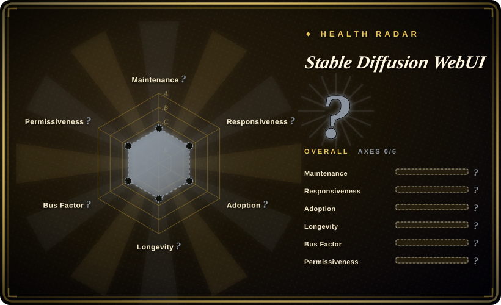

# Stable Diffusion WebUI

A web-based interface for Stable Diffusion image generation, built with Gradio, offering txt2img, img2img, inpainting, outpainting, upscaling, and a rich plugin ecosystem for local GPU inference.

## When to use

You're a creator, researcher, or developer who wants to generate images from text prompts or edit existing images using diffusion models on your own hardware. You need a local web UI where you can write prompts, tweak sampling parameters, do inpainting to remove or add objects, run img2img for style transfer, and train custom embeddings with textual inversion. You have an NVIDIA GPU with at least 6–8 GB of VRAM and are comfortable installing Python packages and managing model checkpoints. You install the WebUI, download a Stable Diffusion checkpoint, and open the browser tab to start generating — no cloud credits, no API keys, full control over the model and the outputs.

## When NOT to use

- **CPU-only inference.** Running diffusion models on CPU is technically possible but excruciatingly slow (minutes per image). This tool is designed for CUDA GPUs; without one, the experience is impractical for iterative creative work.
- **Commercial use without checking AGPL-3.0.** The project is licensed under AGPL-3.0, which carries copyleft obligations. If you plan to distribute a service or product built on top of it, verify your compliance obligations with legal counsel. [未验证]
- **Zero-setup or non-technical users.** Installation requires Python, PyTorch, CUDA drivers, and managing multiple gigabytes of model weights. It is not a one-click consumer app.
- **Team multi-user deployments.** There is no built-in RBAC, queue management, or user isolation. Multiple users sharing one instance will interfere with each other's generation jobs and settings.
- **Managed cloud preference.** If you want a hosted API without managing GPUs, drivers, and model files, use a cloud inference service instead.
- **Strict reproducibility needs.** The WebUI exposes hundreds of parameters, sampler choices, and extension interactions; reproducing an exact image across different PyTorch/CUDA versions or extension sets is difficult.

## Comparison

| Alternative | In index | Our verdict | Tradeoff |
|---|---|---|---|
| ComfyUI | 未收录 | Node-based modular workflow engine for diffusion. | ComfyUI offers deeper customization through node graphs and better for batch pipelines; WebUI is more approachable for casual exploration. |
| InvokeAI | 未收录 | Polished creative canvas with unified canvas and layer support. | More focused on the artistic workflow with a built-in canvas; less extension-heavy than WebUI. |
| Fooocus | 未收录 | Simplified one-click UI focused on ease of use. | Stripped-down presets and minimal controls; good for beginners but limiting for advanced users. |
| DiffusionBee | 未收录 | macOS-native desktop app for Stable Diffusion. | No command-line or extension ecosystem; Apple Silicon optimized but platform-locked. |
| Midjourney / DALL-E | 未收录 | Closed-source cloud-only image generation services. | Proprietary models, subscription-based, no local control; WebUI is open-source and runs on your own GPU. |

## Tech stack

- **Python** — primary implementation language
- **Gradio** — web UI framework for the frontend
- **PyTorch** — deep learning framework for model inference
- **CUDA** — GPU acceleration via NVIDIA drivers
- **Stable Diffusion models** — community checkpoints, LoRAs, embeddings, and VAEs loaded at runtime

## Dependencies

- **NVIDIA GPU** with at least 6 GB VRAM (8 GB+ recommended for larger models and higher resolutions)
- **Python 3.10+** and matching PyTorch/CUDA versions
- **Model checkpoints** — multi-gigabyte `.safetensors` or `.ckpt` files downloaded from community hubs (e.g., Civitai, Hugging Face)
- **Optional: xformers** — for memory-efficient attention and speedups
- **Optional: GFPGAN, CodeFormer, RealESRGAN** — for face restoration and upscaling in the Extras tab

## Ops difficulty

**Medium.** Installation is a one-click script for basic setups, but the real burden is keeping the Python environment, PyTorch, CUDA drivers, and extension ecosystem compatible. Extension updates can break the WebUI after a `git pull`, and model files consume tens of gigabytes of disk space. GPU thermal management, VRAM limits, and batch-size tuning are ongoing concerns. For a personal workstation this is manageable; for a shared server or production pipeline, expect frequent troubleshooting.

## Health & viability

- **Maintenance**: Active but last push was 2026-03, a few months before verification date. The project has a large open-issue backlog (2,493), suggesting both high usage and some strain on maintainer capacity.
- **Governance**: Owned by a single GitHub user (`AUTOMATIC1111`), not an organization. This creates a significant bus-factor risk; the project's continuity depends on one individual's continued involvement. [未验证]
- **Backing**: No corporate or foundation backing visible; funded by community donations and volunteer contributions.
- **Adoption**: Extremely popular (164k stars) and the de-facto standard local interface for Stable Diffusion. A vast ecosystem of extensions, models, and community tutorials exists.
- **Age & Lindy**: Created 2022-08 (~4 years old), which is young but has outlasted many AI-hype tools. It has been continuously active since launch, giving it a partial Lindy signal, though the 4-month gap since last push is worth monitoring.
- **Risk flags**: AGPL-3.0 copyleft license may affect commercial derivative use. Single-maintainer bus factor is the largest structural risk. The project also carries the general model-license risk: community checkpoints have their own licenses (some non-commercial) separate from the tool's AGPL-3.0.

## Caveats (unverified)

- [未验证] The exact maintenance status of the `AUTOMATIC1111` user account and their continued availability is not publicly documented; the bus factor is a genuine concern.
- [未验证] The 2026-03-02 last push date means there has been a ~4 month gap at verification time; verify current activity before assuming the project is still on its previous cadence.
- [未验证] Individual model checkpoints and extensions carry their own licenses and safety filters; the tool's AGPL-3.0 does not govern the weights you download.
- [推断] The 164k star count reflects both genuine popularity and the 2022–2023 AI art boom; some of that visibility is hype-driven rather than current active-user signal.
- [未验证] Specific VRAM requirements vary dramatically by model size, resolution, and enabled extensions; the "6–8 GB" figure is a rule of thumb, not a guarantee.
