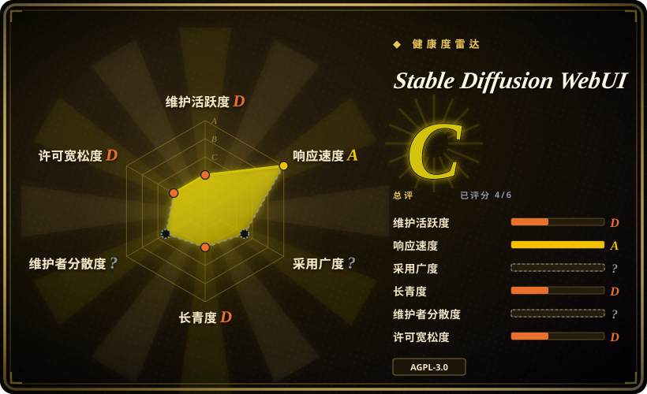

# Stable Diffusion WebUI

基于 Gradio 构建的 Stable Diffusion 图像生成 Web 界面，支持 txt2img、img2img、局部重绘、扩图、超分及丰富的插件生态，面向本地 GPU 推理。

## 何时使用

你是一名创作者、研究者或开发者，想在自有硬件上用文本提示生成图像或编辑现有图像。你需要一个本地 Web UI，可以在里面写提示词、调整采样参数、做局部重绘来移除或添加对象、运行 img2img 进行风格迁移，并用文本反演训练自定义嵌入。你选择 Stable Diffusion WebUI 而不是 ComfyUI，因为你想要传统的标签页界面而非节点图；你选它而不是 InvokeAI，因为它的扩展生态更大、文档更丰富；你偏好它而不是 Fooocus，因为你需要完整的参数控制而非简化预设。你有一块至少 6–8 GB 显存的 NVIDIA GPU，并熟悉安装 Python 包和管理模型 checkpoint。你安装 WebUI，下载 Stable Diffusion checkpoint，打开浏览器标签页即可开始生成——无需云积分、无需 API key，对模型和输出完全可控。

## 何时不用

- **纯 CPU 推理。**如果你没有 GPU 却需要运行 diffusion 模型，请改用 Midjourney 或 DALL-E 等云 API，而不是 Stable Diffusion WebUI，因为 diffusion 模型在 CPU 上运行极慢（单张图需数分钟），本工具为 CUDA GPU 设计。
- **未核查 AGPL-3.0 的商业用途。**如果你需要本地运行且对商业衍生限制更宽松的 diffusion 工具，请改用 ComfyUI（GPL-3.0，copyleft 范围不同）或云 API，而不是 Stable Diffusion WebUI，因为它的 AGPL-3.0 带有强网络 copyleft 义务，可能影响你的分发计划。
- **零配置或非技术用户。**如果你想要一键消费级体验，不想管理 Python、CUDA 和模型权重，请改用 Fooocus 或 Midjourney 等云服务，而不是 Stable Diffusion WebUI，因为安装需要 Python、PyTorch、CUDA 驱动，并管理数 GB 的模型文件。
- **团队多用户部署。**如果你需要内置 RBAC、队列管理或用户隔离的共享服务器，请改用 ComfyUI（队列管理更好）或托管云 API，而不是 Stable Diffusion WebUI，因为它没有原生多用户隔离，并发用户会互相干扰生成任务和设置。
- **偏好托管云服务。**如果你不想管理 GPU、驱动和模型文件，想要托管 API，请改用 Midjourney、DALL-E 或 Stable Diffusion API 服务，而不是 Stable Diffusion WebUI，因为它严格自托管。
- **严格可复现需求。**如果你需要跨机器可复现、版本可控的工作流，请改用 ComfyUI 搭配 JSON 工作流导出，或以编程方式使用 Diffusers（Hugging Face），而不是 Stable Diffusion WebUI，因为它暴露了数百个参数、采样器选择和扩展交互，在不同 PyTorch/CUDA 版本下复现完全一致很困难。

## 横向对比

| 替代品 | 是否收录 | 我们的评价 | 取舍 |
|---|---|---|---|
| [ComfyUI](comfyui.zh.md) | ✅ | 面向 diffusion 的节点式模块化工作流引擎。 | ComfyUI 通过节点图提供更深度定制，更适合批量管线；WebUI 对 casual 探索更友好，界面更简单传统。 |
| InvokeAI | 未收录 | 更精致的创意画布，支持统一画布与图层。 | 更聚焦艺术工作流，自带画布；扩展生态不如 WebUI 丰富。 |
| Fooocus | 未收录 | 简化的一键式 UI，强调易用性。 | 预设精简、控制项最少；对新手友好，但对高级用户限制较大。 |
| DiffusionBee | 未收录 | macOS 原生 Stable Diffusion 桌面应用。 | 无命令行或扩展生态；针对 Apple Silicon 优化，但平台锁定。 |
| Midjourney / DALL-E | 未收录 | 闭源、纯云端图像生成服务。 | 专有模型、订阅制、无本地控制；WebUI 开源且在你自己的 GPU 上运行。 |

## 技术栈

- **Python**——主要实现语言
- **Gradio**——前端 Web UI 框架
- **PyTorch**——模型推理的深度学习框架
- **CUDA**——通过 NVIDIA 驱动进行 GPU 加速
- **Stable Diffusion 模型**——运行时加载的社区 checkpoint、LoRA、嵌入和 VAE

## 依赖

- **NVIDIA GPU**，至少 6 GB 显存（大模型和高分辨率推荐 8 GB+）
- **Python 3.10+** 及匹配的 PyTorch/CUDA 版本
- **模型 checkpoint**——从社区 hub（如 Civitai、Hugging Face）下载的数 GB `.safetensors` 或 `.ckpt` 文件
- **可选：xformers**——用于内存高效 attention 和加速
- **可选：GFPGAN、CodeFormer、RealESRGAN**——用于 Extras 标签页的人脸修复和超分

## 运维难度

**中等。** 基础安装有一键脚本，但真正的负担在于保持 Python 环境、PyTorch、CUDA 驱动和扩展生态的兼容性。扩展更新可能在 `git pull` 后破坏 WebUI，模型文件占用数十 GB 磁盘空间。GPU 温度管理、显存限制和 batch size 调优是持续的关注点。对个人工作站而言可管理；对共享服务器或生产管线，要预期频繁排障。

## 健康度与可持续性

- **响应速度**：无法计算——no_traffic。
- **维护**：活跃，但上次推送为 2026-03，距验证日期已有数月。项目有大量开放 issue（2,493），既表明使用量大，也暗示维护者承受一定压力。
- **治理**：由单一 GitHub 用户（`AUTOMATIC1111`）所有，非组织。这带来显著的 bus factor 风险；项目延续性取决于该个人的持续投入。[未验证]
- **背书**：无可见的企业或基金会背书；由社区捐赠和志愿者贡献资助。
- **采用**：极受欢迎（164k star），是 Stable Diffusion 本地界面的事实标准。存在庞大的扩展、模型和社区教程生态。
- **年龄与 Lindy**：2022-08 创建（约 4 年），虽年轻但已活过许多 AI 炒作工具。自发布以来持续活跃，赋予其部分 Lindy 信号，但距上次推送已间隔 4 个月，值得留意。
- **风险旗标**：AGPL-3.0 copyleft 许可可能影响商业衍生用途。单人维护者 bus factor 是最大的结构性风险。项目还带有一般性模型许可风险：社区 checkpoint 拥有独立于工具 AGPL-3.0 的自有许可（部分非商用）。

## 存疑（未验证）

- [未验证] `AUTOMATIC1111` 用户账户的精确维护状态及其持续可用性未公开记录；bus factor 是真实关切。
- [未验证] 2026-03-02 的上次推送日期意味着验证时已有约 4 个月空白；在假设项目仍保持此前节奏前，请核实当前活跃度。
- [未验证] 单个模型 checkpoint 和扩展带有各自的许可和安全过滤器；工具的 AGPL-3.0 不约束你下载的权重。
- [推断] 164k star 数既反映真实受欢迎度，也来自 2022–2023 的 AI 绘画热潮；部分曝光由炒作驱动，而非当前活跃用户信号。
- [未验证] 具体显存需求因模型大小、分辨率和启用的扩展差异巨大；"6–8 GB" 是经验法则，非保证。
