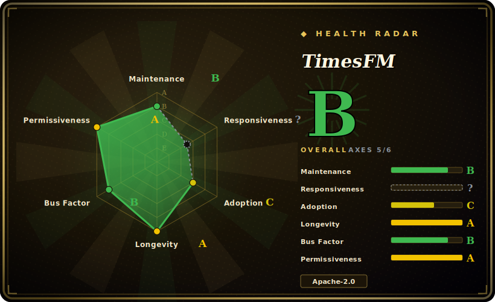

# TimesFM

A pretrained decoder-only **time-series foundation model** from Google Research: feed it a univariate history and it produces zero-shot point and quantile forecasts — no per-dataset training — small enough (200M) to run locally on CPU/GPU.

## When to use

You're a data engineer at a logistics company with thousands of SKUs, each with its own demand history, and the ask is a daily forecast per SKU. Training and maintaining one classical model (ARIMA/Prophet) per series is a maintenance treadmill, and standing up a bespoke deep-learning pipeline means labeled tuning, validation, and a serving stack you don't have time to own. You want something that takes a series in and gives a forecast out, today, without a training job.

So you reach for TimesFM. You `pip install timesfm[torch]`, pull `google/timesfm-2.5-200m-pytorch` from the Hugging Face collection, and call `model.forecast(horizon=..., inputs=[...])` over batches of your series. Because the 2.5 checkpoint is only 200M parameters it loads and runs on a single CPU box or a modest GPU — no cloud forecasting API, no per-call bill, and your demand data stays on your own machine. You get point forecasts plus continuous quantile bands (for prediction intervals) zero-shot, and if accuracy on your domain falls short you can fine-tune via Hugging Face Transformers + PEFT/LoRA rather than starting from scratch. When external drivers matter (promotions, price), the XReg path lets you add covariates.

## When NOT to use

- **Not a chat/LLM or anomaly detector** — TimesFM forecasts numeric time series only. It does not classify, detect anomalies, or generate text; pair it with your own logic for those.
- **Hard real-time / microsecond latency** — it's a 200M–500M transformer; per-call inference is heavier than a fitted ARIMA/exponential-smoothing model. For ultra-low-latency or embedded MCU targets, a tiny classical model wins.
- **You need a guaranteed-supported product** — the README states "this open version is not an officially supported Google product." No SLA; treat it as research code you self-host.
- **Very short or highly irregular series** — a foundation model shines with enough context; for a handful of points, sparse/intermittent demand, or event-driven irregular timestamps, classical or specialized methods are often better.
- **True multivariate causal modeling** — it forecasts series (univariate per channel, with optional exogenous regressors via XReg); it is not a structural/causal multivariate model that learns cross-series dynamics end-to-end.
- **Version churn risk** — model lineage moves fast (1.0 → 2.0 → 2.5 changed parameter count, context length, and the forecasting API); 1.0/2.0 are archived under `v1` (`pip install timesfm==1.3.0`). Pin your checkpoint and API version.
- **Strict licensing on weights** — code is Apache-2.0, but confirm each checkpoint's own license/usage terms on Hugging Face before commercial deployment.

## Comparison

| Alternative | In index | Our verdict | Tradeoff |
|---|---|---|---|
| [BitNet](bitnet.md) | ✅ | Use this page for its stated niche; choose BitNet when you need an on-device **LLM** runtime (1-bit text models), a different modality entirely. | An on-device **LLM** runtime (1-bit text models), a different modality entirely — TimesFM forecasts numbers, BitNet generates text. Listed here only to disambiguate "local model": pick by task, not by both being "small + local". |
| [LiteRT-LM](litert-lm.md) | ✅ | Use this page for its stated niche; choose LiteRT-LM when you need google's on-device **LLM** orchestration runtime (text gen on phones). | Google's on-device **LLM** orchestration runtime (text gen on phones). Not a forecaster; you would not use it for demand forecasting. Same disambiguation note. |
| [Google AI Edge Gallery](ai-edge-gallery.md) | ✅ | Use this page for its stated niche; choose Google AI Edge Gallery when you need a demo app/catalog for running on-device **generative** models, not time-series forecasting. | A demo app/catalog for running on-device **generative** models, not time-series forecasting. Different task. |
| Chronos (Amazon) | 未收录 | Use this page for its stated niche; choose Chronos (Amazon) when you need tokenizes series into a language-model vocabulary. | Tokenizes series into a language-model vocabulary; strong zero-shot forecaster and a direct substitute. TimesFM is decoder-only with native quantile head and (2.5) 16k context. |
| TimGPT / Nixtla `nixtla` | 未收录 | Use this page for its stated niche; choose TimGPT / Nixtla nixtla when you need hosted/managed forecasting API and OSS libs (statsforecast/neuralforecast). | Hosted/managed forecasting API and OSS libs (statsforecast/neuralforecast). Nixtla's classical/neural libs are great when per-series training is fine; TimesFM trades that for zero-shot. |
| Moirai (Salesforce) | 未收录 | Use this page for its stated niche; choose Moirai (Salesforce) when you need another open time-series foundation model with multivariate framing. | Another open time-series foundation model with multivariate framing; overlapping use case, different architecture and license terms. |

## Tech stack

- **Language:** Python.
- **Architecture:** decoder-only transformer for forecasting (patched inputs → autoregressive horizon); optional ~30M quantile head for continuous quantile/interval forecasts.
- **Backends:** PyTorch and JAX/Flax (install `timesfm[torch]` or `timesfm[flax]`).
- **Checkpoints:** hosted in the TimesFM Hugging Face collection (e.g. `google/timesfm-2.5-200m-pytorch`).
- **Fine-tuning:** via Hugging Face Transformers + PEFT (LoRA), with examples in the repo.
- **Covariates:** XReg (external regressors) via `timesfm[xreg]`.

## Dependencies

- **Runtime:** Python; PyTorch *or* JAX/Flax (pick the backend extra). Runs on CPU, GPU, or TPU — CPU is viable for the 200M checkpoint.
- **Install:** `pip install timesfm[torch]` (or `[flax]`, optionally `[xreg]`); the repo uses `uv` for local dev dependency management.
- **Model weights:** downloaded from the Hugging Face TimesFM collection (network access on first load).
- **Compute:** no GPU strictly required for the 200M model; a GPU/TPU helps throughput on large batches or the 500M (2.0) checkpoint.

## Ops difficulty

**Low-to-medium.** Zero-shot inference is a `pip install` plus a `from_pretrained` / `compile` / `forecast` call — no training job, no labeled data, no serving framework required, and the 200M model fits on commodity CPU. Difficulty rises if you (a) batch large fleets of series and need to size GPU/TPU throughput, (b) fine-tune via PEFT (then you own a training/eval loop), (c) add covariates through XReg, or (d) wrap it in a service with input validation, since the model assumes clean, regularly-sampled numeric input. The main lifecycle burden is version management: checkpoint and API changes across 1.0/2.0/2.5 mean you must pin and re-validate on upgrade.

## Health & viability

- **Maintenance (2026-06):** last push 2026-06, repo release v2.0.1 dated 2026-06-11, headline model line at 2.5 — **active** with a moving model lineage (1.0 → 2.0 → 2.5). [推断] Release-tag versioning lags the model naming, so cadence reads as ongoing research, not a frozen product.
- **Governance / backing:** Google Research-maintained (`google-research`, Organization). [推断] No single-maintainer bus factor, but the README explicitly states "not an officially supported Google product" — there is **no SLA**, and Google Research code can stall when the team's focus shifts.
- **Age & Lindy (created 2024-04, ~2yr):** young-ish but consistently active across three model generations — past the "abandoned-young" failure mode, not yet a long-lived Lindy bet. [推断] Treat as a credible-but-evolving foundation model.
- **Adoption:** ~25k stars (volatile, see Caveats); a small (200M) CPU-runnable checkpoint plus HF/PEFT fine-tuning lowers the adoption barrier, and it sits among named peers (Chronos, Moirai, Nixtla) as a recognized TSFM option. [未验证]
- **Risk flags:** code is Apache-2.0, but **per-checkpoint weight licenses on Hugging Face may differ** — verify before commercial use. Version churn (pin checkpoint + API) is the other live flag. [推断]

## Caveats (unverified)

- [未验证] Star count ~25.6k (GitHub API, 2026-06-26); GitHub stars are unreliable and drift continuously — indicative only.
- [未验证] Headline model TimesFM 2.5 release date (Sept 15, 2025) and "200M params / 16k context / 1k-horizon quantile" specs are from the README and HF collection text, not independently benchmarked here.
- [未验证] The latest *GitHub release tag* is v2.0.1 (2026-06-11) while the *model* line is labeled 2.5 — release-tag versioning and model-version naming are tracked separately; confirm which checkpoint a tag ships before pinning.
- [推断] CPU viability for the 200M checkpoint is inferred from its size and "runs on CPU/GPU/TPU" documentation; actual latency/throughput depends on series count, horizon, and hardware — benchmark for your load.
- [未验证] Per-checkpoint weight licenses on Hugging Face may differ from the repo's Apache-2.0 code license; verify before commercial use.
- [推断] Accuracy vs Chronos/Moirai/Nixtla is workload-dependent; no first-party head-to-head is asserted here — evaluate on your own data.
