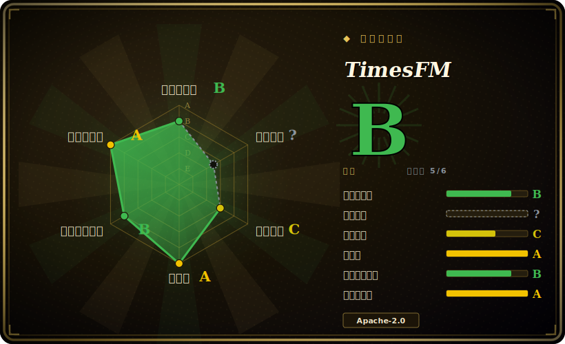

# TimesFM

Google Research 出品的预训练**时间序列基础模型**（decoder-only）：喂入一段单变量历史，它直接给出零样本（zero-shot）点预测和分位数预测——无需按数据集逐一训练——体量足够小（200M），可在本地 CPU/GPU 上跑。

## 何时使用

你是一家物流公司的数据工程师，手上有几千个 SKU，每个都有自己的需求历史，业务要求每天给每个 SKU 出一份预测。给每条序列单独训练并维护一个经典模型（ARIMA/Prophet）是个没完没了的运维负担；自建一套深度学习管线又意味着要做标注调参、验证、外加一套你根本没空维护的推理服务。你想要的是：序列进、预测出，今天就能用，还不用跑训练任务。

于是你选了 TimesFM。`pip install timesfm[torch]`，从 Hugging Face 集合里拉 `google/timesfm-2.5-200m-pytorch`，对一批批序列调用 `model.forecast(horizon=..., inputs=[...])`。因为 2.5 这个 checkpoint 只有 200M 参数，它能在一台单 CPU 机器或一块中等 GPU 上加载运行——没有云预测 API、没有按调用计费的账单，需求数据也留在你自己机器上。你零样本就拿到点预测加连续分位数区间（用于预测区间）；如果在你的领域上精度不够，可以走 Hugging Face Transformers + PEFT/LoRA 微调，而不必从零开始。当外部驱动因素（促销、价格）重要时，XReg 路径让你加入协变量。

## 何时不用

- **不是聊天/LLM，也不是异常检测器** —— TimesFM 只做数值时间序列预测。它不分类、不检测异常、不生成文本；这些要靠你自己的逻辑来配。
- **硬实时 / 微秒级延迟** —— 它是个 200M–500M 的 transformer，单次推理比一个拟合好的 ARIMA/指数平滑模型重。对于超低延迟或嵌入式 MCU 目标，小巧的经典模型更合适。
- **需要官方支持背书** —— README 明确写 "this open version is not an officially supported Google product"。没有 SLA；当作你自托管的研究代码看待。
- **极短或高度不规则序列** —— 基础模型在有足够上下文时才出彩；对于寥寥几个点、稀疏/间歇性需求、或事件驱动的不规则时间戳，经典或专门方法往往更好。
- **真正的多变量因果建模** —— 它预测的是序列（按通道单变量，可选 XReg 外生回归量），不是端到端学习跨序列动态的结构化/因果多变量模型。
- **版本变动风险** —— 模型谱系迭代很快（1.0 → 2.0 → 2.5 改了参数量、上下文长度和预测 API）；1.0/2.0 已归档到 `v1`（`pip install timesfm==1.3.0`）。请固定你的 checkpoint 和 API 版本。
- **权重许可严格** —— 代码是 Apache-2.0，但商用部署前请在 Hugging Face 上确认每个 checkpoint 自身的许可/使用条款。

## 横向对比

| 替代品 | 是否收录 | 取舍 |
|---|---|---|
| [BitNet](bitnet.zh.md) | ✅ | 一个端侧 **LLM** 运行时（1-bit 文本模型），完全是另一种模态——TimesFM 预测数字，BitNet 生成文本。列在这里只为消歧“本地模型”：按任务选，不要因为都“小+本地”就混为一谈。 |
| [LiteRT-LM](litert-lm.zh.md) | ✅ | Google 的端侧 **LLM** 编排运行时（手机上跑文本生成）。不是预测器；不会用它做需求预测。同样的消歧说明。 |
| [Google AI Edge Gallery](ai-edge-gallery.zh.md) | ✅ | 一个运行端侧**生成式**模型的演示 app/目录，不做时间序列预测。任务不同。 |
| Chronos (Amazon) | 未收录 | 把序列 token 化进语言模型词表；很强的零样本预测器，是直接替代品。TimesFM 是 decoder-only、自带分位数头、（2.5）16k 上下文。 |
| TimGPT / Nixtla `nixtla` | 未收录 | 托管/受管的预测 API 加 OSS 库（statsforecast/neuralforecast）。Nixtla 的经典/神经库在“可逐序列训练”时很好用；TimesFM 用零样本换掉这一步。 |
| Moirai (Salesforce) | 未收录 | 另一个开源时间序列基础模型，带多变量框架；用例重叠，但架构和许可条款不同。 |

## 技术栈

- **语言：** Python。
- **架构：** 用于预测的 decoder-only transformer（patch 化输入 → 自回归出 horizon）；可选约 30M 的分位数头，用于连续分位数/区间预测。
- **后端：** PyTorch 和 JAX/Flax（安装 `timesfm[torch]` 或 `timesfm[flax]`）。
- **Checkpoint：** 托管在 TimesFM Hugging Face 集合（如 `google/timesfm-2.5-200m-pytorch`）。
- **微调：** 通过 Hugging Face Transformers + PEFT（LoRA），仓库内有示例。
- **协变量：** 通过 `timesfm[xreg]` 的 XReg（外生回归量）。

## 依赖

- **运行时：** Python；PyTorch *或* JAX/Flax（按后端 extra 选其一）。可跑在 CPU、GPU 或 TPU 上——200M checkpoint 用 CPU 可行。
- **安装：** `pip install timesfm[torch]`（或 `[flax]`，可选 `[xreg]`）；仓库本地开发用 `uv` 管理依赖。
- **模型权重：** 从 Hugging Face TimesFM 集合下载（首次加载需联网）。
- **算力：** 200M 模型不强制要 GPU；GPU/TPU 在大批量或 500M（2.0）checkpoint 上有助吞吐。

## 运维难度

**低到中。** 零样本推理就是一次 `pip install` 加 `from_pretrained` / `compile` / `forecast` 调用——没有训练任务、不要标注数据、不需要服务框架，200M 模型在普通 CPU 上就能跑。难度上升的情形：(a) 批量预测大规模序列、需要测算 GPU/TPU 吞吐；(b) 走 PEFT 微调（那你就要自己维护训练/评估循环）；(c) 通过 XReg 加协变量；(d) 把它包成服务并做输入校验——因为模型假设输入是干净、等间隔采样的数值。主要的生命周期负担是版本管理：1.0/2.0/2.5 之间 checkpoint 和 API 会变，升级时必须固定版本并重新验证。

## 健康度与可持续性

- **维护（2026-06）：** 最后 push 在 2026-06，仓库 release v2.0.1 标注 2026-06-11，头牌模型线在 2.5——**活跃**，且模型谱系在持续推进（1.0 → 2.0 → 2.5）。[推断] release tag 版本号落后于模型命名，因此节奏读起来是持续的研究，而非冻结的产品。
- **治理 / 背书：** 由 Google Research 维护（`google-research`，Organization）。[推断] 没有单一维护者的巴士因子，但 README 明确写“不是受官方支持的 Google 产品”——**没有 SLA**，且 Google Research 的代码会在团队重心转移时停滞。
- **年龄与 Lindy（创建于 2024-04，约 2 年）：** 偏年轻，但跨三代模型持续活跃——已越过“年轻即废弃”的失败模式，但还不是经过长期验证的 Lindy 赌注。[推断] 当作可信但仍在演进的基础模型看待。
- **采用度：** 约 25k star（易波动，见存疑）；小（200M）、可在 CPU 上跑的 checkpoint 加上 HF/PEFT 微调降低了采用门槛，且它在一众同侪（Chronos、Moirai、Nixtla）中是被认可的 TSFM 选项。[未验证]
- **风险标记：** 代码是 Apache-2.0，但 **Hugging Face 上各 checkpoint 的权重许可可能不同**——商用前请核实。版本变动（要 pin checkpoint + API）是另一个活跃风险。[推断]

## 存疑（未验证）

- [未验证] Star 数约 25.6k（GitHub API，2026-06-26）；GitHub star 不可靠且持续漂移——仅作参考。
- [未验证] 头牌模型 TimesFM 2.5 的发布日期（2025-09-15）以及“200M 参数 / 16k 上下文 / 1k horizon 分位数”等规格来自 README 和 HF 集合文本，本文未独立基准测试。
- [未验证] 最新的 *GitHub release tag* 是 v2.0.1（2026-06-11），而*模型*线标的是 2.5——release tag 版本号和模型版本命名是分开追踪的；固定前请确认某个 tag 实际发布的是哪个 checkpoint。
- [推断] 200M checkpoint 的 CPU 可行性是从其体量和“可跑 CPU/GPU/TPU”的文档推断的；实际延迟/吞吐取决于序列数量、horizon 和硬件——请针对你的负载实测。
- [未验证] Hugging Face 上各 checkpoint 的权重许可可能与仓库代码的 Apache-2.0 不同；商用前请核实。
- [推断] 相对 Chronos/Moirai/Nixtla 的精度依负载而定；本文不主张任何第一方正面对比——请在你自己的数据上评估。
