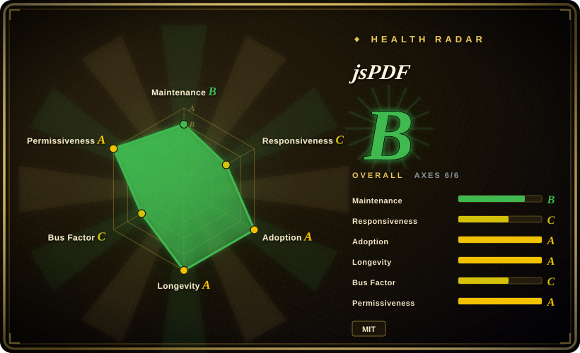

# jsPDF

A client-side JavaScript library for generating PDFs from HTML, text, and graphics — popular for invoices, reports, and tickets in the browser without a server round-trip.

## When to use

You're a front-end developer building a web app where users need to download a PDF — an invoice, a shipping label, a ticket, or a simple report — and you want to generate it right there in the browser without sending data to a server and waiting for a response. You have HTML templates or raw text and graphics to assemble, and you need a quick, lightweight way to build a PDF document client-side. You pull in `jspdf`, create a document instance, add text, images, and tables (via the `autotable` plugin), and call `save()` to drop the file into the user's downloads — no backend PDF service required, no latency, and the data never leaves the client.

The same library fits when you already have styled HTML and want a PDF that looks close to it: the built-in `html` method (powered by html2canvas under the hood) lets you point at a DOM element, render it, and embed the result into a PDF page — handy for receipts, certificates, and data summaries that were already rendered for the screen.

## When NOT to use

- **You need to modify existing PDFs.** jsPDF is creation-only — it builds new documents from scratch. It cannot open an existing PDF, edit its pages, fill pre-existing forms, merge files, or stamp content onto an existing document. For that, use pdf-lib (JS) or a server-side tool.
- **You need pixel-perfect HTML-to-PDF conversion.** The `html` plugin relies on html2canvas, which has known CSS support gaps (flexbox/grid can be fragile, complex layouts may drift) and can struggle with large tables or multi-page content. [推断] For print-quality HTML-to-PDF, a headless browser (Puppeteer/Playwright) or a dedicated server-side renderer is more reliable.
- **Your PDFs are complex or large.** While jsPDF handles text, images, and basic shapes well, it is not designed for heavy document manipulation — complex layouts, rich typography, embedded interactive forms, or very large multi-page documents may exceed what the library comfortably supports. For heavy server-side generation, reportlab (Python) or similar tools are better suited.
- **You need the smallest possible bundle.** jsPDF is featureful but not tiny; for extremely constrained environments, evaluate whether a lighter dedicated tool or a server-side generation endpoint is more appropriate.
- **You need structured document parsing for AI/RAG.** jsPDF generates PDFs; it does not parse or extract structured content from them. For layout-aware parsing of existing documents, use [Docling](../document-parsing/docling.md) or similar.

## Comparison

| Alternative | In index | Our verdict | Tradeoff |
|---|---|---|---|
| [PDF.js](pdfjs.md) | ✅ | Choose PDF.js when you need to render or read existing PDFs in the browser. | A renderer/viewer, not a generator — complementary. PDF.js displays PDFs; jsPDF builds them. |
| [pdf-lib](pdf-lib.md) | ✅ | Choose pdf-lib when you need to create AND modify PDFs in JS, including forms, merging, and drawing, without native deps. | JS library to create and modify PDFs — covers the edit/modify case jsPDF doesn't handle. |
| PyMuPDF / pdfplumber | 未收录 | Choose PyMuPDF / pdfplumber when you need fast server-side PDF text/table extraction or rendering. | Python libraries for server-side PDF work; not a browser generator. |
| [Docling](../document-parsing/docling.md) | ✅ | Choose Docling when you need layout-aware document parsing into structured output for AI/RAG. | A parser, not a generator — it reads documents into structured Markdown/JSON, never creates them. |
| Native `<embed>` / browser PDF plugin | 未收录 | Choose native embed when you only need to display an existing PDF with zero integration work. | Zero-dependency display, but no generation, no programmatic control, and inconsistent across browsers. |

## Tech stack

- **Language:** JavaScript (ES5/ES6+), with TypeScript definitions available.
- **Execution model:** Runs in modern browsers and Node.js; works with bundlers (Webpack, Vite, Rollup) and can be loaded via CDN.
- **Architecture:** Plugin-based — core library is small, and features like `autotable` (tables), `html` (HTML-to-PDF via html2canvas), and SVG import are added as separate plugins.
- **HTML-to-PDF pipeline:** The `html` plugin delegates to html2canvas to rasterize DOM elements to canvas, then embeds the image data into the PDF.

## Dependencies

- **Runtime:** a JavaScript environment — modern browser or Node.js. No native binary dependencies.
- **Install:** `npm install jspdf` for the core library; plugins like `jspdf-autotable` are separate npm packages.
- **html2canvas:** Required when using the `html` plugin for HTML-to-PDF conversion; this is a separate dependency that must be installed alongside jsPDF.
- **Node specifics:** server-side usage in Node may need a canvas polyfill for some operations; plain text + image generation works without one. [未验证]

## Ops difficulty

**Low.** jsPDF is a client-side library — there is no service to deploy, no datastore, no clustering. The "ops" burden is primarily dependency management: keeping the library and its plugins current, and being aware that html2canvas (the HTML-to-PDF engine) has its own release cadence and CSS compatibility limitations. For browser use, it is a standard npm install or CDN include; for Node, confirm that the operations you need (text vs. images vs. canvas-backed features) work in your Node version without additional polyfills.

## Health & viability

- **Maintenance (2026-07):** Active maintenance with ongoing releases in the v2.5.x line; the project has been around since 2014 and shows sustained development. [推断]
- **Governance / backing:** Community-maintained (`parallax/jsPDF`); not backed by a major corporation or foundation. This means maintenance depends on volunteer contributors rather than a funded team — a moderate bus-factor risk compared to vendor-backed alternatives. [推断]
- **Age & Lindy (created ~2014, ~12yr):** old and still active — a decent Lindy signal. A 12-year-old library with ~28k stars that is still receiving updates is a safer bet than a young hyped alternative, though the community-maintenance model means longevity is less guaranteed than a foundation-backed project. [推断]
- **Adoption:** ~28k stars (volatile, see Caveats) and widely used for client-side PDF generation in web apps; the plugin ecosystem (autotable, html2canvas integration, etc.) provides real utility. [未验证]
- **Risk flags:** MIT license (no relicense risk). No open-core gating or CLA requirements observed. The main watch-item is the community-maintenance model: while active now, there is no corporate backstop if contributor interest wanes. [推断]

## Caveats (unverified)

- [未验证] ~28k GitHub stars and "active maintenance" reflect a point-in-time snapshot (v2.5.x, 2026-07); star counts are noisy and date-sensitive — treat as indicative.
- [未验证] html2canvas CSS support gaps and large-table breakage are reported by the community; exact failure modes vary by document complexity and browser version.
- [未验证] Node.js canvas polyfill requirements for specific features (e.g., certain image formats) depend on the Node version and installed packages; verify against your target environment.
- [推断] Plugin ecosystem health and maintenance cadence of individual plugins (autotable, html, etc.) are separate from core jsPDF maintenance; some plugins may lag behind core releases.
- [推断] Community maintenance implies that bug-fix priority and feature roadmap are driven by volunteer availability rather than a commercial roadmap; evaluate against your project's support needs.
