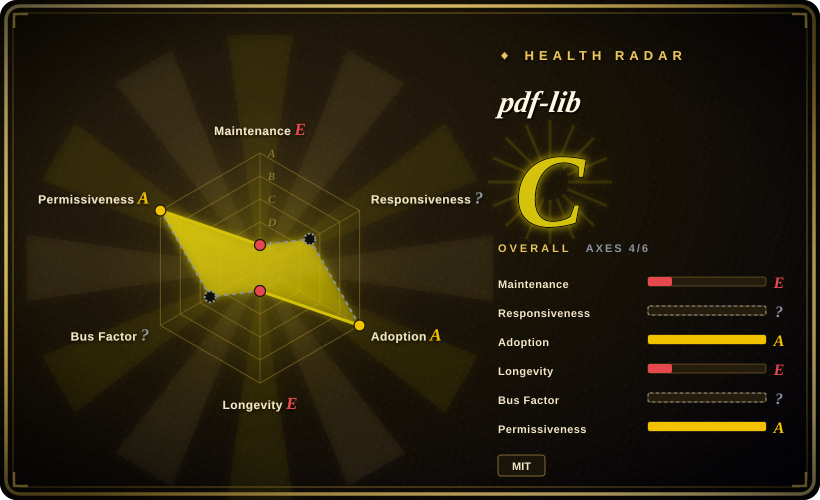

# pdf-lib

A pure JavaScript/TypeScript library for creating and modifying PDFs in the browser, Node.js, Deno, and React Native — zero native dependencies, focused on the "write side" of PDFs (not rendering or viewing).

## When to use

You're a full-stack developer building a web app where users need to generate downloadable PDFs — invoices, shipping labels, certificates, or filled government forms — without a round-trip to a server-side PDF service. Your stack is TypeScript on both ends, and you want the same code to run in the browser and in Node.js. You need to create documents from scratch, stamp them with text, images, and vector graphics, merge multiple PDFs into one, and programmatically fill interactive form fields (checkboxes, text inputs, dropdowns). You reach for pdf-lib because it is a pure JS/TS library with no native dependencies, so it works anywhere JavaScript runs — browser, Node, Deno, even React Native — and it exposes a typed, programmatic API for drawing content, embedding custom fonts, and manipulating page structure directly at the PDF object level. You don't need a headless browser or a server-side PDF engine; the document is built and serialized in-process and delivered as bytes.

The same library is your tool when you need to surgically modify existing PDFs client-side: add a watermark, append an extra page, flatten a form, or extract and recombine pages — all without leaving the JS runtime.

## When NOT to use

- **You need to render or view PDFs.** pdf-lib creates and edits PDFs; it does not display them. For rendering in the browser or Node, use [PDF.js](pdfjs.md).
- **You need HTML-to-PDF conversion.** pdf-lib has no built-in HTML-to-PDF engine; you work directly with the PDF API. For HTML-to-PDF, reach for Puppeteer/Playwright (headless browser) or server-side tools like WeasyPrint.
- **Bundle size is a hard constraint.** The browser bundle is ~500KB+ minified; for a single tiny PDF or a bandwidth-sensitive app, the payload may outweigh the benefit.
- **You need server-side batch processing at scale.** Python libraries like PyMuPDF or pdfplumber are typically faster and lighter for back-end batch extraction, rendering, and heavy manipulation.
- **You need cutting-edge PDF features or a fast-moving ecosystem.** pdf-lib is in maintenance mode; new features and spec-compliance fixes land slowly, and the original author has stepped back from day-to-day maintenance.
- **You need layout-aware structured parsing for AI/RAG.** pdf-lib manipulates PDF structures but does not extract reading order, tables, or semantic document structure — for that, use [Docling](../document-parsing/docling.md).
- **You need a project with strong governance and a committed roadmap.** Governance is informal community maintenance with no foundation or corporate backing; the bus factor is low. [推断]

## Comparison

| Alternative | In index | Our verdict | Tradeoff |
|---|---|---|---|
| [PDF.js](pdfjs.md) | ✅ | Choose PDF.js when you need to render or read PDFs in the browser/Node; choose pdf-lib when you need to create or modify them. | Renders and reads PDFs in the browser/Node — complementary, not a substitute; pdf-lib is the write side, PDF.js is the read side. |
| jsPDF | 未收录 | Choose jsPDF for simpler client-side PDF generation with a smaller API surface and bundle; choose pdf-lib for deeper PDF manipulation (forms, merging, embedded fonts, low-level object access). | Client-side PDF generation from JS; lighter and simpler, but less capable for complex document surgery and font handling. |
| PyMuPDF / pdfplumber | 未收录 | Choose PyMuPDF / pdfplumber for fast Python server-side PDF manipulation and text/table extraction; choose pdf-lib when you must stay in JS/TS. | Python libraries for server-side render + text/table extraction; faster for batch jobs, but not available in the browser. |
| [Docling](../document-parsing/docling.md) | ✅ | Choose Docling when you need layout-aware document parsing for AI/RAG; choose pdf-lib when you need to programmatically create or edit PDFs. | Layout-aware document parser producing structured Markdown/JSON for AI ingestion; different goal — semantic extraction, not document authoring. |
| Native `<embed>` / browser PDF plugin | 未收录 | Use the native plugin for zero-effort viewing; use pdf-lib when you need programmatic control over PDF creation or modification. | Zero-dependency and built into the browser, but only for viewing — no creation, editing, or programmatic access. |

## Tech stack

- **Language:** TypeScript (compiled to JavaScript), with a strongly typed, promise-based API.
- **Execution model:** pure JS/TS library — runs in-browser (via bundler), Node.js, Deno, and React Native. No native dependencies, no WASM, no C++ bindings.
- **Distribution:** npm package (`pdf-lib`) with ES module and CommonJS builds; UMD bundle available for direct browser inclusion.
- **PDF internals:** operates directly on PDF object streams, cross-reference tables, and content streams — low-level PDF spec compliance rather than a high-level abstraction.

## Dependencies

- **Runtime:** a JavaScript environment — any modern browser, Node.js, Deno, or React Native. No external services, no database, no native binary.
- **Install:** `npm install pdf-lib` (or equivalent); the library is self-contained.
- **Font bundling:** standard 14 PDF fonts are available without embedding; custom fonts must be loaded as ArrayBuffers and embedded into the document. [推断]
- **Image support:** embeds PNG and JPEG images directly; other formats must be converted before embedding. [推断]

## Ops difficulty

**Low.** pdf-lib is an in-process library — there is no service to deploy, no datastore, no clustering. "Ops" is essentially dependency management: keeping the npm package current, budgeting the ~500KB+ browser bundle into your build pipeline, and handling occasional breaking changes between versions (the API has shifted over time). Since it is pure JS/TS, there are no platform-specific compilation or deployment concerns. The main operational watch-item is maintenance velocity: if you hit a spec edge-case or a bug, the fix may depend on community PR velocity rather than a committed maintainer.

## Health & viability

- **Maintenance (2026-07):** v1.17.x is the latest major line; the original author (Hopding) has stepped back from active development, and the project is in community maintenance mode. PRs are reviewed and merged, but the pace is slower than peak. [推断]
- **Governance / bus factor:** single original author who has stepped back; no foundation or committed vendor owns the roadmap. Community maintenance keeps it alive, but governance is informal and the bus factor is low. [推断]
- **Backing & longevity:** no corporate or foundation backing; survival depends on sustained community interest and fork activity. The project has been around since ~2018 (~8 years), giving it moderate Lindy signal, but the maintenance-mode status weakens the "still-active" multiplier. [推断]
- **Adoption:** ~9k stars (as of 2026-07) with steady use in JS/TS ecosystems for client-side PDF generation; notable dependents include form-filling and invoice-generation tools. [未验证]
- **Risk flags:** MIT license (no relicense risk); no open-core gating or CLA. The main risk is maintenance velocity: bugs and spec-compliance gaps may linger longer than in an actively driven project. Forks exist but none has clearly emerged as the canonical successor. [推断]

## Caveats (unverified)

- [未验证] ~9k stars and "maintenance mode" status reflect a point-in-time snapshot as of 2026-07; star counts are noisy and the maintenance situation may shift if a new maintainer or dominant fork emerges.
- [未验证] Browser bundle size (~500KB+) is an approximate figure from published build artifacts; your bundler may tree-shake differently depending on which features you import.
- [未验证] Support for Deno and React Native is documented but not personally verified in this review; runtime compatibility depends on the specific environment and version.
- [推断] The exact pace of community maintenance and which forks are most active is inferred from GitHub activity patterns, not a direct audit of maintainer commitments or fork download metrics.
- [推断] The claim that PyMuPDF / pdfplumber are "faster and lighter" for server-side batch work is an inference from their native/C++ implementations, not a head-to-head benchmark against pdf-lib for any specific workload.
