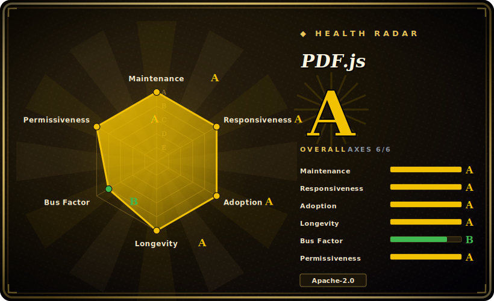

# PDF.js

A pure-JavaScript PDF rendering and parsing library by Mozilla that powers Firefox's built-in viewer — it draws PDF pages to a `<canvas>`, extracts text and metadata, and ships a prebuilt drop-in viewer, running in the browser and in Node.

## When to use

You're a front-end engineer building a web app where users need to view PDFs inline — contracts, invoices, reports — without bouncing them to the browser's native plugin or a third-party SaaS embed. You don't want to upload documents to someone else's server just to render them, and you need the viewer to behave consistently across Chrome, Firefox, and Safari. You pull in `pdfjs-dist`, point it at the PDF (a URL, an `ArrayBuffer`, or bytes you already hold), call `getDocument()`, and render each page into a canvas you control — zoom, page navigation, and text-layer selection all happen client-side. For a turnkey UI you drop in the prebuilt `web/viewer.html` bundle and skip writing the chrome yourself.

The same library is your tool when you need to *read* a PDF, not just show it: pull the text content per page (`getTextContent()`) for client-side search, snippet extraction, or feeding a lightweight search index, or read the document outline and annotations. Because parsing and rendering run in a Web Worker off the main thread, a heavy document won't freeze your UI — and the whole thing works offline once the assets are loaded, so it suits privacy-sensitive apps that must keep documents on the client.

## When NOT to use

- **You need to create or edit PDFs.** PDF.js *renders and reads* PDFs; it is not a generator or editor. To build a PDF from scratch, fill forms programmatically, merge/split, or stamp content, reach for pdf-lib or jsPDF in JS, or reportlab server-side. (PDF.js does support viewing and basic form-field interaction in the viewer, but not authoring a document.)
- **Simple server-side text extraction.** If all you need is to pull text out of PDFs in a batch/back-end job, a full browser-rendering engine is heavy overhead — pdfplumber or PyMuPDF (Python) are leaner and faster for that one job server-side.
- **You want layout-aware structured parsing for AI/RAG.** PDF.js gives you positioned text runs, not reading-order, tables, or document structure tuned for LLM ingestion — for that use [Docling](../document-parsing/docling.md) or similar.
- **Bundle size / worker setup matters and the doc is trivial.** It is a large dependency that needs its worker file served correctly (`workerSrc`); for one tiny PDF the integration cost can outweigh the benefit.
- **Very large or pathological PDFs on weak clients.** Rendering huge, image-heavy, or deeply nested documents in-browser can be slow and memory-hungry; offload heavy parsing to the server when the client can't keep up. [推断]

## Comparison

| Alternative | In index | Our verdict | Tradeoff |
|---|---|---|---|
| pdf-lib | 未收录 | Use this page for its stated niche; choose pdf-lib when you need JS library to **create and modify** PDFs (forms, merge, draw). | JS library to **create and modify** PDFs (forms, merge, draw) — the write side PDF.js doesn't cover; not a renderer/viewer. |
| jsPDF | 未收录 | Use this page for its stated niche; choose jsPDF when you need client-side PDF **generation** from JS. | Client-side PDF **generation** from JS; complementary, not a substitute — it builds documents, PDF.js displays them. |
| PyMuPDF / pdfplumber | 未收录 | Use this page for its stated niche; choose PyMuPDF / pdfplumber when you need python libraries for fast server-side render + text/table extraction. | Python libraries for fast server-side render + text/table extraction; better for back-end batch jobs, but not a browser viewer. |
| [Docling](../document-parsing/docling.md) | 未收录 | Use this page for its stated niche; choose Docling when you need layout-aware document parser producing structured output (reading order, tables) for AI/RAG. | Layout-aware document parser producing structured output (reading order, tables) for AI/RAG; different goal — semantic structure, not pixel-faithful display. |
| Native `<embed>` / browser PDF plugin | 未收录 | Use this page for its stated niche; choose Native <embed> / browser PDF plugin when you need zero-dependency and built into the browser, but inconsistent across browsers, not controllable, and. | Zero-dependency and built into the browser, but inconsistent across browsers, not controllable, and gives you no programmatic text/render access. |

## Tech stack

- **Language:** JavaScript (ES modules), with a small amount of supporting tooling.
- **Execution model:** parsing and rendering run in a **Web Worker**; the main thread drives an API that returns pages you draw to a `<canvas>`, plus a selectable text layer rendered as DOM over the canvas.
- **Build:** Gulp-based build; distributed prebuilt as the `pdfjs-dist` npm package (API + worker + prebuilt `web/viewer.html`).
- **Targets:** modern browsers; also usable in Node (e.g. for headless text extraction / rendering with the appropriate canvas backend).

## Dependencies

- **Runtime:** a JavaScript environment — a modern browser, or Node for server-side use. The worker script (`pdf.worker.js`) must be served and its path configured (`GlobalWorkerOptions.workerSrc`).
- **Install:** `npm install pdfjs-dist` for the library + prebuilt viewer assets; no external services or datastore required.
- **Node specifics:** server-side rendering to canvas needs a canvas implementation (e.g. `node-canvas` / `@napi-rs/canvas`); plain text extraction has lighter needs. [未验证]
- **Build from source:** Node.js and the Gulp toolchain; exact minimum versions are set by the repo and shift over time. [未验证]

## Ops difficulty

**Low.** PDF.js is a client-side (or in-process Node) library — there is no service to deploy, no datastore, no clustering. The one real setup gotcha is wiring the worker: the `pdf.worker.js` file must be served from a reachable URL and `workerSrc` set to match, or rendering silently fails; bundlers (Webpack/Vite) often need a one-time config to emit the worker correctly. Beyond that, "ops" is really just keeping the dependency current (security and format-compatibility fixes land regularly) and budgeting CPU/memory on the client for large documents. Serving the prebuilt viewer is static-file hosting.

## Health & viability

- **Maintenance (2026-06):** last push 2026-06, latest release v6.1.200 dated 2026-06-27 — **active** with a steady release stream; security/format fixes land regularly. [推断]
- **Governance / backing:** Mozilla-owned (`mozilla/pdf.js`, Organization) and the engine behind Firefox's built-in PDF viewer. [推断] That is unusually strong backing: it is load-bearing for a shipping browser, so it has a structural reason to stay maintained — not a hobby project at the mercy of one maintainer.
- **Age & Lindy (created 2011-04, ~15yr):** old **and** still active — a textbook **strong Lindy** bet. A 15-year-old, browser-critical, continuously released library is about as safe a longevity prior as open source offers. [推断]
- **Adoption:** ~53k stars (volatile, see Caveats) plus the de-facto status as *the* JS PDF renderer (shipped in every Firefox, wrapped by countless web viewers) — deep, real ecosystem adoption. [未验证]
- **Risk flags:** Apache-2.0 (no relicense risk); no open-core/CLA gating. The only real watch-item is that it renders/reads but does not author PDFs — a scope boundary, not a viability risk.

## Caveats (unverified)

- [未验证] ~53.5k GitHub stars and "active (2026-06)" reflect a point-in-time snapshot (latest release v6.1.200, 2026-06-27); star counts are noisy and date-sensitive — treat as indicative.
- [未验证] Modern PDF.js renders primarily to `<canvas>`; an older SVG back-end existed historically and may be deprecated/removed in current versions — verify against the version you pin rather than assuming SVG output.
- [未验证] Node-side rendering and the exact canvas backend / API surface vary by version; confirm against the `pdfjs-dist` version you install.
- [推断] In-browser performance and memory pressure on very large or image-heavy PDFs is an inference from the rendering model, not a measured benchmark for any specific document.
- [推断] Build-time Node/Gulp minimum versions are governed by the repo's tooling config and change over time; no specific number asserted here.
