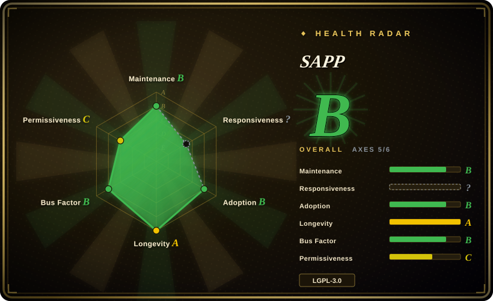

# SAPP

A PHP library for parsing and manipulating PDF objects, rebuilding incremental revisions, and applying one or more PKCS#12-backed digital signatures without recreating the document as a new set of pages.

## When to use

You're maintaining a PHP application that receives existing PDFs, some of which may already carry a signature, and you need to append another signature through the PDF incremental-update model. Importing every page into a newly generated PDF would discard the original revision history and signatures. You load the original bytes with `PDFDoc::from_string()`, attach a PKCS#12 certificate, and serialize a new incremental revision; the repository also provides examples for visible signatures, TSA timestamping, object comparison, stream decompression, and rebuilding a file with flattened older revisions.

Choose SAPP over FPDI when preserving and manipulating the original PDF object graph is more important than importing pages as templates. Choose it over a language-neutral signing CLI when signing must live inside PHP application code and you need access to individual PDF objects rather than a single command invocation.

## When NOT to use

- **You need to decrypt, encrypt, or reliably transform protected PDFs.** Use [qpdf](qpdf.md) instead; SAPP's README explicitly says encrypted documents are not handled, and the source warns that results may be unexpected.
- **You need broad malformed-PDF repair or exhaustive specification coverage.** Use [qpdf](qpdf.md) instead; SAPP documents only basic support for non-zero-generation objects and acknowledges other unspecified limitations.
- **You need page composition, typography, or HTML-to-PDF generation.** Use tc-lib-pdf or [pdf-lib](pdf-lib.md) instead; SAPP deliberately focuses on parsing and object manipulation rather than composing document pages.
- **You need PDF editing in a browser, Node.js, Deno, or React Native.** Use [pdf-lib](pdf-lib.md); SAPP requires PHP and is designed for server-side application integration.
- **You only need a standalone, language-neutral signing command.** Use OpenPDFSign instead; SAPP is valuable when its PHP object API and incremental-update internals are part of the application.
- **Your compliance profile requires independently validated PAdES/LTV behavior.** Evaluate pyHanko or another signing stack with explicit conformance documentation instead; this research confirmed SAPP's signing, TSA, certificate, and revocation-related code paths but did not validate a compliance profile. [未验证]

## Comparison

| Alternative | In index | Our verdict | Tradeoff |
|---|---|---|---|
| [qpdf](qpdf.md) | ✅ | Pick qpdf for encryption, structural transformation, inspection, and robust command-line processing; pick SAPP when a PHP application needs incremental object manipulation and embedded signing. | qpdf is a mature native tool/library with broader PDF transformation coverage; SAPP offers a PHP-native signing workflow but supports a narrower portion of the PDF specification. |
| [pdf-lib](pdf-lib.md) | ✅ | Pick pdf-lib for cross-runtime JavaScript PDF creation and editing; pick SAPP for PHP-side incremental signatures and direct access to the existing document's objects. | pdf-lib supports browser and JavaScript runtimes with a permissive license; SAPP is PHP-only and LGPL, but its design centers on retaining PDF revisions. |
| FPDI | not indexed | Pick FPDI when importing pages from existing PDFs into a newly composed PHP document is the actual task; pick SAPP when recreating pages would lose signatures or revision semantics. | FPDI is mature and MIT-licensed but treats pages as templates; SAPP works closer to the original object graph and carries more parser responsibility. |
| OpenPDFSign | not indexed | Pick OpenPDFSign for a standalone Java command-line signer; pick SAPP when signing and PDF-object changes must be orchestrated inside PHP code. | OpenPDFSign separates signing into a process boundary; SAPP avoids that boundary but makes the host application own PHP extension and parser compatibility. |
| pyHanko | not indexed | Pick pyHanko when Python integration and explicitly documented advanced signature profiles are more important; pick SAPP for a small PHP-native object model and incremental signing workflow. | pyHanko is a broader signing-focused stack; SAPP is easier to embed in PHP but has less independently verified conformance evidence in this research. |

## Tech stack

- **Language and package:** PHP library `ddn/sapp`, autoloaded through Composer with the `ddn\sapp\` PSR-4 namespace.
- **Runtime floor:** `composer.json` requires PHP `>=7.4` and declares no third-party Composer runtime package.
- **PDF model:** parser and value classes represent dictionaries, references, strings, streams, objects, xref data, and incremental versions.
- **Signing:** PKCS#12 certificate loading, OpenSSL private-key operations, CMS/ASN.1 helpers, signature dictionaries, visible appearances, TSA requests, and certificate/revocation helper code.
- **Utilities:** example scripts rebuild PDFs, compare object graphs, decompress streams, add repeated signatures, and exercise TSA/LTS-related paths.

## Dependencies

- **Composer:** Composer is used for installation and autoload generation; the README currently demonstrates `composer require ddn/sapp:dev-main`.
- **PHP extensions:** signing code calls PHP OpenSSL functions; TSA HTTP requests call cURL. These requirements are present in source but are not declared as `ext-openssl` or `ext-curl` in `composer.json`.
- **Certificates:** signing requires a PKCS#12/PFX certificate and its password; timestamping additionally needs a reachable TSA endpoint.
- **No database or service:** basic parsing, rebuilding, comparison, and local signing run in-process without a datastore or separate server.

## Ops difficulty

**Low for parsing and rebuilding; medium for production signing.** The package is small and has no declared third-party runtime library, so a proof of concept is easy in an existing PHP project. Production signing adds certificate custody, secret handling, OpenSSL compatibility, TSA availability, trust-chain and revocation behavior, deterministic output tests, and PDF-viewer interoperability. Because required extensions are not declared in Composer, deployment checks should explicitly fail early when OpenSSL or cURL is unavailable. Pin a release rather than following `dev-main`, and test representative signed, incrementally updated, malformed, and encrypted inputs before adopting it as a signing boundary.

## Health & viability

- **Maintenance, 2026-07:** the repository was not archived, the default branch was pushed on 2026-06-19, and releases 1.5.4 through 1.5.8 were published between 2025-09 and 2026-04.
- **Governance:** the repository belongs to an individual user. GitHub's contributor list showed 75 contributions from the owner and 21 from the second contributor, so maintenance is active but concentrated.
- **Age and Lindy:** created in 2020 and still shipping releases in 2026, SAPP has a useful age-times-activity signal for a specialized PHP library. [推断]
- **Adoption:** 155 stars and a Packagist installation path indicate a niche library rather than a broad PDF platform; compatibility evidence matters more than popularity here.
- **Risk flags:** LGPL-3.0-or-later was confirmed from the actual license and Composer metadata. The larger practical risks are incomplete PDF feature coverage, undeclared PHP extensions, and signing interoperability that must be tested against the target validation environment.

## Caveats (unverified)

- [未验证] No Acrobat, PDF/A, PAdES, long-term-validation, or multi-viewer interoperability suite was run in this research pass.
- [未验证] pyHanko is listed as a compliance-oriented alternative from its project positioning, but its current feature and license details were not reread here.
- [推断] The contributor concentration suggests bus-factor risk even though release activity is current; future maintenance is not guaranteed.
- [未验证] The repository tree did not expose an automated test suite in this pass, so parser and signing regression coverage was not independently assessed.
