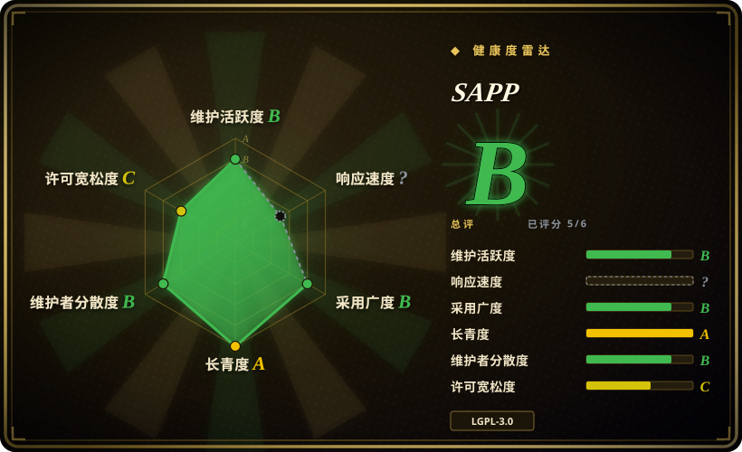

# SAPP

一个 PHP PDF 对象解析与操作库，可重建增量修订，并在不把原文档重新生成为一组新页面的前提下，用 PKCS#12 证书追加一个或多个数字签名。

## 何时使用

你在维护一个 PHP 应用，它接收已有 PDF，其中一些可能已经带有签名，而你需要通过 PDF 的增量更新模型再追加一个签名。如果把每一页导入新生成的 PDF，就会丢失原始修订历史与签名。你可以用 `PDFDoc::from_string()` 载入原始字节，附加 PKCS#12 证书，再序列化出新的增量修订；仓库还提供可见签名、TSA 时间戳、对象比较、stream 解压和压平旧修订后重建文件的示例。

如果保留并操作原始 PDF 对象图比把页面导入模板更重要，选 SAPP 而不是 FPDI。如果签名必须在 PHP 应用代码内部完成，而且你需要访问单个 PDF 对象，而不是只调用一个独立命令，也可以选它而不是跨语言签名 CLI。

## 何时不用

- **需要解密、加密或可靠转换受保护 PDF。** 请改用 [qpdf](qpdf.zh.md)；SAPP README 明确说不处理加密文档，源码也警告结果可能不符合预期。
- **需要广泛修复损坏 PDF，或完整覆盖规范边界。** 请改用 [qpdf](qpdf.zh.md)；SAPP 只声明对 non-zero-generation object 有基础支持，也承认还存在其他未列出的限制。
- **需要页面排版、文字绘制或 HTML 转 PDF。** 请改用 tc-lib-pdf 或 [pdf-lib](pdf-lib.zh.md)；SAPP 有意聚焦解析和对象操作，而不是页面组成。
- **需要在浏览器、Node.js、Deno 或 React Native 中编辑 PDF。** 请改用 [pdf-lib](pdf-lib.zh.md)；SAPP 要求 PHP，面向服务端应用集成。
- **只需要独立、与宿主语言无关的签名命令。** 请改用 OpenPDFSign；只有在应用确实需要 PHP 对象 API 与增量更新内部机制时，SAPP 的价值才更明显。
- **合规要求必须有独立验证过的 PAdES/LTV 行为。** 请评估 pyHanko 或其他明确提供一致性文档的签名栈；本次研究确认了 SAPP 的签名、TSA、证书和吊销相关代码路径，但没有验证具体合规 profile。[未验证]

## 横向对比

| 替代品 | 是否收录 | 我们的评价 | 取舍 |
|---|---|---|---|
| [qpdf](qpdf.zh.md) | ✅ | 需要加密、结构转换、检查和可靠命令行处理时选 qpdf；PHP 应用需要增量对象操作和内嵌签名时选 SAPP。 | qpdf 是更成熟的原生工具/库，PDF 转换覆盖更广；SAPP 提供 PHP 原生签名工作流，但支持的 PDF 规范范围更窄。 |
| [pdf-lib](pdf-lib.zh.md) | ✅ | 需要跨 JavaScript runtime 创建和编辑 PDF 时选 pdf-lib；需要 PHP 侧增量签名和访问现有文档对象时选 SAPP。 | pdf-lib 支持浏览器和 JavaScript runtime，许可证宽松；SAPP 仅支持 PHP 且为 LGPL，但设计中心是保留 PDF 修订。 |
| FPDI | 未收录 | 真正任务是把已有 PDF 页面导入新组成的 PHP 文档时选 FPDI；重新创建页面会丢失签名或修订语义时选 SAPP。 | FPDI 成熟且为 MIT，但把页面当作模板；SAPP 更贴近原始对象图，也承担更多解析器责任。 |
| OpenPDFSign | 未收录 | 需要独立 Java 命令行签名器时选 OpenPDFSign；签名和 PDF 对象修改必须由 PHP 代码统一编排时选 SAPP。 | OpenPDFSign 用进程边界隔离签名；SAPP 避免这个边界，但宿主应用要负责 PHP 扩展和解析兼容性。 |
| pyHanko | 未收录 | Python 集成与明确记录的高级签名 profile 更重要时选 pyHanko；需要小型 PHP 原生对象模型和增量签名流程时选 SAPP。 | pyHanko 是更广的签名专用栈；SAPP 更容易嵌进 PHP，但本次研究得到的独立一致性证据更少。 |

## 技术栈

- **语言与包：** PHP 库 `ddn/sapp`，通过 Composer 自动加载，使用 `ddn\sapp\` PSR-4 namespace。
- **运行时下限：** `composer.json` 要求 PHP `>=7.4`，未声明第三方 Composer 运行包。
- **PDF 模型：** parser 与 value class 表示 dictionary、reference、string、stream、object、xref 数据和增量版本。
- **签名：** 包括 PKCS#12 证书读取、OpenSSL 私钥操作、CMS/ASN.1 helper、signature dictionary、可见签名、TSA 请求，以及证书/吊销辅助代码。
- **工具：** 示例脚本可重建 PDF、比较对象图、解压 stream、追加多个签名，并演示 TSA/LTS 相关路径。

## 依赖

- **Composer：** 用于安装和生成 autoload；README 当前示例是 `composer require ddn/sapp:dev-main`。
- **PHP 扩展：** 签名代码调用 PHP OpenSSL 函数，TSA HTTP 请求调用 cURL；源码存在这些要求，但 `composer.json` 没有声明 `ext-openssl` 或 `ext-curl`。
- **证书：** 签名需要 PKCS#12/PFX 证书及密码；时间戳还需要可访问的 TSA endpoint。
- **没有数据库或独立服务：** 基础解析、重建、比较和本地签名都在进程内运行，不需要数据存储或单独 server。

## 运维难度

**解析与重建为低，生产签名为中。** 包体较小，也没有声明第三方运行库，因此在已有 PHP 项目里做验证很容易。生产签名会增加证书保管、secret 处理、OpenSSL 兼容、TSA 可用性、信任链与吊销行为、确定性输出测试和 PDF viewer 互操作问题。由于 Composer 没有声明所需扩展，部署检查应在缺少 OpenSSL 或 cURL 时尽早失败。应锁定 release，而不是跟随 `dev-main`，并在把它作为签名边界前测试有代表性的已签名、增量更新、损坏和加密输入。

## 健康度与可持续性

- **维护，2026-07：** 仓库未归档，默认分支在 2026-06-19 有 push，1.5.4 至 1.5.8 在 2025-09 至 2026-04 之间连续发布。
- **治理：** 仓库属于个人用户。GitHub contributor 列表显示 owner 有 75 次贡献，第二名有 21 次，说明维护仍活跃但集中度较高。
- **年龄与 Lindy：** 2020 年创建且 2026 年仍在发布，对于垂直 PHP 库来说，具备有价值的年龄乘活跃度信号。[推断]
- **采用度：** 155 个 star 与 Packagist 安装路径说明它是垂直库，而不是广泛 PDF 平台；这里兼容性证据比流行度更重要。
- **风险标记：** 实读许可证和 Composer metadata 可确认 LGPL-3.0-or-later。更实际的风险是 PDF 特性覆盖不完整、PHP 扩展未声明，以及必须在目标验证环境中测试的签名互操作性。

## 存疑（未验证）

- [未验证] 本次没有运行 Acrobat、PDF/A、PAdES、长期验证或多 viewer 互操作测试套件。
- [未验证] pyHanko 依据项目定位被列为偏合规的替代品，但本次没有重读它当前的功能和许可证细节。
- [推断] 尽管发布活动仍在继续，贡献集中度仍意味着 bus-factor 风险，未来维护不受保证。
- [未验证] 本次看到的仓库树没有自动化测试目录，因此没有独立评估 parser 和签名回归覆盖。
