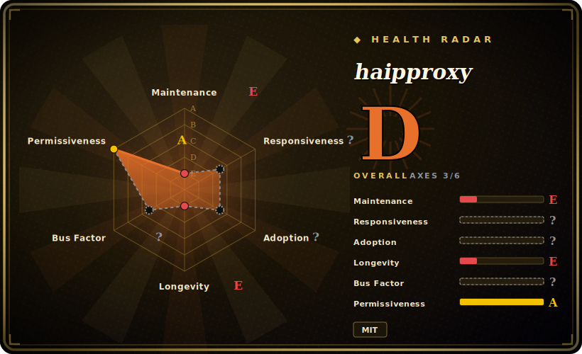

# haipproxy

A distributed, high-availability IP proxy pool built on Scrapy + Redis — crawlers harvest public proxies, validators score them, and consumers pull low-latency proxies via a Python client or a Squid integration.

## When to use

You're running a *large, distributed* crawl — many spiders across machines hammering a target — and a single-node free-proxy harvester can't keep the pool fresh or available enough. You want crawling, validation, and scheduling decoupled so they can scale and survive node failures. You stand up Redis, deploy haipproxy's Scrapy-based crawlers to continuously harvest proxies, let its validators score and rank them, and then have your spiders pull a validated proxy from the Redis-backed pool (via the bundled Python client) or route through the Squid integration. The architecture is explicitly HA: crawlers and schedulers are designed to run redundantly, and a "greedy" selection strategy is documented for squeezing more out of the pool. The project cites a test handling ~80k requests over 11 hours against a target — the use case is sustained, high-volume distributed scraping, not a quick local pool.

This is the right reach when scale and availability are the actual problem — Redis-backed task routing, distributed crawlers, and a consumer client matter — and you accept the heavier infra that comes with it.

## When NOT to use

- **A small or single-machine scrape.** The Scrapy + Redis + scrapy-splash stack is overkill for a handful of requests; a single-node pool (or just a paid proxy) is far less to run.
- **You can't run Redis (and possibly Splash).** Redis is a hard dependency for the task queues and pool state; JS-rendered sources pull in scrapy-splash. If you can't operate those, this isn't your tool.
- **Production reliability on free proxies.** It pools *free public* proxies — flaky by nature; the README itself notes some proxies can't reach sites like Google due to geo-restrictions. For must-not-fail jobs, buy commercial proxies.
- **You need a maintained dependency.** The repo is **long-dormant** — last release ~2018, last push 2022-12. You'd be adopting and operating effectively-frozen, Python-2/3-era code; expect compatibility work (see Health). [未验证]
- **Sensitive traffic.** Routing credentials/private data through unknown harvested proxies is a data-exposure risk. [推断]

## Comparison

| Alternative | In index | Tradeoff |
|---|---|---|
| [Scylla](scylla.md) | ✅ | Single-service pool with a web UI + JSON API, no Redis required — far simpler to run, but not built for distributed/HA crawler scale the way haipproxy is. |
| [ProxyBroker](proxybroker.md) | ✅ | A lightweight CLI finder/checker/server with no infra — easiest to invoke, but no distribution, no HA, and itself dormant/Python-fragile. |
| proxy_pool (jhao104) | 未收录 | Popular Redis-backed self-hosted pool, simpler single-process design than haipproxy's distributed Scrapy architecture; comparable free-proxy niche. [未验证] |
| Paid proxy providers (Bright Data, Oxylabs, …) | 未收录 | Commercial residential/datacenter pools with SLAs and rotation — the production answer; haipproxy only fits when you specifically need a self-hosted *distributed* free pool. |

## Tech stack

- **Language:** Python 3 (Scrapy-based crawlers).
- **Infra:** **Redis** (task queues, pool state, scheduling) and **Scrapy** as the crawling framework; **scrapy-splash** for JavaScript-rendered proxy sources.
- **Architecture:** decoupled crawler / validator / scheduler components designed for high availability; flexible task routing; configurable selection strategies (e.g. greedy).
- **Consumers:** a bundled Python client and a Squid proxy integration for downstream spiders.

## Dependencies

- **Runtime:** Python 3, a running **Redis** server (required), Scrapy; **scrapy-splash** (and thus a Splash instance) for JS-rendered sources.
- **Deploy:** standalone (manual dependency install + component startup) or **docker-compose** for a containerized stack.
- **Consumer side:** the Python client lib, or Squid if you route through it.
- **It is a multi-component system**, not a single binary or single process.

## Ops difficulty

**Medium to high.** This is genuinely a *distributed system* to operate: Redis, multiple Scrapy crawler/validator/scheduler components, optionally Splash for JS sources, and a consumer client or Squid. docker-compose eases standup, but you still run and monitor several moving parts, keep Redis healthy, and accept that the free-proxy pool quality fluctuates. The dormancy compounds this — running ~2018-era Scrapy/Python code today likely needs dependency pinning or porting before it even comes up. The infra burden plus the compatibility burden makes this the heaviest of the three pools indexed here.

## Health & viability

- **Maintenance (2026-06).** **Dormant.** Last release v0.1 is from 2018; last push 2022-12 with no activity since — not actively developed, though not formally archived. Treat as frozen, Python-2/3-transition-era code.
- **Governance / bus factor.** An **Organization** account (SpiderClub) but with a very small active contributor core; the org wrapper doesn't change that real maintenance has stopped. Bus factor is effectively the same as an abandoned single-maintainer repo. [推断]
- **Age & Lindy verdict.** ~9 years old (created 2017-09) but **dormant since ~2022** ⇒ Lindy *fails*: age without continued activity signals abandonment, not durability. Old + dormant is a red flag, not social proof.
- **Adoption.** ~5.5k stars and ~900 forks reflect real historical popularity (especially in the Chinese scraping community), but on a dormant repo this is *legacy* adoption — not evidence it works on today's stack. [未验证]
- **Risk flags.** Long dormancy + likely modern-stack incompatibility are the headline risks, on top of the inherent unreliability/security exposure of free public proxies. MIT, no relicense concern.

## Caveats (unverified)

- [未验证] ~5.5k stars as of 2026-06; last release v0.1 (2018), last push 2022-12 — figures are date-sensitive and from the GitHub API.
- [未验证] Compatibility with current Python/Scrapy is not tested here; ~2018-era code likely needs porting/pinning, but the specific failures are unconfirmed.
- [未验证] The ~80k-requests/11-hours figure is the project's own benchmark from the README, not independently reproduced.
- [推断] "Org account but effectively abandoned" is inferred from the commit/release gap, not an official deprecation notice; free-proxy security risk is a general property, not a measured claim about its sources.
