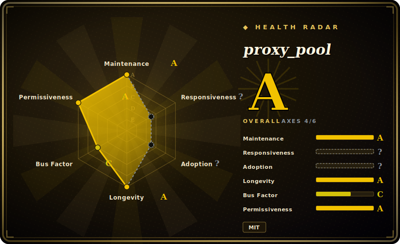

# proxy_pool

A self-hosted free-proxy IP pool: it crawls free HTTP/HTTPS proxies from public web sources, validates them on a schedule, stores the live ones in Redis, and serves usable IPs to your scraper through a tiny Flask HTTP API.

## When to use

You're building a Python web scraper that keeps getting rate-limited or IP-banned because every request leaves from the same address. You don't want to pay for a commercial proxy plan for a hobby/research project, and you'd rather not hand-maintain a brittle list of proxy IPs that go dead within hours. You stand up proxy_pool with `docker-compose up`, point it at a Redis instance, and let its scheduler continuously crawl free-proxy sites, test each candidate, and evict the dead ones. Your scraper then just calls `GET http://127.0.0.1:5010/get/` to pull a currently-live proxy, uses it for a request, and calls `/delete/` when one stops working — so the pool self-heals and your crawler gets a rotating supply of IPs without you babysitting a list.

It fits best when proxy *quality* is negotiable but you need *rotation and freshness* for free: scraping public data at modest volume, distributing requests across many ephemeral IPs, or experimenting before deciding whether a paid proxy service is worth it.

## When NOT to use

- **You need reliability, speed, or security — free proxies have none of these.** Free proxies are scraped from public lists: most are dead, slow, overloaded, or vanish within hours, and an unknown third party operates each one. For anything that matters in production, paid residential/datacenter proxies are the correct tool — proxy_pool is a *free-tier convenience*, not a dependable transport.
- **You're sending anything sensitive through them.** An untrusted free proxy can read, log, or tamper with your traffic (MITM); never route credentials, authenticated sessions, or private data through the pool. Even with HTTPS, you're trusting an anonymous operator.
- **You're trying to bypass anti-bot systems.** This is an IP rotator, not an anti-detection stack — it does no fingerprint/TLS/JS-challenge evasion. Cloudflare/DataDome-class defenses will not be solved by swapping IPs.
- **Legal / ToS exposure of scraping.** Rotating IPs to evade rate limits or blocks can violate a site's Terms of Service and, depending on jurisdiction and target, carry legal risk. The tool does nothing to make scraping lawful; that's on you.
- **You don't want to run infrastructure.** It is self-hosted and requires a Redis (or SSDB) instance plus a long-running scheduler/API process you operate and monitor.
- **You need predictable throughput or SLAs.** Live-proxy count fluctuates with whatever the free sources yield that day; you cannot guarantee a minimum pool size or latency.

## Comparison

| Alternative | In index | Our verdict | Tradeoff |
|---|---|---|---|
| Paid proxy services (Bright Data / Decodo) | 未收录 | Use this page for its stated niche; choose Paid proxy services (Bright Data / Decodo) when you need commercial residential/datacenter/ISP proxies with SLAs, large clean IP ranges, and support. | Commercial residential/datacenter/ISP proxies with SLAs, large clean IP ranges, and support — reliable and fast, but paid (often metered per-GB) and not open-source. The right call for production. |
| ProxyBroker | 未收录 | Use this page for its stated niche; choose ProxyBroker when you need python async library/CLI that finds and checks public proxies. | Python async library/CLI that finds and checks public proxies; more of a toolkit/library than a packaged service-with-API + storage. Maintenance has been intermittent. [未验证] |
| scylla | 未收录 | Use this page for its stated niche; choose scylla when you need self-hosted intelligent free-proxy pool with a web UI and API (Python). | Self-hosted intelligent free-proxy pool with a web UI and API (Python); similar niche, different stack and feature emphasis. [未验证] |
| haipproxy | 未收录 | Use this page for its stated niche; choose haipproxy when you need scrapy/Redis-based high-availability proxy pool aimed at scraping. | Scrapy/Redis-based high-availability proxy pool aimed at scraping; heavier Scrapy-centric design vs proxy_pool's small Flask service. [未验证] |
| scrapy-rotating-proxies | 未收录 | Use this page for its stated niche; choose scrapy-rotating-proxies when you need a Scrapy *downloader middleware* that rotates a list you supply and bans dead ones. | A Scrapy *downloader middleware* that rotates a list you supply and bans dead ones — it consumes proxies, it does not source/validate them; pair it with a pool like this one rather than treat it as a substitute. |

## Tech stack

- **Language:** Python.
- **API:** Flask serving a small REST surface (`/get`, `/get_all`, `/count`, `/delete`, `/pop`), run under gunicorn.
- **Storage:** Redis is the default/primary backend; SSDB is also supported (configured via a `redis://` / `ssdb://` `DB_CONN` URL).
- **Crawling / validation:** `requests` + `lxml` to fetch and parse free-proxy source pages; `APScheduler` drives the periodic crawl-and-validate cycle.
- **Architecture:** two roles — a *scheduler* process (crawl proxies, then validate/evict on a timer) and a *web API* process (serve proxies to clients) — sharing the Redis store.

## Dependencies

- **Runtime:** Python (3.x), plus its pinned libs (`requests`, `lxml`, `Flask`, `gunicorn`, `APScheduler`, `redis`, `click`).
- **Datastore (you run it):** a Redis instance (or SSDB) — required; the pool's entire state lives there.
- **Sources (external, uncontrolled):** the public free-proxy websites it crawls — not a dependency you install, but your pool's quality is entirely at their mercy and source pages break over time.
- **Install paths:** clone + `pip install -r requirements.txt`, or the provided Docker / docker-compose setup (app + Redis).

## Ops difficulty

**Low-to-medium.** Getting it running is easy: docker-compose brings up the app and Redis, and there's no clustering or schema to manage. The ongoing burden is operational babysitting rather than scaling: free-proxy *source* pages change or die, so crawlers go stale and need fixing/extending; the live-proxy count can crater when sources dry up; and you'll want to monitor pool size and tune the validation interval. Redis is the one stateful piece to keep alive and (ideally) password-protected, since the value of the whole service is just whatever's in that store.

## Health & viability

- **Maintenance (2026-06).** Repo is **not archived** and was last pushed 2026-06-15, so commit activity is recent — but the **last tagged release is 2.4.1 from 2023-02**; treat it as actively-tended-but-not-actively-released rather than fast-moving. [推断]
- **Governance / bus factor.** A **single-maintainer User repo** (owner jhao104, ~533 of the commits; the next contributor has ~13) — that's a clear **bus-factor flag**: roadmap and continuity rest on one person. [推断]
- **Age & Lindy verdict.** Created **2016-11 (~9.5 years)** and still receiving commits ⇒ a **decent Lindy** signal for its niche — long-lived and well-known in the Chinese scraping community, not a hyped newcomer. [推断]
- **Adoption.** ~23.4k stars and ~5.4k forks indicate broad, sustained popularity as a reference free-proxy-pool implementation. [未验证]
- **Risk flags — the real one is the model, not the repo.** MIT licensed, no relicense history found. The dominant risk is **inherent**: a free-proxy pool is only as good as the public sources it scrapes, so reliability is structurally low regardless of how healthy the code is. [推断]

## Caveats (unverified)

- [未验证] ~23.4k stars / ~5.4k forks as of 2026-06 — star/fork counts are date-sensitive and unreliable as a quality signal; treat as indicative only.
- [未验证] Latest release 2.4.1 dated 2023-02; the repo shows a more recent `pushed_at` (2026-06-15), but commits-since-release content and significance were not audited line-by-line.
- [推断] "Single-maintainer / bus-factor" is inferred from the contributor distribution (one dominant author), not from any stated governance doc.
- [推断] The substitute projects (ProxyBroker, scylla, haipproxy, scrapy-rotating-proxies) are positioned from their general reputation/role, not from a fresh per-repo audit this pass — verify current state before relying on the comparison.
- [未验证] The set and stability of the free-proxy source sites proxy_pool crawls changes over time; the effective live-proxy yield was not measured.
