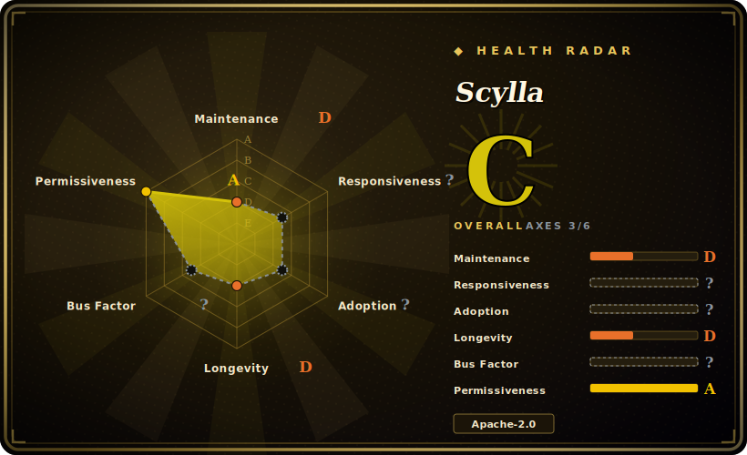

# Scylla

A self-hosted "intelligent proxy pool" app that continuously crawls public proxies, validates and scores them (latency, stability, anonymity), and exposes them via a web UI, a JSON API, and a built-in forward-proxy server.

## When to use

You're running scrapers that keep getting rate-limited or IP-blocked, and you want a *standing service* that maintains a pool of vetted free proxies for you to draw from — not a CLI you re-run by hand. You `docker run` Scylla, wait a minute or two while it populates, then hit `http://localhost:8899/api/v1/proxies?https=true&anonymous=true&country=US` to get a JSON list of currently-valid proxies filtered by HTTPS support, anonymity, and country — and feed those straight into requests/Scrapy with minimal code. You can also point traffic at its built-in forward-proxy port and let it pick a validated IP for you, and watch the pool's health and a geographical distribution map in the web UI. It's the "runnable service with an API" form factor: stand it up once, query it from many jobs.

This is the right reach when you want a *queryable, always-on* free-proxy pool with quality scoring and a dashboard, and you're comfortable self-hosting a small Python service (ideally via Docker).

## When NOT to use

- **HTTPS through the built-in forward proxy.** The docs state the forward-proxy server does **not** support HTTPS requests — for HTTPS you consume the JSON API's proxy list and connect yourself, rather than chaining through Scylla's proxy port. A real constraint to design around.
- **Production reliability.** It pools *free public* proxies — inherently flaky, slow, and sometimes malicious. For anything that must not fail, buy commercial proxies; Scylla is for low-stakes/experimental scraping.
- **A frequently-maintained dependency.** The last tagged release is 2022 and activity since is sparse (a 2025 touch). You're adopting near-frozen code — fine for experiments, risky as a load-bearing dependency (see Health).
- **Sensitive traffic.** Routing credentials or private data through unknown harvested proxies is a data-exposure risk. [推断]
- **Zero-ops expectations.** It's a service with a datastore and crawlers; while Docker makes startup easy, you still operate a running process and accept that the pool quality fluctuates.

## Comparison

| Alternative | In index | Our verdict | Tradeoff |
|---|---|---|---|
| [ProxyBroker](proxybroker.md) | ✅ | Use this page for its stated niche; choose ProxyBroker when you need a CLI-first finder/checker/server rather than a UI+API service. | A CLI-first finder/checker/server rather than a UI+API service; more dormant and more prone to modern-Python breakage, but lighter to invoke for a quick harvest. |
| [haipproxy](haipproxy.md) | ✅ | Use this page for its stated niche; choose haipproxy when you need distributed Scrapy+Redis pool built for high-availability at crawler scale. | Distributed Scrapy+Redis pool built for high-availability at crawler scale; much heavier infra (Redis required) and also long-dormant, vs Scylla's single-service simplicity. |
| Paid proxy providers (Bright Data, Oxylabs, …) | 未收录 | Use this page for its stated niche; choose Paid proxy providers (Bright Data, Oxylabs, …) when you need commercial pools with SLAs, auth, residential IPs, and rotation. | Commercial pools with SLAs, auth, residential IPs, and rotation — the production answer; Scylla only fits when free + self-hosted is acceptable. |
| proxy_pool (jhao104) | 未收录 | Use this page for its stated niche; choose proxypool (jhao104) when you need another popular self-hosted free-proxy pool with a similar crawl/validate/API shape (Redis-backed). | Another popular self-hosted free-proxy pool with a similar crawl/validate/API shape (Redis-backed); comparable niche, different stack and maintenance status. [未验证] |

## Tech stack

- **Language:** Python (with a small JS/build front-end for the web UI, built via npm + make from source).
- **Components:** a continuous crawler/validator, a datastore for proxy records + quality metrics, a JSON REST API (`/api/v1/proxies`), a web UI (proxy list + geographical map), and a built-in HTTP forward-proxy server.
- **Validation:** scores latency, stability, validity, and anonymity; headless-browser crawling capability for sources.

## Dependencies

- **Runtime:** Python; a database to persist proxy records and metrics (bundled/embedded).
- **Install:** Docker (recommended, single command), `pip` from PyPI, or build from source (git + npm + make).
- **Network:** outbound access to crawl proxy sources; exposes API + forward-proxy ports locally.
- **No external service cluster required** for the basic single-node deployment. [推断]

## Ops difficulty

**Low to medium.** Docker makes the happy path a one-liner, and after a 1–2 minute warm-up you have a live API. The medium part is that it's a *standing service* with a datastore and background crawlers: you operate a running process, the pool quality fluctuates as free proxies churn, and you must design around the no-HTTPS-forward-proxy limitation by consuming the API list directly. Building from source adds an npm/make front-end step. No clustering for single-node use, but it's more to run than a one-shot CLI.

## Health & viability

- **Maintenance (2026-06).** Last tagged release 1.2.0 is from 2022-03; the repo was touched as recently as 2025-06 but without a fresh release — **coasting toward dormant**, not actively developed. This is a fork-lineage repo (`MikeChongCan/scylla`) whose description was repurposed with AI/LLM framing. Not archived.
- **Governance / bus factor.** A User-account repo with a small contributor set (incl. dependabot); single-maintainer bus-factor risk, no foundation backing. The ~4.0k stars on a User repo with stalled releases is a flag worth weighing, not social proof. [推断]
- **Age & Lindy verdict.** ~8 years old (created 2018-04) but with a stalled release line ⇒ Lindy is **weak-to-mixed**: long-lived, but the "still-active" half is shaky given no recent releases.
- **Adoption.** ~4.0k stars indicate historical popularity for self-hosted proxy pooling; current adoption/health is less clear given the release gap. [未验证]
- **Risk flags.** Stalled releases + free-proxy unreliability + the HTTPS-forward-proxy limitation are the standing risks; Apache-2.0, no relicense concern. The repurposed AI-era description is marketing, not a capability change. [推断]

## Caveats (unverified)

- [未验证] ~4.0k stars as of 2026-06 and last release 1.2.0 (2022-03) — figures are date-sensitive; the 2025-06 push is from the API but its substance is not inspected.
- [未验证] Exact datastore, headless-browser usage, and the precise current source list are from the README/docs, not confirmed against the code in this pass.
- [推断] "Coasting toward dormant" is inferred from the release gap (2022) vs sporadic later commits, not an official status.
- [推断] Free-proxy security/reliability risks are general properties of harvested public proxies, not measured against Scylla's specific sources.
