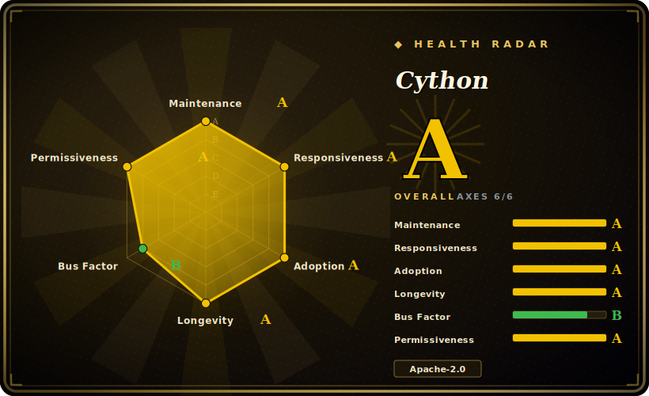

# Cython

A compiler that turns Python (and an annotated Python-superset) into C, producing native CPython extension modules — the standard way to make hot Python code fast or to wrap a C/C++ library.

## When to use

You profiled your Python program and found a tight numeric loop that dominates the runtime — pixel math, a parser inner loop, an N-body step. Rewriting the whole thing in C is overkill and you'd lose the Python ergonomics, but the pure-Python loop is just too slow. You rename the module `.py` → `.pyx`, add a few `cdef int`/`cdef double` type annotations to the hot variables, compile it with Cython into a C extension, and the loop now runs at near-C speed while the rest of your code stays Python. You didn't rewrite your program; you compiled the part that mattered.

You also reach for Cython when you need to **wrap a C or C++ library** and expose it to Python: you write a thin `.pyx` that declares the external `cdef extern from "lib.h"` signatures and Python-facing wrappers, and Cython generates the glue C that builds into an importable module. It's the workhorse behind a large slice of the scientific Python stack — many packages ship Cython-generated extensions — so it's the proven path when `ctypes`/`cffi` feel too loose or too slow and you want compiled, typed, statically-checkable bindings.

## When NOT to use

- **Your bottleneck is I/O or already-vectorized.** If the slow part is network/disk waiting, or already runs in NumPy/pandas C code, compiling your Python loop won't help — fix the algorithm or the I/O, not the language.
- **You want zero build step / pure-Python distribution.** Cython introduces a **C compiler and a build/wheel pipeline**; if you need a pip-installable pure-Python package with no compilation, that cost may not be worth it. Consider Numba (JIT, no separate build) or PyPy.
- **You'd be better served by a JIT.** For numeric kernels, **Numba** can give big speedups with a decorator and no C toolchain; for whole-program speed, **PyPy** may beat hand-Cythonizing — Cython shines when you want explicit C-level control and stable ABI extensions.
- **You're writing greenfield performance code with no Python-interop need.** If you don't need to live inside CPython, writing the component directly in C/C++/Rust (and binding via PyO3/pybind11) may be cleaner than the Cython superset.
- **You can't tolerate the .pyx/typing learning curve.** Getting real speedups requires understanding `cdef`, typed memoryviews, GIL handling, and the C build; naive Cythonization of untyped code yields little.

## Comparison

| Alternative | In index | Tradeoff |
|---|---|---|
| Numba | 未收录 | LLVM-based JIT for numeric Python via a decorator; no separate C build, great for array/loop kernels, but narrower scope (numeric, no C++ wrapping) and runtime-JIT model. |
| PyPy | 未收录 | An alternative Python interpreter with a tracing JIT; can speed whole programs with no code changes, but C-extension compatibility and ecosystem fit can be the catch. |
| pybind11 / nanobind | 未收录 | Header-only C++ ↔ Python binding libraries; ideal when your code is already C++, but you write C++, not a Python superset. |
| cffi / ctypes | 未收录 | Call C from Python without compiling a custom extension; simpler for thin FFI but no compiled-speed Python and weaker static typing than Cython. |
| mypyc | 未收录 | Compiles type-annotated Python to C using mypy types; closer to "compile my Python" with standard typing, but younger and narrower than Cython. |
| Rust + PyO3 | 未收录 | Write the hot component in Rust and bind to Python; memory-safe and fast, but a different language and toolchain than the Python-superset approach. |

## Tech stack

- **What it is:** a compiler written largely in Cython/Python that emits **C** (and can target C++), which a C compiler then builds into a CPython extension module. [推断]
- **Language model:** Python plus optional C type declarations (`cdef`, typed memoryviews, `cpdef`, `nogil`), pure-Python mode annotations, and `extern` blocks to bind C/C++ APIs.
- **Build integration:** `cythonize()` in setup.py / build backends, plus Jupyter `%%cython` magic for inline use; produces standard wheels.
- **Targets:** CPython (the primary target); generated C is portable across the platforms CPython supports.

## Dependencies

- **Runtime (of generated modules):** just CPython — a Cython-built extension imports like any other compiled module, with no Cython runtime dependency for end users.
- **Build-time:** a **C compiler** (and a C++ compiler if targeting C++) plus the CPython development headers; Cython itself is a pip-installable Python package.
- **Optional:** a build backend (setuptools/meson) for packaging; NumPy headers if you compile against its C API. [未验证]

## Ops difficulty

**Low-to-medium, and it's build-time, not runtime.** Once compiled, the resulting extension is just an importable module — no service, no ops. The burden is the **build pipeline**: you need a working C toolchain on every build platform, and shipping a library means producing wheels for each OS/Python-version combination (manylinux, macOS, Windows), which is the usual native-extension packaging chore. Debugging compiled Cython (gdb, typed-vs-object pitfalls, GIL bugs) is harder than debugging pure Python. For a single app on one platform it's easy; for a widely-distributed library the matrix is the work.

## Health & viability

- **Maintenance (2026-06).** Last pushed 2026-06; releases are frequent and current — 3.2.5/3.2.6 and a 3.3.0a1 alpha all in mid-2026 — clearly **very active**. Not archived.
- **Governance / bus factor.** Organization-owned (`cython`) with a deep, long-standing core team (scoder/Stefan Behnel, robertwb/Robert Bradshaw, da-woods, dalcinl, and others) — a real multi-maintainer project, not a one-person repo. [推断]
- **Age & Lindy verdict.** This repo dates to 2010-11 (~15 years) and Cython's lineage (from Pyrex) is older still; **continuously active for over a decade** ⇒ **very strong Lindy**. It is foundational infrastructure under much of scientific Python. [推断]
- **Adoption.** ~10.8k stars, 1.6k forks, and an enormous transitive install base — a large fraction of the PyData/scientific ecosystem ships Cython-compiled extensions. Apache-2.0 licensed. [未验证]
- **Risk flags.** Few — permissive license, broad governance, heavy real-world dependency. The realistic "risk" is fit, not viability: a JIT (Numba/PyPy) or a Rust binding may suit a given task better than the Cython superset.

## Caveats (unverified)

- [未验证] ~10.8k stars, 1615 forks, 1520 open issues as of 2026-06 — volatile, date-sensitive; the large open-issue count is consistent with a big, old, widely-used project, not a red flag on its own.
- [未验证] Latest releases observed: 3.2.6 and a 3.3.0a1 alpha in 2026-06; release lines and dates shift, verify the current stable line before pinning.
- [推断] The compiler-emits-C / targets-CPython architecture and the typed-superset language model are described from Cython's documented design and the `language: Cython` metadata, not a source audit.
- [未验证] Exact build-time dependencies (which C/C++ compilers, NumPy headers, build backend) depend on your target and packaging choices; verify against current Cython docs.
