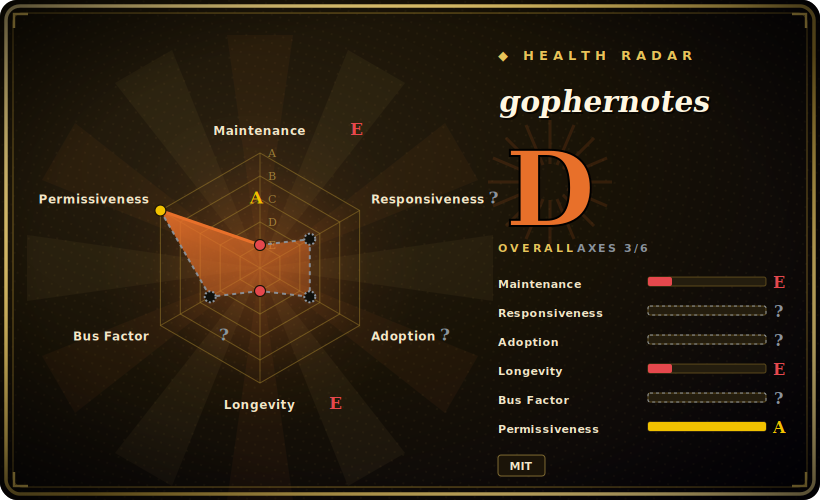

# gophernotes

A Jupyter kernel for the **Go** language — write and run Go interactively in Jupyter notebooks (and nteract), cell by cell, with persistent state between cells.

## When to use

You think in Go and you want a notebook. You're exploring a dataset, sketching out an algorithm, or building a teaching document and you'd like the literate-programming workflow Jupyter gives Python users — run a cell, see the result, tweak, re-run, interleave prose and code — but in the language you actually ship. You install gophernotes as a Jupyter kernel, open a notebook, pick "Go," and now each cell evaluates Go: declare a variable in one cell, use it in the next, import a package, print output inline. For interactive Go exploration, prototyping, or producing a runnable Go tutorial as a notebook, it bridges Go into the Jupyter ecosystem you (or your readers) already use.

You also reach for it when you want **shareable, executable Go documents** — a notebook that mixes explanation with live Go cells someone can re-run — rather than a static `.go` file plus a README. It leans on a Go interpreter so cells run without a full compile-link cycle per snippet, which is what makes the notebook feel interactive rather than batch.

## When NOT to use

- **The project looks stalled — verify before depending on it.** Last release (v0.7.5) is 2022 and the repo was last pushed 2023-11; against modern Go releases it may have compatibility gaps. Confirm it works with your current Go version before building on it. [未验证]
- **You need full, standard Go semantics.** It runs Go through an **interpreter** (gomacro lineage), not the standard compiler, so some language features, generics edge-cases, cgo, or certain packages may behave differently or not work. This is exploration, not production execution. [未验证]
- **Your data-science workflow is Python-shaped.** If your stack is pandas/NumPy/matplotlib, a Go kernel doesn't get you that ecosystem; the Python kernel + Go-as-microservice split is often more practical.
- **You want rich notebook plotting / widgets out of the box.** The Go notebook experience is far thinner than Python's (limited plotting, fewer display integrations); don't expect IPython/Jupyter-widget parity.
- **Production or CI execution.** Notebooks-as-pipeline and interpreter-run Go are a poor fit for reproducible production jobs — compile and run real Go binaries there.

## Comparison

| Alternative | In index | Tradeoff |
|---|---|---|
| Python (IPython) kernel | 未收录 | The default Jupyter experience with the full data-science ecosystem; if you don't specifically need Go, this is the path of least resistance. |
| gomacro (REPL) | 未收录 | The Go interpreter/REPL gophernotes builds on; great for terminal-based interactive Go, but not a notebook UI. |
| Go Playground / `go run` | 未收录 | Quick one-off Go execution; no persistent cell state, no notebook prose interleaving — fine for a snippet, not a literate document. |
| Jupyter polyglot kernels (e.g. for Rust/JS) | 未收录 | Same "language X in Jupyter" idea for other languages; each varies in maintenance and completeness — gophernotes is the Go entry, with the stalled-maintenance caveat. |
| Tour of Go / interactive docs | 未收录 | Curated interactive Go learning, but fixed content — not a kernel you run your own code in. |

## Tech stack

- **Language:** Go; implements the **Jupyter kernel protocol** (ZeroMQ messaging) so Jupyter/nteract can drive it.
- **Execution:** evaluates Go via an embedded interpreter (gomacro lineage) so cells run without per-snippet compile-link, enabling persistent inter-cell state.
- **Integration:** registers as a Jupyter kernel (kernelspec); works in JupyterLab/Notebook and nteract.
- **Distribution:** installed as a Go binary + a Jupyter kernel registration step.

## Dependencies

- **Runtime:** a **Go toolchain**, **Jupyter** (or nteract), and the gophernotes binary registered as a kernel; ZeroMQ libraries underpin the kernel protocol.
- **Platform:** Linux/macOS/Windows where Go and Jupyter run; version compatibility with current Go is the practical constraint given the project's age. [未验证]
- **Install:** `go install` the binary, then copy/register the kernelspec into Jupyter.

## Ops difficulty

**Low-to-medium, and front-loaded at install.** There's no service to operate — it's a local kernel you register once. The friction is setup: installing the Go toolchain, building/installing the binary, wiring the kernelspec into Jupyter, and possibly satisfying ZeroMQ/native build prerequisites. Given the project's stalled maintenance, the realistic ops cost is **compatibility debugging** — making an older kernel work against your current Go/Jupyter versions — more than ongoing operation. Once it runs, day-to-day use is just opening notebooks.

## Health & viability

- **Maintenance (2026-06).** Last release v0.7.5 is **2022**, repo last pushed **2023-11** — **stalled**: no recent activity, well behind current Go releases. Not formally archived, but effectively in maintenance-stop territory. [推断]
- **Governance / bus factor.** Organization-owned (`gopherdata`) with several historical contributors (dwhitena, cosmos72, SpencerPark, sbinet, mattn…), but no visible recent steward — a bus-factor and continuity concern given the inactivity. [推断]
- **Age & Lindy verdict.** Created 2016-01 (~10 years) but Lindy requires **age × still-active**; since it's stalled, age alone is **not** reassuring here — long-lived-but-dormant fails the Lindy test. [推断]
- **Adoption.** ~4k stars reflect real historical interest as *the* Go-in-Jupyter kernel, but a Go notebook is a niche workflow and momentum appears to have faded; treat stars as legacy recognition. [未验证]
- **Risk flags.** **Stalled maintenance** is the headline risk, compounded by interpreter-vs-compiler semantic gaps and likely friction with new Go versions. MIT-licensed, so no relicense/copyleft concern. [推断]

## Caveats (unverified)

- [未验证] ~4k stars, 265 forks, 55 open issues as of 2026-06 — volatile, date-sensitive; likely legacy popularity rather than current momentum.
- [未验证] Latest release v0.7.5 (2022) and last push 2023-11 — "stalled" is inferred from this cadence; the repo is not archived, so check for any newer activity before assuming dead.
- [未验证] Compatibility with current Go versions is unconfirmed and is the main practical risk; the interpreter (gomacro lineage) may not track recent Go language features.
- [推断] The Jupyter-kernel-protocol / ZeroMQ / gomacro-interpreter architecture is inferred from the project's description and standard Jupyter-kernel design, not a source audit.
- [未验证] The exact limitations vs standard `go build` semantics (generics, cgo, specific packages) are not enumerated here; verify the features you need against the running kernel.
