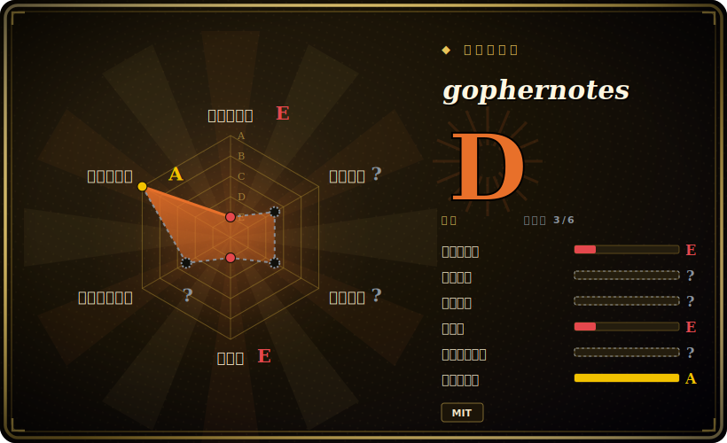

# gophernotes

**Go** 语言的一个 Jupyter 内核——在 Jupyter 笔记本（以及 nteract）里逐 cell 交互式地写和跑 Go，cell 之间状态持久。

## 何时使用

你习惯用 Go 思考，又想要一个笔记本。你在探索一份数据集、勾勒一个算法，或者写一份教学文档，想要 Jupyter 给 Python 用户的那种文学化编程工作流——跑一个 cell、看结果、改、再跑，把散文和代码交织起来——但用你真正交付的语言。你把 gophernotes 装成 Jupyter 内核，打开笔记本，选“Go”，于是每个 cell 都求值 Go：在一个 cell 里声明变量，在下一个里用它，import 一个包，把输出内联打印。对于交互式 Go 探索、原型，或把一份可运行的 Go 教程做成笔记本，它把 Go 接进了你（或你的读者）已经在用的 Jupyter 生态。

当你想要**可分享、可执行的 Go 文档**——一份把讲解和别人能重跑的活 Go cell 混在一起的笔记本——而非一个静态 `.go` 文件加一份 README 时，你也会选它。它依托一个 Go 解释器，所以 cell 运行不必每个片段都做完整的编译链接，这正是让笔记本感觉交互而非批处理的原因。

## 何时不用

- **项目看起来已停滞——依赖前先核实。** 最近发布（v0.7.5）是 2022 年，仓库最后 push 于 2023-11；对着现代 Go 发布它可能有兼容缺口。在它之上构建前请确认它在你当前 Go 版本上能用。[未验证]
- **你需要完整、标准的 Go 语义。** 它通过**解释器**（gomacro 血统）而非标准编译器跑 Go，所以某些语言特性、泛型边界情况、cgo 或某些包可能表现不同或不工作。这是探索，不是生产执行。[未验证]
- **你的数据科学工作流是 Python 形状的。** 如果你的栈是 pandas/NumPy/matplotlib，Go 内核给不了你那个生态；Python 内核加 Go 当微服务的拆分往往更实用。
- **你想要开箱即用的丰富笔记本绘图 / widget。** Go 的笔记本体验比 Python 薄得多（绘图有限、显示集成更少）；别指望和 IPython/Jupyter-widget 等同。
- **生产或 CI 执行。** 笔记本当管线加解释器跑的 Go 不适合可复现的生产作业——那里要编译并运行真正的 Go 二进制。

## 横向对比

| 替代品 | 是否收录 | 我们的评价 | 取舍 |
|---|---|---|---|
| Python（IPython）内核 | 未收录 | 当前页用于它的主场景；如果更看重“默认的 Jupyter 体验，带完整数据科学生态”，再选 Python（IPython）内核。 | 默认的 Jupyter 体验，带完整数据科学生态；如果你不是非要 Go，这是阻力最小的路。 |
| gomacro（REPL） | 未收录 | 当前页用于它的主场景；如果更看重“gophernotes 依托的 Go 解释器/REPL”，再选 gomacro（REPL）。 | gophernotes 依托的 Go 解释器/REPL；适合终端里交互式 Go，但不是笔记本 UI。 |
| Go Playground / `go run` | 未收录 | 当前页用于它的主场景；如果更看重“快速一次性跑 Go”，再选 Go Playground / go run。 | 快速一次性跑 Go；没有持久 cell 状态、没有笔记本散文交织——适合片段，不适合文学化文档。 |
| Jupyter 多语言内核（如 Rust/JS 的） | 未收录 | 当前页用于它的主场景；如果更看重“其他语言“在 Jupyter 里跑语言 X”的同一思路”，再选 Jupyter 多语言内核（如 Rust/JS 的）。 | 其他语言“在 Jupyter 里跑语言 X”的同一思路；各自维护度和完整度参差——gophernotes 是 Go 那一份，带停滞维护的告诫。 |
| Tour of Go / 交互文档 | 未收录 | 当前页用于它的主场景；如果更看重“精选的交互式 Go 学习，但内容固定”，再选 Tour of Go / 交互文档。 | 精选的交互式 Go 学习，但内容固定——不是你跑自己代码的内核。 |

## 技术栈

- **语言：** Go；实现 **Jupyter 内核协议**（ZeroMQ 消息）以便 Jupyter/nteract 驱动它。
- **执行：** 经一个内嵌解释器（gomacro 血统）求值 Go，使 cell 不必每个片段编译链接即可运行，从而持久保留 cell 间状态。
- **集成：** 注册为 Jupyter 内核（kernelspec）；在 JupyterLab/Notebook 和 nteract 里工作。
- **分发：** 装成一个 Go 二进制加一步 Jupyter 内核注册。

## 依赖

- **运行时：** 一个 **Go 工具链**、**Jupyter**（或 nteract），以及注册为内核的 gophernotes 二进制；ZeroMQ 库支撑内核协议。
- **平台：** Go 和 Jupyter 能跑的 Linux/macOS/Windows；鉴于项目年龄，与当前 Go 的版本兼容性是实际约束。[未验证]
- **安装：** `go install` 这个二进制，然后把 kernelspec 复制/注册进 Jupyter。

## 运维难度

**低到中，且集中在安装阶段。** 没有要运维的服务——它是你注册一次的本地内核。摩擦在于搭建：装 Go 工具链、构建/安装二进制、把 kernelspec 接进 Jupyter，可能还要满足 ZeroMQ/原生构建的前置条件。鉴于项目停滞维护，现实的运维成本是**兼容性调试**——让一个较旧的内核对着你当前的 Go/Jupyter 版本跑起来——多于持续运营。一旦跑起来，日常使用就是开笔记本。

## 健康度与可持续性

- **维护（2026-06）。** 最近发布 v0.7.5 是 **2022** 年，仓库最后 push 于 **2023-11**——**停滞**：无近期活动，明显落后于当前 Go 发布。未正式归档，但实际上处于维护停止地带。[推断]
- **治理 / bus factor。** 组织所有（`gopherdata`），有若干历史贡献者（dwhitena、cosmos72、SpencerPark、sbinet、mattn……），但没看到近期的守护者——鉴于不活跃，是 bus-factor 与延续性的担忧。[推断]
- **年龄与 Lindy 判断。** 2016-01 创建（约 10 年），但 Lindy 要求**年龄×仍活跃**；既然停滞，单凭年龄在这里**并不**让人安心——长寿但休眠通不过 Lindy 测试。[推断]
- **采用度。** 约 4k star 反映出它作为*那个* Go-in-Jupyter 内核的真实历史兴趣，但 Go 笔记本是小众工作流，势头看来已退；把 star 当遗产认可。[未验证]
- **风险标记。** **停滞维护**是头号风险，叠加解释器对编译器的语义缺口和与新 Go 版本的可能摩擦。MIT 许可，所以没有 relicense/copyleft 顾虑。[推断]

## 存疑（未验证）

- [未验证] 截至 2026-06 约 4k star、265 fork、55 个 open issue——易变且对时间敏感；很可能是遗产人气而非当前势头。
- [未验证] 最近发布 v0.7.5（2022）、最后 push 2023-11——“停滞”是从该节奏推断的；仓库未归档，所以在认定它死掉前请查有无更新的活动。
- [未验证] 与当前 Go 版本的兼容性未经确认，是主要实际风险；解释器（gomacro 血统）可能跟不上近期 Go 语言特性。
- [推断] Jupyter 内核协议 / ZeroMQ / gomacro 解释器的架构是从项目描述和标准 Jupyter 内核设计推断的，并非源码审计。
- [未验证] 相对标准 `go build` 语义的确切限制（泛型、cgo、特定包）这里未一一列出；请对照运行中的内核核实你需要的特性。
