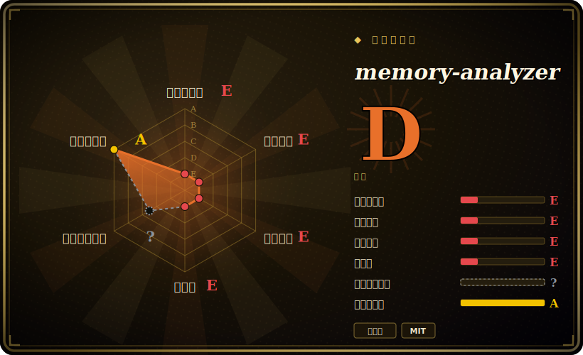

# memory-analyzer

一个对**正在运行**的 Python 进程做一次性内存检查的工具——通过 GDB 挂上去、暂停目标，报告按类型的对象计数、总大小，以及前向／后向引用图。**已被 Meta 归档（只读）——依赖前先看「健康度与可持续性」。**

## 何时使用

你是个 SRE 或后端工程师，正在追一个长期运行的 Python 3 守护进程（跑在 Linux 上）的内存泄漏。你在本地复现不出来，又不想重新部署加埋点，也不愿重启进程（重启就会丢掉那个正在表现出膨胀的在途状态）。你找到 PID，跑 `memory_analyzer run $PID`，它就对那个活的解释器启动 GDB，短暂暂停进程（以及它所有的线程），把你丢进一个 ncurses UI，里面显示每种类型有多少活对象、它们的总大小，以及——按需——把最大那些对象钉住不放的前向和后向引用链。过一会儿带 `--snapshot` 再对同一个 PID 跑一次，它会 diff 两次捕获，让你看哪些对象类型在随时间增长。对于一次性看「这个活进程内部到底什么在吃内存」的快照，它正好能干这件事。

诚实的提醒是：这是一个**已不再维护**的工具的*合法*用法——它被 Meta 归档、代码最后改动停在 2021 年，目标是 Python 3.6／3.7，而且它的引用图功能还在试图把 PNG 上传到 **Phabricator**（一个 Meta 内部的遗留物）。即便场景吻合，也把它当作从阁楼里翻出来借用的工具，先核实它在你的解释器上能跑——或者直接换一个有维护的替代品（见横向对比）。

## 何时不用

- **当作一个你今后要依赖的工具——它已归档。** Meta 把它移进了 `facebookarchive` 组织；仓库是**只读**的：没有修复、不收 PR、没有发布。最后一次代码 push 是 **2021-09**（截至 2026-06 约 5 年前）。把废弃工具用于生产诊断是一个长期负债——优先选有维护的替代品。
- **在现代／未来 Python 版本上不测试就用。** 它声明 `python_requires>=3.6`，且只标注了 3.6／3.7（两者现已 EOL）。自 2021 年起，它没有跟进 CPython 演进的对象模型或 GDB 集成，所以与当前 CPython 的兼容性未经验证，是个真实的风险。[推断]
- **在拿不到 GDB ＋ ptrace 的任何地方。** 它启动 GDB 来挂载目标，因此需要主机允许 ptrace。在加固系统上你得 `echo 0 > /proc/sys/kernel/yama/ptrace_scope` 或以 root 运行；在很多容器里（没有 `SYS_PTRACE` capability）以及在 macOS／Windows 上，它没法干净地工作。它的 README 明说自己以 Linux／ptrace 为中心。
- **做持续／生产环境内存监控。** 这是**一次性快照**工具——它在遍历堆时会暂停整个进程（以及*所有线程*），而抓引用更被明确称为「一项昂贵的操作」。它不是低开销的持续 profiler，别在热点路径上或循环里跑它。
- **当 Phabricator 上传路径对你重要时。** 引用图功能被接到上传 PNG 到 Phabricator；在 Meta 之外你只能靠 `--no-upload` 标志和本地 PNG，而那套集成无人维护。[推断]
- **当你只是想追踪自己代码里的内存分配时。** 如果你掌控源码，标准库 **tracemalloc**（或 memray／Scalene）能给你有维护、摩擦更低的分配追踪，且不需要 GDB 挂载——优先用它们。

## 横向对比

| 替代品 | 是否收录 | 取舍 |
|---|---|---|
| [pyrasite](pyrasite.zh.md) | ✅ | 同样经 gdb 挂到运行中的 Python 进程，但它*注入任意代码*（对象 dump、线程栈、反向 shell），而非给出打包好的按类型内存报告；面更广、更危险，同样低节奏但**未归档**。 |
| tracemalloc（标准库） | 未收录 | 内置于 CPython；*从你自己的进程内部*追踪分配并显示内存从何处分配——永久维护、无需 GDB，但要求你掌控／能埋点代码（无法挂到任意运行中的 PID）。 |
| memray（Bloomberg） | 未收录 | 活跃维护的原生内存 profiler，带火焰图和 live 模式；当下 Python 内存工作的现代默认选择，但你用它自己的工具启动／挂载，而非读取任意 PID 的 ncurses 快照。 |
| Pympler | 未收录 | memory-analyzer 自己依赖的对象内省库；从你的进程内部给出按类型的对象大小／计数——有维护，但是个你嵌入的库，不是挂到 PID 的工具。 |
| objgraph | 未收录 | 这里的另一个依赖；从进程内部画对象引用图，追是什么让对象活着——有维护，但是进程内的，不是外部挂载。 |
| guppy3 / heapy、Scalene | 未收录 | guppy3 ＝从进程内部做堆分析；Scalene ＝有维护的 CPU＋GPU＋内存 profiler。两者都是「内存去哪了」的有维护替代品，都不像 memory-analyzer 那样挂到一个外部的活 PID。 |

## 技术栈

- **语言：** Python 3（CLI 入口 `memory_analyzer`），驱动 **GDB** 挂载目标进程。
- **机制：** 用 `sys.executable` 里的解释器启动 GDB（可用 `-e` 覆盖），暂停目标 PID（所有线程），并*在目标内部*用 **pympler** ＋ **objgraph** 枚举活对象、大小和前向／后向引用。
- **UI：** 一个 **ncurses** 终端 UI，用来浏览按类型的计数／大小以及快照 diff 页；引用图渲染成 PNG。
- **输出：** 二进制快照文件放在 `memory_analyzer_out/` 下，可用 `memory_analyzer view <file>` 重新查看；支持多 PID 和快照对比模式。
- **Meta 遗留物：** 引用图 PNG 被接到上传至 **Phabricator**（用 `--no-upload` 关掉）。

## 依赖

- **主机上的运行时：** **GDB**，以及能 **ptrace** 目标的能力（内核 `yama/ptrace_scope` ＝ 0，或以 root 运行；容器需 `SYS_PTRACE` capability）。
- **前端包：** `click`、`attrs`、`jinja2`、`prettytable`，加 `pympler` 和 `objgraph`。
- **关键的是，要在目标的库路径里：** 你必须把 **objgraph** 和 **pympler** 装到被分析进程能 import 到的地方——分析器是在目标内部跑它们的，所以这是个真实的前置条件，不只是前端依赖。
- **安装：** 一个小的可 pip 安装的包（`memory_analyzer`）；真正的约束是 GDB／ptrace／主机前置条件，而非 pip 安装本身。

## 运维难度

**中——而且纯粹是因为无人维护在抬高它。** 没有要当服务跑的东西；你 pip 装好按需调用。摩擦在于（1）**环境：** 让 GDB attach 被允许（ptrace_scope／root、容器 capability）并把 objgraph＋pympler 装进*目标的* import 路径；（2）**爆炸半径：** 它在遍历堆时暂停整个进程和所有线程，而引用收集是昂贵的——不是能在繁忙生产进程上随手跑的东西；以及（3）**腐化：** 自 2021 年无更新、目标 3.6／3.7，你可能撞上与当前 CPython／GDB 的兼容摩擦，而且只能自己打补丁（面对一个只读仓库）。它是把精密、短暂使用的工具——但现在变成了你得自己维护的那种。

## 健康度与可持续性

- **已归档——这是核心事实（2026-06）。** 仓库位于 **`facebookarchive`** 之下且 **`archived: true`**（只读）：不合并、不发布、不修复。最后一次代码 push 是 **2021-09-15**。这是决定性信号——它是**被废弃**，而不仅仅是安静。
- **年龄 × 仍活跃 ＝ 负面的 Lindy 判断。** 2019-07 创建（约 7 年），但自 2021 年起不活跃。Lindy 要求年龄**×仍活跃**；光有年龄不等于安全。一个又老*又死*的工具通不过这个测试——多年的休眠是风险标记，不是耐久信号。
- **治理 / bus factor →实际为零。** 所有者是一个 **Organization**（Meta），但贡献者（`thatch`、`lisroach`、`cooperlees`，都是前／Meta 员工）已经离开，且项目已归档——没有可以升级求助的维护者。[推断]
- **背后组织的历史记录。** Meta 经常把 OSS 关停并归档进 `facebookarchive`；处在那个组织之下本身就是废弃通知。别把「Meta 背书」读成这里仍有支持——背书已经明确结束了。
- **采用度。** 约 156 star ／约 14 fork（2026-06）——认可度一般，从来不是个大生态；Python 内存工作的注意力此后已转向有维护的工具（memray、tracemalloc、Scalene）。把 star 当历史看。[未验证]
- **风险标记。** 宽松的 **MIT**（没有许可证陷阱），但**废弃 ＋ EOL Python 目标 ＋ GDB／ptrace 脆弱性 ＋ 一个与 Phabricator 耦合的功能**才是真正的标记。判断：只在万不得已做一次性活儿时用，并优先选有维护的替代品。

## 存疑（未验证）

- [未验证] 截至 2026-06 约 156 star、约 14 fork、6 个 open issue——易变且对时间敏感；反映的是历史／一般的认可度，而非当前活跃度（仓库已归档）。
- [未验证] 只有一个早期 GitHub release（`0.1.0`，「Initial Release」，2019-10）；`0.1.1`／`0.1.2` 只是 tag 而无 release，`setup.py` 里写着 `version="0.1.2"` 加分类 「Development Status :: 1 - Planning」——即它从未到达稳定发布线。
- [推断] 与当前 CPython（3.7 之后）和现代 GDB 的兼容性未确认；`python_requires>=3.6`、仅 3.6／3.7 的分类，加自 2021 年无更新，使不兼容很可能但此处未测试——用前请核实。
- [未验证] 确切的 GDB／ptrace 要求（GDB 版本、`ptrace_scope`、容器 `SYS_PTRACE`）随主机而异；以 Linux／ptrace 为中心的约束取自 README，并非逐环境审计。
- [推断] Phabricator 的 PNG 上传路径，以及「把 objgraph＋pympler 装进目标库路径」的要求，取自 README／manifest，而非当前版本的一次实跑——若你要继续用请对照代码核实。
- [推断] bus factor「实际为零」是从归档状态加贡献者已离开推断的，并非维护者声明。
